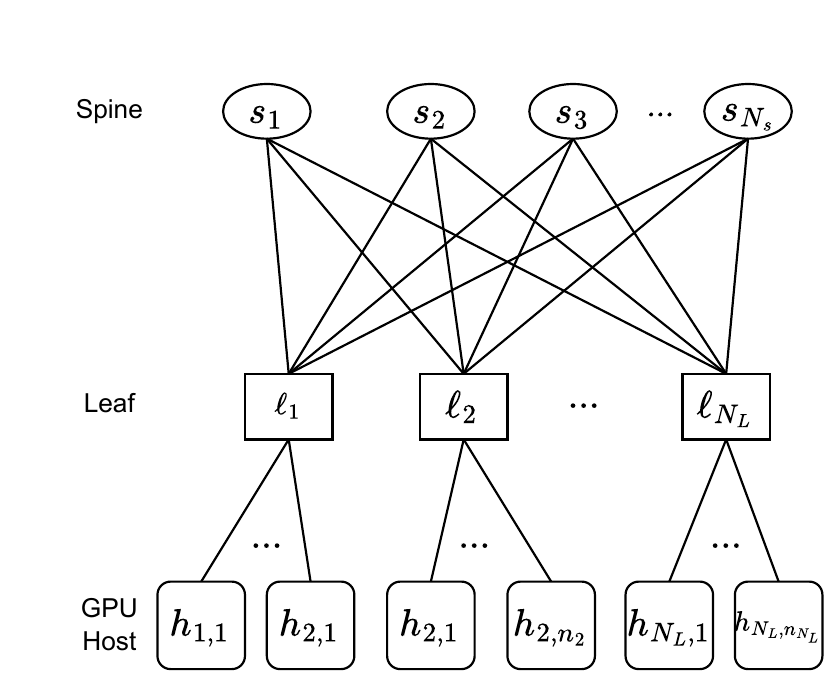
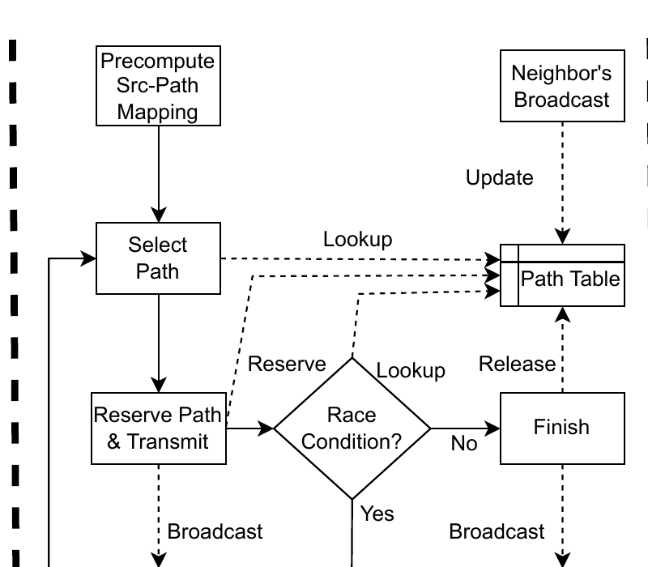
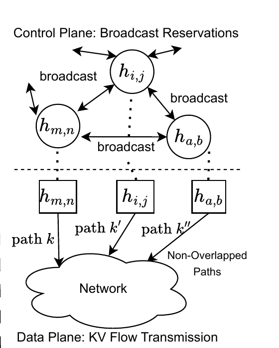

# ARK：让分离式 LLM Serving 的 KV Cache 传输避开网络碰撞

LLM serving 的分离式架构正在把一个过去主要属于 GPU 显存管理的问题，推到数据中心网络控制面上。

在传统 colocated serving 里，prefill 和 decode 通常在同一张 GPU 或同一组 worker 上完成。Prefill 阶段把 prompt 并行算成 KV cache，decode 阶段随后反复读取这些 KV 逐 token 生成。系统当然要处理 KV cache 的分页、复用、淘汰和压缩，但多数数据移动仍然发生在本地显存或节点内部。

Prefill/decode disaggregation 改变了这个边界。Prefill 节点负责吞吐密集的 prompt 计算，decode 节点负责内存带宽敏感的自回归生成，两类节点可以分开扩缩容，也可以按阶段特征使用不同资源。代价是：prefill 完成后，KV cache 必须跨节点转移到 decode 侧。长上下文、RAG、多轮 agent 和 reasoning workload 让这条传输路径越来越重，KV cache 不再只是“模型运行时的中间状态”，而是进入 TTFT 和尾延迟关键路径的显式网络流。

ARK 这篇工作抓住的就是这层问题：当多个大 KV transfer 在数据中心网络里同时发生时，GPU worker 空闲并不代表路径空闲；两个看似独立的请求如果被路由到共享链路上，可能会互相拉长 flow completion time，进而伤害首 token 延迟。它的思路不是继续只优化 attention kernel 或 KV 压缩，而是把 KV cache transfer 当成一等公民来做路径选择、预留和碰撞规避。

**(a) 两层 spine-leaf 网络拓扑**

**(b) ARK 路径预留控制器**

**(c) 分离的控制平面与 KV flow 数据平面**

> **图源与许可：** Mohammad Saeed 等，*ARK: Avoiding Routing Collisions for KV Cache Transfer in Disaggregated LLM Inference*，Figure 1。图片截取自[作者公开 PDF](https://saeed.github.io/files/arc_niac26.pdf)，依据 [CC BY 4.0](https://creativecommons.org/licenses/by/4.0/) 许可使用。原图依次展示网络拓扑、ARK 路径预留控制器，以及分离的控制平面与 KV flow 数据平面。

## 背景：分离式推理让 KV cache 变成网络负载

Prefill 和 decode 的资源画像差异很明显。

Prefill 更像批量矩阵计算。输入 prompt 的 token 可以并行处理，计算密度高，Tensor Core 利用率更容易做上去。Decode 则每一步只生成一个 token，每步都要读历史 KV cache，长上下文下更容易被 HBM 带宽、cache miss、page table 访问和调度开销限制。

因此，Splitwise、DistServe、Mooncake、Dynamo、llm-d 等系统都在推动分离式 serving：把 prefill pool 和 decode pool 拆开，让系统分别管理 TTFT 和 TPOT，把计算密集阶段和内存带宽敏感阶段解耦。

但这个解耦并不免费。一次请求在分离式系统里的典型路径会变成：

1. router 把请求送到某个 prefill worker；
2. prefill worker 计算 prompt，生成每层 K/V；
3. KV cache 通过网络传给选定的 decode worker；
4. decode worker 接管请求，开始首 token 之后的流式生成。

第 3 步就是新瓶颈。对短 prompt 来说，KV transfer 可能只是小开销；对长上下文来说，它可能是数 GB 级状态移动。更麻烦的是，线上系统不是单请求运行，而是多个 prefill worker、decode worker 和 KV transfer 同时存在。此时网络路径的共享与碰撞会直接进入用户可见延迟。

## 问题：GPU 空闲不代表网络路径空闲

很多 serving scheduler 会优先看 GPU 侧指标：worker 队列长度、batch size、prefix cache 命中、显存剩余、decode token backlog、预估 TTFT/TPOT 等。这些指标很重要，但对分离式 KV transfer 来说还少了一维：从 prefill 节点到 decode 节点之间的路径是否正在被其他大流占用。

在 Clos 或 fat-tree 这类数据中心网络里，两个 source-destination pair 可能在逻辑上不同，却在某几条上行、下行或 spine-link 上重叠。如果多个 KV flow 同时走到同一组链路，交换机队列和链路带宽会成为共享瓶颈。结果是：

- 单个 KV transfer 的 flow completion time 被拉长；
- decode worker 即使已经被分配，也必须等 KV 到达；
- 请求的 TTFT 尾延迟上升；
- prefill worker 可能因为输出侧传输阻塞而影响后续请求；
- scheduler 看到的 GPU 空闲度和用户感受到的延迟开始脱节。

这就是 ARK 要解决的核心矛盾：分离式 serving 把算力池拆开后，调度器不能只问“哪个 decode GPU 有空”，还要问“从当前 prefill 节点到这个 decode 节点，哪条网络路径现在不会撞车”。

## ARK 的设计直觉：为 KV flow 预留不重叠路径

ARK 的基本直觉很直接：既然 KV cache transfer 是延迟敏感的大流，就不要把它交给普通 ECMP 或被动拥塞控制去碰运气。系统应该在控制面提前知道可用路径，并在发送前为每个 KV flow 选择尽量不重叠的路径。

可以把 ARK 拆成三层来看。

第一层是 **路径候选集合**。系统为 prefill 节点和 decode 节点之间预计算多条可用 source path。这样，当一个请求完成 prefill、需要传 KV 时，控制面不是临时盲选下一跳，而是在已有候选路径中挑选。

第二层是 **reservation 控制面**。当某条 KV transfer 准备开始，发送侧会广播或发布路径预留信息，让其他发送方知道这条路径上的链路正在被占用。新的 KV flow 在选择路径时会避开已经被预留的重叠链路，减少大流之间的直接碰撞。

第三层是 **数据面传输**。真正传输 KV cache 时，系统按选定的 non-overlapped path 发包，并在传输结束后释放 reservation。这样，KV flow 的路径选择不只是局部 hash 或默认路由结果，而是和当前 serving 流量状态有关。

这套设计的关键不是“永远找到完全不重叠路径”。真实集群里，请求很多、路径有限、拓扑和拥塞状态都在变化，完全避让不一定总可行。它更重要的意义是：把 KV transfer 从普通背景流量里提出来，给它一个能被 serving runtime 感知和控制的路径层。

## 为什么这和普通负载均衡不一样

传统负载均衡通常以服务实例为中心。它选择哪个 prefill worker、哪个 decode worker，主要看实例负载和服务质量。网络层则负责尽力转发，ECMP 根据五元组或 hash 把 flow 分到路径上。

ARK 的视角更细：它关心一次 KV transfer 本身。一次请求的 decode worker 即使很空，如果从 prefill 到它的路径已经被几个大 KV flow 占住，这个选择也可能不是好选择。反过来，一个略忙一点的 decode worker，如果它和当前 prefill 节点之间有更干净的路径，整体 TTFT 可能反而更低。

这会改变 serving control plane 的输入变量。一个成熟调度器至少要同时看四类信息：

1. **GPU 侧状态**：prefill/decode 队列、batch、显存、KV block 可用量；
2. **KV 侧状态**：本次 KV 大小、是否可复用、是否需要压缩或分层存储；
3. **网络侧状态**：路径重叠、链路 reservation、近期 flow completion time；
4. **SLO 侧状态**：TTFT deadline、TPOT/TBT 约束、请求优先级和租户策略。

只有把这些放在一起，系统才能避免“GPU 维度看起来最优，网络维度实际很差”的决策。

## 和 KVServe、Kairos、Mooncake 放在一起看

ARK 不是孤立出现的。它和最近几类 KV-centric serving 工作拼在一起，会形成一条很清楚的趋势：KV cache 正在从 kernel 内部状态变成跨层系统资源。

KVServe 关注的是 **压缩决策**。当 KV cache 要跨网络移动时，不同压缩 profile 会在质量、带宽和延迟之间形成 Pareto 选择。它把“压不压、压多少”从静态配置改成服务感知的在线决策。

Kairos 关注的是 **prefill deflection**。当 prefill pool 排队而 decode pool 还有 TBT 余量时，它把部分 prefill 借道到 decode 节点本地执行，从而省掉跨节点 KV transfer。它相当于从调度路径上减少某些 KV movement。

Mooncake 和相关 KV pool 方向关注的是 **KV cache 分层与复用**。KV 不一定只在单个 worker 本地存在，也可能被放进 CPU、DRAM、SSD、远端 KV pool 或跨节点存储层里，供未来请求复用。

ARK 则补上 **网络路径选择**。当 KV movement 确实必须发生时，系统需要知道这些大流应该怎么走，如何避免互相碰撞。

这几个方向不是互斥关系，而是可以组成一个更完整的 serving runtime：

- 能不搬时，通过 cache locality、deflection 或 recompute 避免搬；
- 必须搬时，根据 SLO 和带宽决定是否压缩；
- 真的发送时，用路径预留和碰撞规避降低 FCT；
- 到达后，把 KV 放进可管理的分层缓存，供后续请求复用。

## 工程落地：scheduler 需要哪些 telemetry

如果要把 ARK 的思想落到一个真实 LLM serving 平台里，最先要补的不是复杂算法，而是 telemetry。

第一，要知道 KV flow 的大小。KV 大小与模型层数、head 数、head dimension、精度、prompt length 和是否 MLA/GQA 有关。Scheduler 如果只知道“请求长度”，还不够精确；它要能估算实际需要移动多少字节。

第二，要知道路径占用。控制面需要维护当前 KV transfer 的 reservation，至少能判断候选路径之间是否共享瓶颈链路。更进一步，可以结合交换机队列、ECN、RTT 或近期 FCT 反馈。

第三，要知道请求 deadline。不同请求对 TTFT 的敏感度不同。交互式聊天、agent 工具链、批量摘要、后台 embedding 任务不应该用完全相同的路径策略。

第四，要知道 worker 侧回压。网络路径再干净，如果 decode worker 的 KV block 紧张、decode batch 已经逼近 TBT SLO，选择它也不合适。反过来，prefill 侧如果输出队列堆积，可能需要更激进地转移或压缩。

第五，要把失败路径显式化。Reservation 可能过期，路径状态可能竞争，传输可能被突发流量打断。Serving runtime 需要有 fallback：改走次优路径、压缩后重发、选择另一个 decode worker，或者在极端情况下让请求走 colocated path。

## 对 GPU 系统工程的启发

ARK 最有意思的地方，是它把 LLM serving 的瓶颈继续往下推了一层。

过去我们说推理系统优化，常常从 attention kernel、paged KV cache、continuous batching、CUDA Graph、speculative decoding、MoE routing 这些 GPU 或 runtime 内部机制讲起。分离式 serving 出现后，问题扩展到 prefill/decode worker 的资源配比和 KV transfer 成本。ARK 进一步说明：当 KV transfer 成为大规模常态，连数据中心网络路径本身都要进入模型 serving 的控制面。

这对平台设计有三个直接启发。

第一，KV cache 应该有自己的生命周期管理。它从 prefill 中生成，被 decode 消费，可能被压缩、迁移、复用、淘汰，也可能跨节点或跨机架移动。把它只当作一块显存 buffer，会低估系统复杂度。

第二，LLM router 会越来越像一个多资源调度器。它不只是 HTTP/gRPC 入口，也不只是把请求分给最空的 worker；它要同时理解 GPU、内存、网络、KV locality 和 SLO。

第三，网络优化不能只留给基础设施团队。对传统微服务来说，应用通常不需要知道具体链路；但对长上下文 LLM serving 来说，一次 KV transfer 就可能是一个大状态迁移。模型服务本身必须给网络层提供语义：这是 KV flow、它有 deadline、它的大小可估计、它和首 token 延迟相关。

## 什么时候 ARK 类方法最有价值

ARK 类路径感知方法最适合以下场景。

第一，系统已经采用 prefill/decode disaggregation，并且 KV transfer 经常处在 TTFT 关键路径上。如果 colocated serving 已经足够，或者 prompt 很短、KV 很小，路径预留的收益会比较有限。

第二，请求存在长尾上下文和突发。几个长 prompt 同时完成 prefill 时，会产生一批大 KV flow；如果它们碰到同一组上行链路，尾延迟会明显恶化。

第三，集群拓扑有多路径选择空间。Clos/fat-tree 给了控制面选择不同 path 的机会；如果网络本身路径单一或瓶颈固定，ARK 能做的就会受限。

第四，服务对 TTFT/P95/P99 比均值更敏感。路径碰撞往往首先表现为尾延迟，而不是平均延迟。面向交互式 LLM、agent 或在线代码助手的系统，会比离线批处理更需要这种机制。

## 局限与开放问题

路径预留也有代价。

首先，控制面必须足够快。KV transfer 位于请求关键路径，如果 reservation 协议本身太慢，就会吃掉收益。ARK 的启发适合和轻量级交换机规则、source routing 或边缘控制面结合，而不是引入重型集中式事务。

其次，reservation 状态要处理竞争。多个 prefill 节点可能几乎同时选择路径，状态传播有延迟，完全一致很难。系统需要检测冲突、处理过期 reservation，并避免因为保守预留而降低整体利用率。

第三，网络不是唯一瓶颈。某些情况下，压缩、局部 recompute、decode-side prefill deflection、prefix cache 命中或 KV pool 复用，可能比换路径更有效。ARK 更像是工具箱里处理“必须跨网络搬 KV”这一段的专用工具。

第四，多租户策略会更复杂。不同租户的请求优先级、带宽配额、SLO 和隔离要求不同。KV flow 的路径预留如果没有公平策略，可能让高优先级长上下文请求长期压制普通请求。

## 小结

如果用一句话概括 ARK：它把分离式 LLM serving 里的 KV cache transfer 从被动网络流量，提升为可感知、可预留、可避让的一等调度对象。

这件事的意义很大。Prefill/decode 分离解决了 GPU 阶段异构，却引入了跨节点 KV movement；KV compression、KV pool 和 prefill deflection 分别从减少字节、复用状态、避免转移的角度处理这个问题；ARK 则提醒我们，当 KV 必须移动时，路径本身也要被纳入 serving control plane。

未来的高性能 LLM serving 可能不会只有一个“最优 worker 选择器”，而会是一个同时理解请求、KV、GPU、网络和 SLO 的多资源调度器。对长上下文和 agentic workload 来说，谁能把 KV cache 从显存对象升级成系统级状态来管理，谁就更有机会稳定压住 TTFT 和尾延迟。

## 参考资料

- Mohammad Saeed et al. ARK: Avoiding Routing Collisions for KV Cache Transfer in Disaggregated LLM Inference. ACM SIGCOMM/NAIC, 2026. <https://dl.acm.org/doi/10.1145/3789240.3828750>
- Mohammad Saeed et al. ARK author-hosted PDF. <https://saeed.github.io/files/arc_niac26.pdf>
- An Internet for the KV Cache: Rethinking Classical Infrastructure Boundaries in the LLM Inference Age. arXiv:2608.01526, 2026. <https://arxiv.org/html/2608.01526v1>
- llm-d Project. Disaggregated Serving Architecture. <https://llm-d.ai/docs/architecture/advanced/disaggregation>
- NVIDIA Dynamo Documentation. Research Publications. <https://docs.nvidia.com/dynamo/v1.4.2/research-publications>
