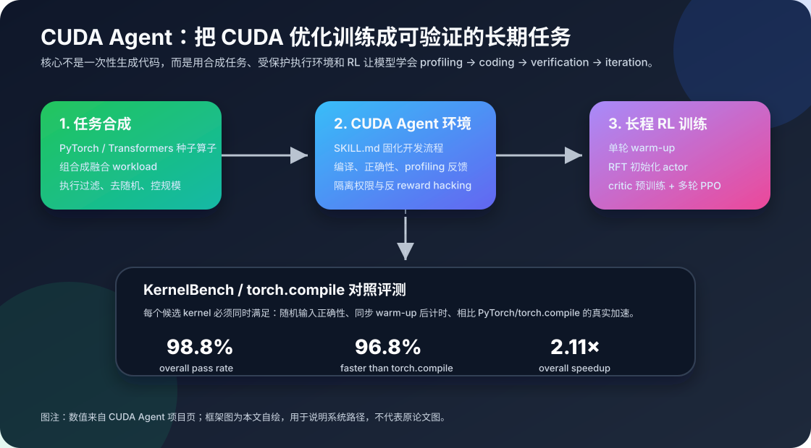

# CUDA Agent：让模型学会写高性能 CUDA Kernel

高性能 CUDA kernel 优化一直是 AI 系统里最“手工艺”的部分之一。上层模型结构可以用 PyTorch 很快写出来，编译器也能通过 graph capture、fusion、Triton/Inductor 等路径做自动优化，但一旦进入真正困难的边界：不规则访存、多个算子融合、寄存器与 shared memory 取舍、warp 级协作、numerical edge case，性能差距往往又会回到“谁更懂 GPU”。

这也是最近 LLM 写 CUDA 方向很有意思的地方。它不是简单地问“模型会不会写一段能编译的 CUDA 代码”，而是在问：**能不能把 CUDA 优化变成一个可训练、可验证、可迭代的系统任务**？2026 年 2 月提交的 CUDA Agent 论文给了一个很清晰的答案：不要只让模型一次性补全 kernel，而是把它放进带编译、测试、profile 和奖励信号的环境里，用大规模 agentic reinforcement learning 训练它的内在 CUDA 优化能力。

## 要解决的问题：代码能跑，不等于 kernel 真快

深度学习系统里经常会遇到这样的路径：研究者先用 PyTorch 写一个新算子或新模块，功能验证很快完成；真正要部署或做公平性能比较时，却发现 eager PyTorch 路径太慢，`torch.compile` 能优化一部分，但仍可能受限于图结构、动态 shape、算子边界或已有 lowering 规则。

这时自定义 kernel 很有吸引力，因为它可以把多个阶段融合在一起，避免中间结果写回 global memory，也可以针对具体数据形状调整 tile、vectorization、shared memory staging 和寄存器使用。但自定义 kernel 的成本很高：

- 正确性不是只看一个输入，要覆盖随机输入、边界 shape、数值容差；
- 性能不是只看一轮计时，要 warm-up、同步、排除编译和缓存干扰；
- 优化不是线性的，减少一次访存可能增加寄存器压力，提升 occupancy 又可能降低 arithmetic intensity；
- 一个看似聪明的 fusion 可能因为 shared memory bank conflict 或 non-coalesced access 变慢。

所以，LLM 生成 CUDA 的难点不只是语法。更难的是让模型学会一套工程闭环：先理解 reference operator，再写 kernel 和 binding，编译，跑正确性测试，profile，定位瓶颈，修改，再验证。CUDA Agent 的设计正是围绕这个闭环展开。

## KernelBench 提供了“可测量”的目标

CUDA Agent 的重要背景是 KernelBench。KernelBench 把任务定义为：给定一个 PyTorch reference program，让模型生成正确且更快的 CUDA/DSL kernel，在目标 GPU 上替换原实现。它的任务分为多个层次：

- Level 1：单个基础算子，例如卷积、矩阵乘、LayerNorm；
- Level 2：简单融合模式，例如 Conv + Bias + ReLU、Matmul + Scale + Sigmoid；
- Level 3：更完整的模型结构，例如 MobileNet、VGG、MiniGPT、Mamba；
- Level 4：面向 HuggingFace 模型的更开放任务。

这个 benchmark 有两个关键点。第一，它同时看正确性和性能，而不是只看 pass rate。KernelBench 使用类似 `fast_p` 的指标：生成代码必须正确，并且相对参考实现达到超过阈值 `p` 的加速，才算成功。第二，它把 kernel generation 放回真实系统语境：模型不是写一道算法题，而是在优化神经网络算子的执行路径。

因此，CUDA Agent 把目标设得很具体：在 KernelBench 上，不仅要写出能过测试的 kernel，还要在很多 case 上超过 `torch.compile` 这样的强编译器基线。论文和项目页报告，CUDA Agent 在 KernelBench Level-1、Level-2、Level-3 上分别达到 100%、100%、92% 的 faster-than-`torch.compile` rate；项目页还给出 overall pass rate 98.8%、overall faster-than-`torch.compile` 96.8%、overall speedup 2.11x。

这些结果不应该被理解成“LLM 从此替代所有编译器”。更准确地说，它说明在有明确任务、执行反馈和搜索空间约束时，模型可以学到一部分传统自动编译很难覆盖的 kernel-level 设计经验。

## CUDA Agent 的核心方法：数据、环境、训练三件事一起做

CUDA Agent 可以拆成三层。

第一层是 **scalable data synthesis pipeline**。高质量 CUDA 训练数据很稀缺，人工写专家 kernel 更不现实。CUDA Agent 的做法不是只收集现成 kernel，而是先从 PyTorch 和 Transformer 生态里抓取种子算子，再用 LLM 做组合式合成，把多个 torch operators 串成更复杂的 fused workload。这样得到的任务往往不能简单地逐算子优化再拼起来，因为 fusion 会改变中间结果是否落到 global memory、寄存器 live range、shared memory 使用和并行粒度。

合成之后还要过滤。项目页提到，它会保留 eager 和 compile 模式都能运行的任务，去掉随机算子，做 anti-hacking 检查，避免输出常量或不同输入下难以区分的任务，并把 workload 控制在合理运行时间范围内。最终形成 CUDA-Agent-Ops-6K 这样的训练任务集。

第二层是 **skill-augmented CUDA development environment**。这一步很关键，因为强化学习需要可靠奖励。如果环境很容易被钻空子，模型可能学会调用 fallback、硬编码输出、跳过真实计算，或者利用测试漏洞拿高分。CUDA Agent 在 agent 环境里放入结构化 CUDA workflow：profile 原始 PyTorch，实现 CUDA kernel 和 binding，在 GPU sandbox 里编译，跑 correctness 和 performance test，再迭代优化。

它还用受保护的 verify/profile 脚本、权限隔离、多输入正确性检查、同步 warm-up profiling、禁止 fallback 等机制减少 reward hacking。换句话说，模型得到的奖励尽量来自“真实 kernel 质量”，而不是来自环境漏洞。

第三层是 **stable long-horizon RL training**。CUDA 优化不是一轮问答就能完成的任务，论文中 CUDA Agent 支持 128k context 和最多 200 个 interaction turns。长程 RL 很容易不稳定，所以它采用分阶段训练：先做 single-turn warm-up，让模型具备基本 CUDA 生成能力；再用 rejection fine-tuning 初始化 actor，过滤掉低效循环和无效 tool-call 模式；然后预训练 critic，最后进入多轮 agentic RL。

这三个部分缺一不可。只有数据，没有执行环境，模型学不到真实性能反馈；只有环境，没有大规模任务，训练会过拟合少量模式；只有普通微调，没有长程 RL，模型可能能写一些模板，但很难学会 profile-driven iteration。

## 它和普通“让 LLM 写 CUDA”有什么不同

很多 CUDA code generation 方法更像 test-time search：让模型写一个版本，编译失败就修，性能不好就让它根据错误信息或 profiler 继续改。这类方法有用，但上限高度依赖 base model 原本会不会 CUDA。模型不懂 coalescing、不懂 occupancy、不懂 shared memory 时，外层循环只能在有限范围里补救。

CUDA Agent 的重点则是把这种开发循环本身变成训练对象。模型不是每次从零开始靠 prompt 硬想，而是在大量任务中反复经历：

1. reference PyTorch 表达了什么计算；
2. 哪些算子边界可以融合；
3. 哪些数据应该放寄存器、shared memory 或直接重算；
4. 编译错误、正确性失败、性能回退分别意味着什么；
5. profiler 反馈应该转化成什么代码修改。

这更接近“训练一个会做 CUDA 优化的 agent”，而不是“给通用聊天模型加一个 CUDA 提示词”。

一个很值得注意的细节是，它把 reward 设计得非常工程化。正确性是门槛，性能是目标，但性能必须在防作弊和可重复测量的环境里算。对于系统研究来说，这比模型架构本身还重要：如果 reward 不可靠，RL 会非常擅长学坏。

## 为什么这对 AI 系统有意义

从 AI 系统角度看，CUDA Agent 代表了一种新的自动化方向：不是把所有优化都塞进静态编译器，也不是完全依赖人工专家，而是把优化过程拆成可执行、可反馈、可训练的环境。

这和传统 compiler autotuning 有相似之处。autotuner 会在 tile size、unroll factor、vector width 等参数空间里搜索；CUDA Agent 的搜索空间更开放，包含代码结构、fusion 方式、memory hierarchy 使用和 debugging 策略。它的优势是表达能力更强，劣势是更难保证正确性、可解释性和覆盖边界。

对于深度学习框架，这种方法可能特别适合几个场景：

- 新算子或新模型结构出现很快，编译器还没有专门 lowering；
- workload shape 相对固定，值得为具体形状生成 specialized kernel；
- 现有 `torch.compile` 已经是强基线，但某些融合或内存布局仍有手写优化空间；
- 研究原型需要快速判断“理论更优的结构在优化后是否真的更快”。

它也可能和编译器互补。模型可以提出 candidate kernel 或 schedule，编译器负责 lowering、合法性检查和后端优化；编译器可以提供 IR、cost model 和 profiler 信号，模型负责更高层的策略搜索。未来更成熟的路径也许不是“LLM vs compiler”，而是“LLM 作为 compiler/autotuner 的开放式策略层”。

## 适用场景与局限

CUDA Agent 最适合目标明确、反馈可靠、运行环境可控的 kernel 优化任务。KernelBench 这类 benchmark 很适合训练和评估，因为 reference operator、输入生成、正确性测试和计时方式都可以标准化。

但它也有明显局限。

首先，benchmark 成绩不等于生产可用。真实生产系统有更多边界：动态 shape、不同 GPU 架构、driver/CUDA 版本差异、混合精度策略、异常输入、框架 ABI、可维护性和安全审计。一个在 benchmark 上很快的 kernel，进入长期维护代码库之前还需要更严格的工程审查。

其次，性能测量本身很脆弱。GPU 频率、thermal throttling、并发任务、memory allocator 状态、first-run JIT、不同 batch shape 都会影响计时。CUDA Agent 通过 warm-up 和同步 profiling 降低噪声，但线上环境仍然比训练环境复杂。

第三，生成代码的可解释性和责任边界仍然重要。手写 kernel 出 bug 已经很难排查，模型生成 kernel 更需要保存设计意图、测试覆盖和 profiler 记录。否则短期获得的速度，可能换来长期维护成本。

最后，RL 训练成本不低。构建 6K 合成任务、GPU sandbox、verify/profile 环境和长程训练管线，本身就是一个系统工程。对个人开发者来说，更现实的使用方式可能是消费这类模型或工具，而不是从头复现训练。

## 我的理解：自动优化正在从“生成答案”走向“训练工作流”

CUDA Agent 给我的最大启发是，系统优化里的 AI agent 不能只追求一次性答案。CUDA kernel 优化本来就是一个闭环：写代码、编译、测试、profile、理解瓶颈、再写代码。真正有价值的模型应该学会这个闭环，而不是只学会输出一段看起来像 CUDA 的文本。

这也解释了为什么它的三个设计点都围绕“反馈质量”：任务要可执行，环境要防作弊，奖励要同时覆盖正确性和性能，训练要能承载多轮迭代。模型能力不是凭空出现的，而是从大量可靠反馈中长出来的。

对后续 AI 系统设计来说，这个模式很值得借鉴：

- 把复杂工程任务拆成可运行的环境；
- 用 reference implementation 定义语义；
- 用自动化测试守住正确性；
- 用 profiler 或系统指标提供性能奖励；
- 用隔离和反作弊机制保护奖励信号；
- 让模型在长期交互中学习调试和优化策略。

这个思路不只适用于 CUDA。数据库查询优化、网络协议调参、编译器 pass 排序、分布式训练 overlap、LLM serving placement，都可能被组织成类似的“可验证系统优化环境”。CUDA Agent 只是其中很典型、反馈最密集的一个例子。

## 小结

如果用一句话概括 CUDA Agent：它把高性能 CUDA kernel 生成从一次性代码补全，推进到由任务合成、受保护执行环境和长程强化学习组成的系统训练问题。

它的意义不只是某些 KernelBench 数字很好看，而是展示了一条自动化系统优化的路线：让模型在真实编译、测试和 profiling 反馈里学习优化工作流。对 CUDA 高性能计算来说，这可能会让更多新算子和新模型结构更快拥有可用的高性能实现；对 AI 系统来说，它也提醒我们，可靠环境和奖励设计可能和模型本身一样重要。

## 参考资料

- Weinan Dai et al. CUDA Agent: Large-Scale Agentic RL for High-Performance CUDA Kernel Generation. arXiv:2602.24286, 2026. <https://arxiv.org/abs/2602.24286>
- CUDA Agent Project Page. <https://cuda-agent.github.io/>
- Scaling Intelligence. KernelBench: Can LLMs Write GPU Kernels? <https://scalingintelligence.stanford.edu/blogs/kernelbench/>
- KernelBench GitHub Repository. <https://github.com/ScalingIntelligence/KernelBench>
- PyTorch Documentation: torch.compile. <https://docs.pytorch.org/docs/2.12/generated/torch.compile.html>
