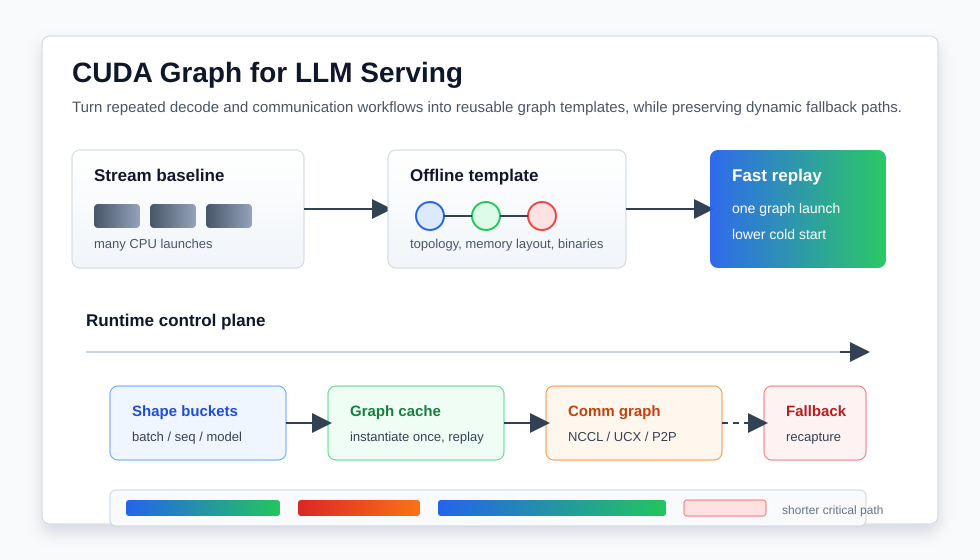

# CUDA Graph 与 LLM Serving：从启动开销到动态图执行

LLM serving 的性能优化经常被归结为 batch、KV cache、并行策略和调度算法。但在 GPU 时间线上，还有一个更底层、也更容易被低估的问题：一次 decode step 可能包含大量很短的 GPU kernel，如果每个 kernel 都由 CPU 逐个提交，host launch overhead 和 kernel boundary 就会成为真实瓶颈。

CUDA Graph 的价值正在这里变得越来越明显。它把一段由 kernel、memcpy、memset、event 等节点组成的工作流提前定义和实例化，后续重复执行时只需要 launch 已经准备好的 graph。对 decode 这种高度重复的路径来说，这正好对应“同一类 token 生成流程被执行很多次”的场景。

但近两年的系统工作也说明，CUDA Graph 不是简单地把 stream 录一遍就结束。LLM serving 有动态 batch、动态 sequence length、MoE 路由、并行度切换、通信状态、GPU 内存地址稳定性和冷启动要求。真正困难的地方不只是“怎么捕获 graph”，而是 **如何让 graph 在动态服务系统里可复用、可重构、可调度，并且不会把系统锁死在一个静态形状上。**



## 1. 问题：GPU kernel 很快，提交和边界却不一定快

传统 stream 执行模型很直观：CPU 按顺序把 kernel、拷贝和同步操作提交到 stream，GPU 依赖 stream 顺序执行。这个模型灵活，但每次提交都需要 host driver 做准备工作。对一次耗时很长的 kernel 来说，这点开销可以忽略；对 LLM decode 中大量短 kernel 来说，launch overhead 就会占据明显比例。

NVIDIA CUDA Programming Guide 对 CUDA Graph 的定义很直接：graph 是一组由依赖边连接的操作，定义和执行分离。这样可以把许多设置成本提前支付，重复执行时降低 CPU launch 成本，也给 CUDA runtime 一个完整 workflow 进行优化的机会。

LLM serving 正好有几个会放大 launch overhead 的特征：

- decode 阶段每次只生成少量 token，单次计算粒度小；
- attention、norm、activation、sampling、routing、通信等步骤拆成很多 kernel；
- 高并发服务需要 CPU 同时处理网络、调度、KV cache 管理和多模型请求；
- autoscaling 或 parallelism reconfiguration 会频繁创建新 worker；
- MoE 和分布式 serving 还要把通信和计算一起放进时间线。

因此，CUDA Graph 的第一层作用是减少重复 launch。工程上可以把稳定的 decode 子图捕获下来，让每个 step 不再从 host 侧逐个提交几十到几百个操作，而是提交一个已经实例化好的 graph。

## 2. CUDA Graph 能解决什么，不能解决什么

CUDA Graph 最适合解决两类问题。

第一类是 **CPU 提交开销**。如果一次 iteration 由许多短 kernel 构成，graph replay 能显著降低 host 侧 launch 和调度成本。HPC 迭代应用、推理 decode loop、固定 shape 的训练 micro-step 都属于这一类。

第二类是 **重复工作流的整体优化**。stream 是一段段提交，CUDA Graph 则把完整依赖关系交给 runtime。它可以表达 kernel、memcpy、event、host node、conditional node、memory node 等多种节点，也可以通过 dependency edge 表示执行顺序。

但 CUDA Graph 本身并不自动解决下面这些问题：

- dynamic shape 改变后，原 graph 是否还能复用；
- kernel 参数里的 device pointer 是否仍然有效；
- lazy-loaded kernel code 是否已经准备好；
- 多 GPU rank、NCCL/UCX/UCC 通信状态是否能跨进程或跨并行度重用；
- graph 内部 kernel boundary 是否仍然限制 fine-grained pipeline；
- cold start 时捕获和实例化 graph 是否反而成为初始化瓶颈。

这也是为什么近期工作不再只说“使用 CUDA Graph”，而是在讨论 graph template、context materialization、通信层 graph engine，以及 megakernel / task graph compiler。它们解决的是 CUDA Graph 进入生产 serving 系统后的第二层问题：静态图如何适配动态系统。

## 3. Foundry：把 CUDA Graph 冷启动从分钟级压到秒级

Foundry 关注的是 LLM serving 里的 cold start。现代 serving provider 会根据流量自动扩缩容，也会在 dense/MoE 模型之间切换并行配置。模型权重加载已经被很多系统优化到秒级，但 CUDA Graph capture 仍可能耗时几十秒到数分钟，导致启动时间被 graph warmup 支配。

Foundry 的核心观察是：CUDA Graph 不能天真地序列化。它不只包含 graph topology，还绑定了 execution context，例如 kernel 参数中的 device address、capture 时 lazy loaded 的 kernel binary、通信相关的状态等。如果直接把 graph 当作一个普通对象保存，很容易在下次进程、下次地址布局或不同 GPU rank 上失效。

它的做法可以拆成四步：

1. **离线捕获和模板化。** 在离线阶段捕获代表性 graph，把拓扑和上下文信息整理成 template。
2. **确定性内存布局。** 在线重建时尽量复现 capture 时的 device address，让 kernel 参数里的 pointer 不失效。
3. **kernel binary 提前抽取和加载。** 避免在线 warmup 时再触发 lazy loading。
4. **分布式 rank 状态补丁。** 单 GPU 捕获出来的模板可以扩展到多 GPU deployment，只对 rank-dependent communication state 做 patch。

论文报告 Foundry 在 dense 和 MoE 模型、最高 235B 参数规模上，把 cold-start latency 最高降低 99%；Qwen3-235B-A22B 的初始化时间从 10 分钟降到 3.9 秒，同时保留 CUDA Graph 带来的 throughput 收益。

这个结果对工程系统很关键。因为 serving 性能不只看 steady-state token/s，还要看扩容、迁移、故障恢复、模型切换时能不能快速进入服务状态。如果 CUDA Graph capture 成了新 worker 上线的最长步骤，那么 graph 优化反而会卡住弹性能力。Foundry 的意义是把 graph 从“运行时现场录制”变成“可物化的部署资产”。

## 4. 通信层 CUDA Graph：把 P2P workflow 放进 UCX

CUDA Graph 不只适用于计算 kernel，也适用于通信 workflow。2026 年的 intra-node GPU-to-GPU multi-path transfer 工作把 CUDA Graph engine 放进 UCX 传输层，用来优化节点内 GPU P2P 通信。

它要解决的问题是：多 GPU 节点里，GPU-to-GPU 数据传输可能有多条路径，例如 NVLink、PCIe、host staging 等。为了吃满带宽，runtime 可能需要拆分消息、选择路径、启动多段 copy 或 staging 操作，再做同步。这个过程如果每次都由 host 零散提交，会产生明显的 launch 和同步成本。

论文的方法是把多路径 P2P 通信 workflow 动态构建并缓存为 CUDA Graph。这样上层应用或 collective library 仍然通过 UCX 使用通信能力，但传输层内部能把细粒度 staged transfer 封装成可重复执行的 graph。

这和 LLM serving 的启发相同：如果一个通信模式会反复出现，就应该把它从“每次重新提交一串操作”变成“准备好一次，后续低成本 replay”。区别在于，这里 graph 捕获的是通信路径而不是纯计算路径。

对 HPC 和分布式训练来说，类似机会很多：

- pipeline parallel 中固定 stage 之间的 activation send/recv；
- tensor parallel group 内重复的 all-gather / reduce-scatter 子流程；
- MoE dispatch/combine 中固定 expert parallel group 的局部通信；
- stencil、FFT transpose、domain decomposition 里的重复邻居通信；
- GPU direct storage 或 KV cache offload 中的固定数据搬运链路。

如果通信库能把这些链路图化，应用层就不必手动管理每个低级拷贝和同步节点。

## 5. Event Tensor：CUDA Graph 之后，为什么还需要动态图 megakernel

CUDA Graph 降低 launch overhead，但它仍然保留 kernel boundary。也就是说，graph replay 可以让 CPU 更快地提交一组 kernel，却不一定让这些 kernel 内部更细粒度地流水化。很多时候，后一个 kernel 只依赖前一个 kernel 的一部分 tile，但 kernel boundary 会让它等整个前序 kernel 完成。

Event Tensor 这类 megakernel/compiler 工作正是在处理这个问题。它把 operator 分解成 tile-level tasks，用 event tensor 表达细粒度依赖，并在一个 persistent kernel 内调度这些任务。这样可以同时减少 launch overhead，并绕开粗粒度 kernel boundary，暴露更多 inter-kernel parallelism。

它解决的另一个难点是动态性。LLM serving 里 batch size、sequence length、MoE expert 路由都可能变化。传统 megakernel 容易在静态 shape 上表现好，但遇到 shape dynamism 和 data-dependent routing 就很难工程化。Event Tensor 把 shape-dependent 和 data-dependent 的依赖作为一等抽象，目标是在动态 workload 中仍然能生成高性能 persistent kernel。

从系统设计上看，CUDA Graph 和 megakernel 不是互斥关系，而是两个层级：

```text
CUDA Graph:  减少 host 提交成本，复用稳定 workflow
Megakernel:  消除部分 kernel boundary，做 tile 级细粒度调度
```

如果 decode path 主要被 CPU launch overhead 限制，CUDA Graph 往往是更直接的优化。如果瓶颈来自 kernel boundary 和 tile 级 pipeline 缺失，megakernel 或 task-graph compiler 才更有空间。实际系统里，两者可能同时存在：graph 负责较大粒度的服务流程，persistent kernel 负责内部的动态算子流水线。

## 6. 落地流程：从 profile 到 graph template

如果要在一个 LLM serving 或 HPC runtime 里引入 CUDA Graph，我会按下面顺序做。

第一步，先确认瓶颈是不是 launch overhead。用 Nsight Systems 看 CPU submit、GPU kernel 时间线和空隙。如果 kernel 很短、数量很多、GPU 中间有 host launch gap，CUDA Graph 值得优先尝试。如果主要瓶颈是 HBM、collective 或单个大 GEMM，graph replay 不会凭空增加带宽或算力。

第二步，找稳定子图。不要一开始就捕获整个系统。优先选择 shape 相对稳定、重复频率高、依赖关系清楚的 decode block、通信子流程或固定迭代 loop。动态 shape 可以先按 bucket 分组，例如 batch/sequence length bucket。

第三步，固定内存和参数布局。CUDA Graph 对 device pointer 很敏感。需要明确 buffer pool、KV cache page、workspace 和通信 buffer 的生命周期。否则 graph 捕获成功，线上 replay 却因为地址变化需要频繁 recapture。

第四步，处理 warmup 和 lazy loading。生产系统里要把 graph capture、kernel module loading、workspace 初始化和通信状态准备从请求热路径中移出去。Foundry 这类方法说明，graph template 可以成为部署阶段的一部分，而不是每个 worker 启动后临时重新构造。

第五步，为多 GPU 通信单独建模。NCCL、UCX、UCC 等通信库是否支持 graph capture、capture 范围内能否包含 collective、rank-dependent state 如何 patch，都要独立验证。通信图通常比计算图更依赖拓扑和 rank。

第六步，保留 fallback path。dynamic workload 一定会遇到 graph bucket 覆盖不到的请求。工程上需要 stream fallback、recapture 策略和 graph cache eviction，而不是强迫所有请求进入同一个 graph。

## 7. 一个工程判断表

| 现象 | 可能原因 | 优先动作 |
| --- | --- | --- |
| GPU timeline 中短 kernel 之间有明显空隙 | CPU launch overhead 或同步过多 | 捕获稳定 decode 子图或迭代 loop |
| worker 扩容慢，warmup 时间很长 | graph capture / instantiation 成为冷启动瓶颈 | 离线模板化、确定性内存布局、提前加载 kernel binary |
| graph replay 经常失效 | device pointer、shape 或通信状态不稳定 | 建 buffer pool、shape bucket、graph cache |
| replay 后仍有 kernel boundary 导致等待 | CUDA Graph 只降低提交成本，不消除边界 | 评估 megakernel、operator fusion、tile-level scheduler |
| 多 GPU graph 难复用 | rank-dependent communication state 绑定太深 | 区分 topology template 和 rank state patch |

这个表的核心是：不要把 CUDA Graph 当作一个全局开关。它更像 runtime 里的缓存对象。缓存命中时非常有效，但前提是 key 设计得好：shape、地址、并行配置、通信 group、kernel binary 和 workspace 状态都要被纳入管理。

## 8. 对 HPC / CUDA 开发者的启发

第一，优化对象要从单个 kernel 扩展到 workflow。CUDA Graph 的基本思想就是把一串操作作为整体管理。HPC 迭代求解器、AI inference decode、通信 staging pipeline 都是天然候选。

第二，地址稳定性是性能条件。很多 CUDA 优化讨论只关注 kernel 代码，但 graph replay 还要求 memory layout 可控。allocator、buffer pool 和 workspace 生命周期会直接影响能不能复用 graph。

第三，动态性要分层处理。shape bucket、graph cache、template materialization、rank patch、fallback path 都是让静态图适配动态系统的工程手段。直接追求“一个 graph 覆盖所有情况”通常不现实。

第四，通信路径也应该图化。多 GPU 程序里的 repeated P2P、collective 子流程、KV cache movement 和 storage staging 都可能从 graph replay 中获益。通信库在这里不只是数据搬运库，也会成为 graph runtime 的一部分。

第五，CUDA Graph 不是 fusion 的替代品。它减少 host 提交成本，但不自动消除所有 kernel boundary。如果 profile 显示瓶颈来自 tile 级依赖和细粒度流水线，就要继续考虑 fusion、persistent kernel 或 compiler/runtime 协同。

## 小结

CUDA Graph 正在从一个 CUDA feature 变成 LLM serving 和 GPU runtime 的核心构件。它最直接的价值是降低重复 workflow 的 CPU launch overhead，但真正进入生产系统后，关键问题会变成冷启动、动态图、内存布局、通信状态和 fallback 管理。

Foundry 展示了 graph context 可以被模板化和物化，从而让 CUDA Graph 不再拖慢 autoscaling；UCX multi-path transfer 工作说明通信 workflow 也可以通过 graph engine 降低细粒度提交成本；Event Tensor 则提醒我们，graph replay 之后仍要面对 kernel boundary 和动态任务调度。

对做 HPC、CUDA 和深度学习系统的人来说，值得记住的一句话是：**CUDA Graph 优化的不是某个 kernel，而是一次可复用的 GPU 工作流。** 只有当 workflow、内存、shape 和通信状态都被系统化管理时，它才会稳定地变成端到端收益。

## 参考资料

- Xueshen Liu, Yongji Wu, Yuncheng Yao, Danyang Zhuo, Ion Stoica, Z. Morley Mao. Foundry: Template-Based CUDA Graph Context Materialization for Fast LLM Serving Cold Start. arXiv:2604.06664, 2026. <https://arxiv.org/abs/2604.06664>
- Event Tensor: A Unified Abstraction for Compiling Dynamic Megakernel. arXiv:2604.13327, 2026. <https://arxiv.org/abs/2604.13327>
- Seyedtaghi Sojoodi et al. Accelerating Intra-Node GPU-to-GPU Communication Through Multi-Path Transfers with CUDA Graphs. arXiv:2604.22228, 2026. <https://arxiv.org/abs/2604.22228>
- NVIDIA CUDA C++ Programming Guide: CUDA Graphs. <https://docs.nvidia.com/cuda/cuda-c-programming-guide/index.html#cuda-graphs>
