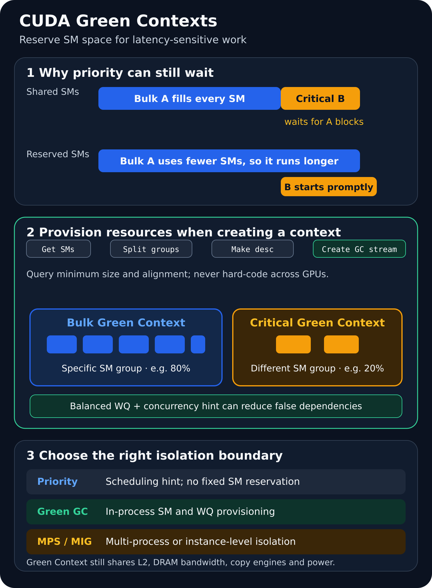

# CUDA Green Contexts：用 SM 空间分区隔离延迟敏感任务

同一张 GPU 上经常同时存在两类工作：持续压满设备的吞吐型 kernel，以及到达不规律、但要求尽快完成的延迟敏感 kernel。典型例子包括在线推理旁路的轻量预处理、仿真主循环中的紧急控制任务、训练过程中需要及时推进的通信 kernel。

直觉上，可以把关键工作放进高优先级 CUDA stream。但 stream priority 只影响**尚未获得执行资源的工作如何排队**。如果一个长时运行 kernel 已经让 thread block 驻留在所有 SM 上，高优先级 kernel 仍要等至少一部分 block 结束；优先级不会凭空制造空闲 SM，也不应被理解为通用的 thread-block 抢占机制。

CUDA Green Context 解决的是更具体的问题：在 execution context 创建时给它供应一组特定 SM，并可附带 work queue（WQ）配置。提交到该 context 所属 stream 的 kernel 只能使用这组资源。这样，吞吐任务即使 launch geometry 很大，也不能占用为关键任务预留的 SM。



*图源与许可：本站原创，许可随本文使用；未复用第三方图像。依据 NVIDIA CUDA Programming Guide 的 [Green Contexts 调度语义](https://docs.nvidia.com/cuda/cuda-programming-guide/04-special-topics/green-contexts.html) 与 CUDA 13.1 Runtime API 整理。图中的 80/20 仅用于解释机制，不代表通用最优配置。*

## 1. 背景：高优先级 stream 为什么仍可能排队

设 bulk kernel A 先启动。它的 grid 足够大，每个 block 执行时间也足够长，因此所有 SM 都已有 resident block。稍后，短小的关键 kernel B 被提交到更高优先级 stream。

高优先级能让 B 在资源释放后优先于低优先级待执行 block 被调度，但 B 的启动时间仍满足：

```text
T_start(B) >= T_submit(B) + T_wait_for_releasable_resource
```

如果 A 的 block 粒度很粗，`T_wait_for_releasable_resource` 就会直接进入 B 的 tail latency。这里真正需要观察的不是 API 调用耗时，而是：

- **submit-to-start**：CPU 提交到第一个 B block 真正执行的时间；
- **submit-to-complete**：CPU 提交到 B 完成的时间；
- P95、P99、P99.9，而不只是平均值；
- 为降低 B 延迟所付出的 bulk throughput 代价。

Green Context 通过限制 A 可见的 SM 集合，让另一组 SM 不会被 A 的 block 占据。它减少的是“没有 SM 可启动”这一类阻塞条件；其他约束仍可能让 B 延迟。

## 2. 机制：Green Context 到底分了什么

CUDA Programming Guide 将 Green Context 定义为一种轻量 context：它从创建开始就与一组具体 GPU 资源关联。当前可供应的重点资源是：

1. **SM resource**：一个具体 SM 集合。GC 中的 kernel 最多只能访问被供应的 SM；
2. **work queue resource/configuration**：影响独立 stream-ordered workloads 是否可能因映射到同一 WQ 而形成伪依赖。

从 CUDA 13.1 开始，Runtime API 通过 `cudaExecutionContext_t` 暴露这套能力。execution context 可以表示传统 primary context，也可以表示 Green Context。对已有 kernel 而言，device code 通常不需要修改；host 侧改为创建资源、GC 与 GC stream，再把这个 stream 传给 launch 或支持用户 stream 的库即可。

有三个语义必须分清：

- **供应 N 个 SM，不等于 kernel 一定同时用满 N 个 SM。** 实际活跃数还受 grid、occupancy、寄存器、shared memory 和同期工作影响；
- **不同 GC 使用不重叠 SM，不等于独立工作保证并发。** WQ、依赖关系和其他设备资源仍可能阻止并发；
- **固定 SM 集合不等于完整隔离。** L2、HBM 带宽、copy engine、功耗与频率等仍是共享资源。

## 3. 工程流程：CUDA 13.1 Runtime API 四步创建

### 第一步：查询设备资源，而不是硬编码粒度

调用 `cudaDeviceGetDevResource` 获取设备的 SM 资源：

```cpp
cudaDevResource all_sms{};
CUDA_CHECK(cudaDeviceGetDevResource(
    device, &all_sms, cudaDevResourceTypeSm));

printf("SMs=%u, minPartition=%u, coscheduledAlignment=%u\n",
       all_sms.sm.smCount,
       all_sms.sm.minSmPartitionSize,
       all_sms.sm.smCoscheduledAlignment);
```

`minSmPartitionSize` 和 `smCoscheduledAlignment` 随 compute capability 与 flags 变化。以默认 flags 为例，Hopper（CC 9.0）的常见粒度是 8 SM，但工程代码仍应读取设备返回值，不能把“8”推广到所有 GPU。

### 第二步：拆分 SM resource

`cudaDevSmResourceSplitByCount` 适合产生若干同质分区；`cudaDevSmResourceSplit` 可以在一次调用中生成异质分区，更适合 bulk/critical 这种不同大小的组。

下面给出一个完整骨架。它把“约 80/20”先对齐到运行时报告的合法粒度；实际返回数量仍以 `groups[i].sm.smCount` 为准。

```cpp
#include <cuda_runtime.h>
#include <algorithm>
#include <cstdio>
#include <cstdlib>

#define CUDA_CHECK(call) do {                                      \
  cudaError_t e = (call);                                          \
  if (e != cudaSuccess) {                                          \
    std::fprintf(stderr, "%s:%d: %s\n", __FILE__, __LINE__,       \
                 cudaGetErrorString(e));                            \
    std::exit(EXIT_FAILURE);                                       \
  }                                                                \
} while (0)

__global__ void bulk_kernel(float* x, int n) {
  int i = blockIdx.x * blockDim.x + threadIdx.x;
  if (i < n) x[i] = x[i] * 1.000001f + 1.0f;
}

__global__ void critical_kernel(float* x) {
  if (blockIdx.x == 0 && threadIdx.x == 0) x[0] += 1.0f;
}

static unsigned round_down(unsigned value, unsigned quantum) {
  return (value / quantum) * quantum;
}

int main() {
  constexpr int device = 0;
  CUDA_CHECK(cudaSetDevice(device));  // 也提前初始化 primary context

  cudaDevResource all_sms{};
  CUDA_CHECK(cudaDeviceGetDevResource(
      device, &all_sms, cudaDevResourceTypeSm));

  const unsigned total = all_sms.sm.smCount;
  const unsigned quantum = std::max(
      all_sms.sm.minSmPartitionSize,
      all_sms.sm.smCoscheduledAlignment);

  if (quantum == 0 || total < 2 * quantum) {
    std::fprintf(stderr, "device cannot form two requested partitions\n");
    return EXIT_FAILURE;
  }

  unsigned critical_sms =
      std::max(quantum, round_down(total / 5, quantum));
  unsigned bulk_sms =
      round_down(total - critical_sms, quantum);
  if (bulk_sms < quantum) {
    std::fprintf(stderr, "bulk partition is too small\n");
    return EXIT_FAILURE;
  }

  cudaDevSmResourceGroupParams params[2]{};
  params[0].smCount = bulk_sms;
  params[1].smCount = critical_sms;
  // coscheduledSmCount/preferredCoscheduledSmCount=0:
  // 使用当前架构默认值；flags=0，不启用 backfill。

  cudaDevResource groups[2]{};
  cudaDevResource remainder{};
  CUDA_CHECK(cudaDevSmResourceSplit(
      groups, 2, &all_sms, &remainder, 0, params));

  std::printf("actual bulk=%u, critical=%u, remainder=%u\n",
              groups[0].sm.smCount, groups[1].sm.smCount,
              remainder.sm.smCount);

  cudaDevResourceDesc_t bulk_desc{};
  cudaDevResourceDesc_t critical_desc{};
  CUDA_CHECK(cudaDevResourceGenerateDesc(&bulk_desc, &groups[0], 1));
  CUDA_CHECK(cudaDevResourceGenerateDesc(&critical_desc, &groups[1], 1));

  cudaExecutionContext_t bulk_ctx{};
  cudaExecutionContext_t critical_ctx{};
  CUDA_CHECK(cudaGreenCtxCreate(&bulk_ctx, bulk_desc, device, 0));
  CUDA_CHECK(cudaGreenCtxCreate(&critical_ctx, critical_desc, device, 0));

  cudaStream_t bulk_stream{}, critical_stream{};
  CUDA_CHECK(cudaExecutionCtxStreamCreate(
      &bulk_stream, bulk_ctx, cudaStreamDefault, 0));
  CUDA_CHECK(cudaExecutionCtxStreamCreate(
      &critical_stream, critical_ctx, cudaStreamDefault, 0));

  constexpr int n = 1 << 20;
  float* data = nullptr;
  CUDA_CHECK(cudaMalloc(&data, n * sizeof(float)));

  bulk_kernel<<<8 * total, 256, 0, bulk_stream>>>(data, n);
  CUDA_CHECK(cudaGetLastError());

  cudaEvent_t critical_done{};
  CUDA_CHECK(cudaEventCreate(&critical_done));
  critical_kernel<<<1, 32, 0, critical_stream>>>(data);
  CUDA_CHECK(cudaGetLastError());
  CUDA_CHECK(cudaEventRecord(critical_done, critical_stream));
  CUDA_CHECK(cudaEventSynchronize(critical_done));

  CUDA_CHECK(cudaExecutionCtxSynchronize(bulk_ctx));
  CUDA_CHECK(cudaEventDestroy(critical_done));
  CUDA_CHECK(cudaFree(data));
  CUDA_CHECK(cudaStreamDestroy(critical_stream));
  CUDA_CHECK(cudaStreamDestroy(bulk_stream));
  CUDA_CHECK(cudaExecutionCtxDestroy(critical_ctx));
  CUDA_CHECK(cudaExecutionCtxDestroy(bulk_ctx));
  return 0;
}
```

编译时需要 CUDA 13.1 或更新版本的头文件与 Runtime：

```bash
nvcc -std=c++17 -O3 green_context_demo.cu -o green_context_demo
```

生产代码还应检查 device/driver 支持情况，并让清理路径覆盖中途失败。示例故意保留了 remainder；若它不进入任何 descriptor，就不会被这两个 GC 使用。

### 第三、四步：生成 descriptor 并创建 Green Context

`cudaDevResourceGenerateDesc` 把一段连续的 `cudaDevResource` 数组封装为 descriptor；`cudaGreenCtxCreate` 再用 descriptor 供应资源。一个 descriptor 可以同时包含 SM 与一项 WQ config/resource，但资源必须来自同一设备，并满足 API 对组合方式的约束。

创建 GC 后，使用 `cudaExecutionCtxStreamCreate` 创建所属 stream。普通 `<<<... , stream>>>` launch 会自动落到这个 execution context。cuBLAS、cuDNN 等库只有在支持用户 stream 且显式绑定该 stream 时，其工作才会进入对应 GC；仅仅创建 GC 不会迁移库的默认 stream。

## 4. Work Queue：有空闲 SM 为什么仍可能不并发

两个独立 workload 如果映射到同一底层 work queue，可能引入 false dependency。Green Context 可以携带 WQ 配置，例如：

```cpp
cudaDevResource resources[2]{};
resources[0] = groups[1];  // critical SM group
resources[1].type = cudaDevResourceTypeWorkqueueConfig;
resources[1].wqConfig.device = device;
resources[1].wqConfig.sharingScope =
    cudaDevWorkqueueConfigScopeGreenCtxBalanced;
resources[1].wqConfig.wqConcurrencyLimit = 2;

cudaDevResourceDesc_t desc{};
CUDA_CHECK(cudaDevResourceGenerateDesc(&desc, resources, 2));
```

`wqConcurrencyLimit=2` 表达“预计最多有两个并发的 stream-ordered workloads”；balanced sharing scope 让 driver 尽量减少不同 GC 之间的 WQ 重叠。两者都是降低潜在干扰的配置/提示，不是并发执行保证。设置过大还可能浪费稀缺 WQ，因此应从真实并发度出发，而不是盲目拉满 `CUDA_DEVICE_MAX_CONNECTIONS`。

## 5. 性能与资源模型：延迟换吞吐，而非免费加速

可把关键任务延迟拆成：

```text
L_critical =
    L_submit
  + L_queue_SM
  + L_queue_WQ
  + T_execute(N_critical_SM, shared_resources)
  + L_sync
```

Green Context 主要压低 `L_queue_SM`，合理 WQ 配置可能压低 `L_queue_WQ`。但当关键分区较小时，`T_execute` 可能变长；如果 critical kernel 本身需要很多 blocks 才能完成，它会产生更多 wave。

对 bulk kernel，可用一个粗略模型观察容量损失：

```text
waves_bulk ≈ ceil(
  blocks_bulk /
  (N_bulk_SM × resident_blocks_per_SM)
)
```

从全卡切走 SM 会增加 `waves_bulk`，因此 bulk 完成时间通常上升。关键分区没有工作时，这部分容量还可能闲置。真正的目标应是约束优化：

```text
minimize P99(L_critical)
subject to bulk_throughput >= target
           power <= limit
```

还要把共享资源放回模型：

- **L2 / HBM**：两个 GC 仍会争用缓存容量与显存带宽；
- **copy engine / fabric**：SM 分区不会自动划分 DMA、PCIe 或 NVLink 路径；
- **power / frequency**：并发工作可能触及功耗墙并导致降频；
- **launch geometry / occupancy**：provisioned SM count 只是可访问上限，不是活跃 SM 数；
- **SM oversubscription**：同一 SM 可被多个 GC 供应，但重叠会削弱隔离，应只在明确测量后使用。

因此，80/20 只能是实验起点。合理的 critical 分区取决于 SLA、kernel block 时长、到达分布、内存压力、GPU 架构和 toolkit/driver 版本。

## 6. Green Context、priority、MPS 与 MIG 怎么选

| 机制 | 主要作用域 | SM 语义 | 隔离边界 | 适合场景 |
| --- | --- | --- | --- | --- |
| Stream priority | 单进程、stream 调度 | 不预留 SM；资源释放后优先排队 | 最轻量，不提供资源隔离 | 短 block、等待可接受、先做低成本优化 |
| Green Context | 单进程内也可程序化使用 | 创建时绑定具体 SM 集合；可配置 WQ | 不隔离 L2、HBM、故障等共享资源 | 同一应用内 bulk + latency-sensitive QoS |
| MPS | 主要面向多进程 | 动态 active-thread percentage 限制数量但不固定身份；CUDA 13.1 另有静态分区模式 | 面向多进程复用，需 daemon | MPI、多进程服务共享 GPU |
| MIG | 支持 MIG 的 GPU 实例级 | 将 GPU 切成较小实例 | 提供更强的计算和内存资源隔离 | 多租户、运维级 QoS 与故障域要求 |

MIG 实例内部仍可能出现“某个 kernel 占满实例内全部 SM”的问题，因此可以在一个 MIG 实例内继续使用 Green Context。反过来，Green Context 不能替代 MIG 的租户隔离。

CUDA 13.1 的 MPS 静态分区也需要单独辨认：它面向不同进程，且静态模式不允许 SM oversubscription；Green Context 更轻量，也适用于单进程内部的多个 execution contexts。

## 7. CUDA Graph、Cluster 与生命周期陷阱

### CUDA Graph

Graph launch 所用 stream 主要负责依赖跟踪，**不会单独决定 kernel node 使用哪组 SM**。节点的 execution context 在创建或 capture 时确定：

- stream capture：相关 stream 的 execution context 决定被捕获节点的 context；
- 显式 graph API：应使用可指定 `ctx` 的通用 `cudaGraphAddNode` 与 `cudaKernelNodeParamsV2`；
- 不要假设把同一 graph 改到 GC stream 上 launch，就能改变已有 kernel node 的资源归属。

用 Nsight Systems 检查 graph 时，应启用 node tracing；默认把整张 graph 显示在 launch stream 所属 GC 下，不足以证明每个节点的真实 context。

### Thread Block Cluster

cluster kernel 可以在 GC stream 上运行，但拆分时的 `coscheduledSmCount` 会影响合法 cluster 结构。调用 `cudaOccupancyMaxPotentialClusterSize` 或 `cudaOccupancyMaxActiveClusters` 时，应在 `cudaLaunchConfig_t.stream` 中传入实际 GC stream，让 occupancy 查询考虑被供应的 SM。

### 同步与销毁

当一个 GC 有多个 stream 时，`cudaExecutionCtxRecordEvent`、`cudaExecutionCtxWaitEvent` 和 `cudaExecutionCtxSynchronize` 比逐 stream 管理更直接。销毁顺序建议为：

1. 停止新的 host 提交；
2. 等待 execution context 内工作完成；
3. 销毁 event 与 GC streams；
4. 最后调用 `cudaExecutionCtxDestroy`。

还要注意：对设备 primary context 调用 execution-context synchronize，会同步同设备上创建的 Green Context。把这种全局同步留在热路径中，可能抵消分区带来的 tail-latency 收益。

## 8. 可复现实验：不要只看平均 kernel 时间

建议比较三组配置：

1. 两个普通 non-blocking streams；
2. critical stream 使用更高优先级；
3. bulk/critical 使用两个不重叠 Green Context，并按需加入 balanced WQ 配置。

固定 bulk workload，周期性或按指定分布注入 critical kernel，扫描：

- critical SM 数与分区比例；
- critical 到达间隔和 burst 大小；
- bulk block 执行时间、grid wave 数与 occupancy；
- `wqConcurrencyLimit` 和 sharing scope；
- 低/高 HBM 压力；
- 是否发生 SM oversubscription。

每组至少记录：

- submit-to-start 与 submit-to-complete 的 P50/P95/P99/P99.9；
- bulk jobs/s、samples/s 或有效 FLOP/s；
- GPU utilization、SM active、DRAM throughput；
- 功耗、频率与温度；
- 测试 GPU、driver、toolkit、clock/power policy 和 kernel 参数。

验证工具上，Nsight Systems 可观察不同 Green Context timeline row 与启动等待；Nsight Compute 的 Green Context Resources 能检查 resource bitmask、provisioned SM count 与是否出现预期之外的重叠。注意这些视图展示的是“可访问资源”，不是 kernel 实际使用过的所有 SM。

## 9. 局限：Green Context 不解决什么

- 不提供任意时刻的 thread-block 强制抢占；
- 不保证两个独立 kernel 必然并发；
- 不提供 MIG 等级的安全、显存、缓存或故障隔离；
- 不消除 L2、HBM、copy engine、互连和功耗竞争；
- 不会自动让未绑定 GC stream 的 CUDA 库进入目标 context；
- 不能用 provisioned SM count 代替实际 occupancy 与活跃 SM 测量；
- 静态预留会牺牲 bulk 并行度，关键分区空闲时可能浪费容量；
- 分区粒度与 cluster 约束具有架构相关性，代码必须查询运行时返回值。

如果 profile 表明 tail latency 主要来自 HBM 拥塞、host launch 抖动、同步依赖或网络尾延迟，那么先做 SM 分区通常不会命中根因。

## 10. 实践检查表

- [ ] 已证明关键任务的 P99/P99.9 等待主要来自 SM 排队或 WQ 伪依赖；
- [ ] 已保留“普通 stream”和“高优先级 stream”两个 baseline；
- [ ] 运行时读取 `smCount`、`minSmPartitionSize`、`smCoscheduledAlignment`；
- [ ] 检查 split 后的实际分区与 remainder，不把请求值当返回值；
- [ ] bulk 与 critical 的 SM 集合默认不重叠；
- [ ] WQ concurrency limit 与真实并发 workload 数一致；
- [ ] 所有 CUDA 库 handle 都绑定到正确的 GC stream；
- [ ] Graph 节点的 execution context 在创建/capture 阶段已核验；
- [ ] cluster occupancy 查询使用实际 GC stream；
- [ ] 同时报告 tail latency、bulk throughput、带宽、功耗和频率；
- [ ] 用 Nsight Systems/Compute 验证 context row、bitmask 与 provisioned SM；
- [ ] 文档中明确写出“不保证并发”和“不是完整隔离”。

## 小结

Green Context 不是“更高优先级的 stream”，而是一种 host 侧资源供应机制。它用固定 SM 集合阻止吞吐任务侵占关键任务的计算容量，并用 WQ 配置减少部分伪依赖，从而让延迟敏感工作更可能及时启动。

代价同样明确：bulk 的 wave 数可能增加，预留分区可能闲置，L2/HBM/功耗等共享资源仍会互扰。正确的落地方式不是套用一个固定 80/20 比例，而是先定位 tail latency 根因，再以 `P99 latency + bulk throughput + shared-resource pressure` 的联合指标调参。

## 参考资料

- NVIDIA. CUDA Programming Guide — Green Contexts. <https://docs.nvidia.com/cuda/cuda-programming-guide/04-special-topics/green-contexts.html>
- NVIDIA. CUDA Runtime API — Execution Context Management. <https://docs.nvidia.com/cuda/cuda-runtime-api/group__CUDART__EXECUTION__CONTEXT.html>
- NVIDIA. CUDA Driver API — Green Contexts. <https://docs.nvidia.com/cuda/cuda-driver-api/group__CUDA__GREEN__CONTEXTS.html>
- NVIDIA. CUDA Programming Guide — Compute Capabilities. <https://docs.nvidia.com/cuda/cuda-programming-guide/05-appendices/compute-capabilities.html>
- NVIDIA Technical Blog. CUDA 13.1 Powers Next-Gen GPU Programming with NVIDIA CUDA Tile and Performance Gains. <https://developer.nvidia.com/blog/nvidia-cuda-13-1-powers-next-gen-gpu-programming-with-nvidia-cuda-tile-and-performance-gains/>
- NVIDIA. Multi-Process Service Documentation. <https://docs.nvidia.com/deploy/mps/latest/index.html>
- NVIDIA. Multi-Instance GPU User Guide. <https://docs.nvidia.com/datacenter/tesla/mig-user-guide/latest/index.html>
- NVIDIA. CUDA Programming Guide — Locality Domains. <https://docs.nvidia.com/cuda/cuda-programming-guide/04-special-topics/locality-domains.html>
