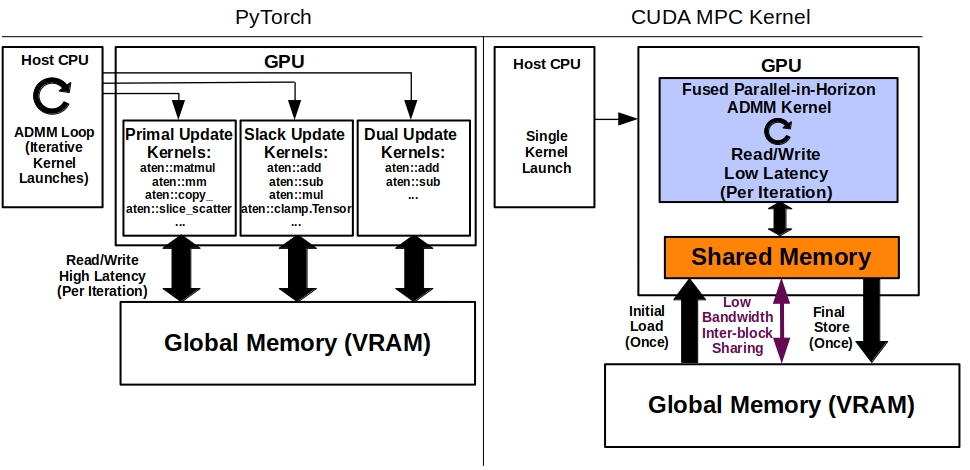

# CudaMPC：把实时模型预测控制压进一个持久化 CUDA Kernel

模型预测控制（Model Predictive Control，MPC）的基本循环并不复杂：读取当前状态，向未来滚动一个有限时间域，求解带动力学与约束的优化问题，只执行控制序列的第一步，然后在下一个采样时刻重新求解。真正困难的是时间预算。机器人、无人机和车辆的控制周期往往只有几十到几百毫秒，而长预测时间域、高维状态和碰撞约束会迅速放大在线优化成本。

GPU 看起来天然适合这个问题，但“把矩阵运算放到 GPU 上”并不自动等于低延迟。若一次 ADMM 迭代仍由 PyTorch/JAX 层发起很多细碎算子，主机调度、kernel launch 和中间变量反复进出全局显存，可能比真正的数值计算更贵。CudaMPC 论文的核心贡献正是重新划分边界：它不是把传统 MPC 求解器搬上 GPU，而是让算法分解、CUDA 执行模型和存储层次共同决定求解器的形态。

> **图源与许可：** Babak Akbari、Melissa Greeff，*CUDA MPC: A GPU-Native Solver for Model Predictive Control*，Figure 1，arXiv:2608.03051v1。图片取自[论文 HTML 版](https://arxiv.org/html/2608.03051v1)，依据 [CC BY 4.0](https://creativecommons.org/licenses/by/4.0/) 许可复用。原图左侧展示框架级多 kernel 执行与每轮 VRAM 读写，右侧展示 CudaMPC 的单次 kernel 启动、共享内存常驻迭代及仅在首尾访问全局显存的路径。

## MPC 为什么会卡在在线求解

有限时间域非线性 MPC 可以写成：在预测步 `k=0...N` 上寻找状态 `x_k` 和控制量 `u_k`，使阶段代价与终端代价之和最小，同时满足初始状态、系统动力学、状态约束和输入约束。每个控制周期只应用求得的第一个控制量，然后根据新观测滚动时间域再次优化。

预测时间域越长，控制器看得越远，更有机会提前绕开障碍、协调多智能体或处理慢动态；代价是变量和约束数量随 `N` 增长。CPU 求解器可以利用稀疏结构、Riccati 递推和二阶方法，但许多流程仍沿时间域前后扫描。对 10 Hz 控制环而言，一次求解必须稳定落在 100 ms 内，平均值快而 P99 偶尔超时同样会破坏闭环。

传统 GPU 加速常停在“线性代数卸载”这一层：矩阵乘、加法、投影分别变成 kernel，Python 或框架 runtime 负责串起迭代。这样做开发方便，但会产生三个固定成本：

1. 每轮 ADMM 包含多个小 kernel，重复 launch；
2. primal、consensus、dual 等中间变量跨 kernel 落入 VRAM；
3. CPU 仍参与迭代调度，设备很难形成真正自包含的控制流。

当单个阶段问题不大、计算量不足以摊薄调度开销时，GPU 的峰值 FLOPS 并不是决定性指标。此时优化目标更接近“减少数据移动和同步次数”，而不是继续增加算术并行度。

## 第一层设计：把预测时间域拆成可并行的局部问题

CudaMPC 采用 sequential convex programming（SCP）处理非线性动力学与非凸约束：外层围绕上一条轨迹做局部线性化，得到一系列凸子问题；内层再用 parallel-in-horizon ADMM 求解。

关键是 ADMM 的 consensus splitting。系统为相邻预测阶段引入局部副本与一致性约束，使每个阶段或一小段 sub-horizon 可以独立更新 primal、consensus 和 dual 变量，仅在边界处与邻居交换状态。这样，原本沿整个时间域传播的依赖，被改造成局部计算加最近邻通信。

这种算法重写比“把现有 for-loop 换成 CUDA”更重要。CUDA block 之间没有廉价、任意的细粒度同步；如果算法每一步都要求全时间域 barrier，时间域越长，最慢 block 对全局的拖累越明显。局部依赖则能自然映射为：

- 一个 CUDA block 负责连续的 `M` 个预测阶段；
- block 内线程合作更新局部变量；
- block 内通过 `__syncthreads()` 协作；
- 只有 sub-horizon 边界经 global memory 与相邻 block 交换。

这里的经验非常通用：GPU 优化不应只问“哪个算子能并行”，还应问“能否改变数值分解，让通信拓扑与硬件层次一致”。

## 第二层设计：把整个 ADMM 内循环融合进一个 kernel

PyTorch 路径中，primal update、slack/consensus update 和 dual update 往往对应多组算子。即使它们都在 GPU 上，每轮仍会形成一串 kernel launch。CudaMPC 则使用 `cudaLaunchCooperativeKernel` 启动融合 kernel，让所有 solver blocks 在 residency 允许的范围内同时驻留，并在设备端完成预定的 ADMM 迭代。

这带来两项直接收益。

第一，host 不再介入每次内层迭代。CPU 只负责准备问题并发起求解，迭代控制流留在 GPU 上。对于求解规模不大但控制频率高的场景，这能消除大量固定 launch latency。

第二，kernel 边界不再强迫中间变量写回 VRAM。融合后，变量的生命周期可以横跨多次 ADMM 更新，为共享内存常驻创造条件。

论文在 AFTI-16 线性飞机模型上用同一种 parallel-in-horizon ADMM 对比不同实现，尽量隔离执行架构的影响。在 `N=1000` 时，融合方案把 inner-ADMM 的 kernel launch 从 **172,456 次降到 11 次**，VRAM 流量从 **17.42 GB 降到 31.2 MB**，平均单次迭代从 **0.86 ms 降到 0.0060 ms**。相对 PyTorch/Julia 框架实现，论文报告的峰值加速为 **965×（N=50）**；这更像是对“框架调度与全局内存往返有多贵”的量化，而不能简单外推为对所有 MPC 求解器的 965 倍提升。

## 第三层设计：用共享内存换低 occupancy

CudaMPC 在 kernel 初始化阶段，把每个 sub-horizon 的系统矩阵、轨迹以及 primal/consensus/dual 变量协作加载到 shared memory。求解过程中，大部分中间量都留在片上；global memory 主要承担初始加载、最终写回和 block 边界交换。

这与 FlashAttention 的 I/O-aware 思路相似：速度不只来自更多计算单元，而来自减少慢速存储层之间的往返。但这里有一个看似反直觉的结果：论文中的持久化 kernel occupancy 只有 **13.4%**，并且由于共享内存占用，每个 SM 只驻留一个 block。

低 occupancy 并不必然等于低性能。Occupancy 是隐藏延迟的一种手段，不是最终目标。CudaMPC 面对的是延迟敏感的单次求解；如果提高 occupancy 需要把工作集溢出到 VRAM、增加 kernel 边界或重复加载，更多活跃 warps 反而可能更慢。论文选择让一个 block 尽可能多地保留本地时间域数据，以牺牲并发 residency 换取较少的 I/O。

工程上，局部时间域长度 `M` 受两个上限共同约束：每个 block 的最大线程数，以及每个阶段工作集占用的 shared memory。状态维度增大时，单阶段 footprint 变大，`M` 变小、block 数增加、边界交换随之增多。如果单个阶段的状态已经放不进 shared memory，这套 block-resident 设计便不再适用。

## 邻居原子同步：避免每轮全网格 barrier

时间域被分到多个 block 后，边界状态仍需保持动力学一致。如果每次 primal 和 consensus 更新后都调用 `grid.sync()`，所有 block 会被最慢者拖住，而且同步成本随 block 数增加。

CudaMPC 改用 pairwise atomic flags：每个 block 在 primal 更新和 consensus 更新后分别推进阶段计数器，只等待左右相邻 block 的对应计数，而不是等待整个 grid。因为依赖关系本来就局限于相邻时间段，这种协议让协调成本不直接随总 block 数增长。

代价是算法变为部分异步。边界变量在同步点前交换，一个 block 最多可能读到邻居上一轮的值，即 delay bound 为 1。论文将其解释为有界延迟的 asynchronous ADMM，而不是严格同步的 ADMM。这个细节很关键：高性能实现没有假装硬件同步是免费的，而是把允许的执行松弛写回算法模型。

对其他 GPU 科学计算问题也有相同启发：若数值方法允许 bounded staleness、局部松弛或异步收敛，就可能用算法容忍度换掉昂贵的全局 barrier。

## 实验结果应该怎样阅读

论文在 Intel Core i7-12700H、16 GB RAM 和 NVIDIA RTX 3060 Laptop GPU 6 GB 上评测六类非线性机器人问题，包括 Pendulum、Cart-Pole、Car Parking、Truck-Trailer、Quadcopter-Pole 和 10-agent Centralized Swarm。

在短时间域、低维且约束稀疏的问题上，CPU 二阶方法依然有竞争力，甚至可能以更短时间域获得相近或更好的闭环误差。CudaMPC 的优势主要随预测时间域和约束复杂度增长：

- Pendulum 相对次快求解器的加速从 `N=50` 的 1.9× 增至 `N=1000` 的 20.1×；
- Cart-Pole 从 1.1× 增至 10.1×；
- Car Parking 在 `N=100` 时为 5.75 ms，而 acados 为 165.71 ms；
- 10-agent swarm 在 `N=100`、100 ms 采样周期下平均求解 28.22 ms，并显式满足成对碰撞约束。

长时间域带来的不只是 benchmark 数字。Car Parking 案例能够在 0.1 s 采样周期内规划约 100 s 的前视范围，从而把碰撞规避直接放进 receding-horizon optimization；多智能体案例则说明，当长前视和复杂硬约束同时存在时，实时可行的时间域长度会改变控制器能够解决的问题类别。

不过，这些结果需要谨慎解释。不同求解器使用不同算法和停止条件，不能把所有速度差都归因于 CUDA kernel；论文也明确把同 ADMM 分解的 PyTorch/Julia 对比与跨求解器对比分开。对生产系统而言，闭环稳定性、最坏执行时间、数值精度和 infeasibility 处理至少和均值延迟同样重要。

## 对 CUDA 工程的五点启发

### 1. 先找固定开销，再谈峰值算力

如果 Nsight Systems 显示大量短 kernel、空隙和重复 memcpy，瓶颈可能是调度与数据移动，而非 SM 算力。此时 fusion、persistent kernel 或 CUDA Graph 往往比微调单个算子更重要。

### 2. 数据生命周期决定存储层次

只在一个算子内使用的变量适合寄存器；跨多步局部迭代复用的工作集适合 shared memory；只有跨 block 边界或最终结果才需要 global memory。先画出变量生命周期，再决定 layout，比看到数组就直接放 VRAM 更有效。

### 3. Occupancy 不是 KPI

需要关注的是 solve latency、memory traffic、stall reason 和有效吞吐。共享内存常驻导致的低 occupancy 可能是正确选择，只要它减少了更昂贵的全局访问和 launch。

### 4. 同步范围必须与依赖范围匹配

最近邻依赖不应默认使用全网格 barrier。可以评估 atomic epoch、ring/halo exchange、cooperative groups 或异步迭代，但必须证明内存可见性和收敛条件。

### 5. Kernel fusion 也有边界

巨型 kernel 会增加寄存器压力、shared memory 压力、编译复杂度和 watchdog 风险，也降低中间步骤的可观测性。若问题规模、状态维度或分支差异过大，拆分 kernel 或使用 CUDA Graph 可能更稳。最佳粒度应由 profile 和实时 deadline 决定。

## 如果要在真实机器人上落地

CudaMPC 目前展示的是算法与 GPU 执行协同设计的潜力，但离安全关键部署仍有几层工程工作：

1. **最坏时间分析**：控制系统关心 deadline miss，而不只是平均 solve time；需要报告尾延迟、冷启动和不同 GPU 负载下的抖动。
2. **数值与收敛保护**：固定迭代数、部分异步边界和低精度计算需要 residual 监控、超时降级与安全控制器兜底。
3. **资源隔离**：持久化 cooperative kernel 可能长时间占据 SM 和 shared memory；与感知、规划、神经网络推理共卡时，需要 stream priority、MPS/MIG 或独占策略。
4. **硬件迁移**：不同 GPU 的 shared memory、cooperative launch residency 和 watchdog 条件不同，`M` 与 grid 配置必须重新 autotune。
5. **端到端集成**：论文不计一次性 JIT/graph capture，但实际系统还要考虑传感器输入、状态估计、CPU-GPU 数据通路和控制输出。

## 局限与开放问题

截至本文撰写时，这项工作是 arXiv v1 预印本。论文注明代码将在接收后发布，因此暂时无法独立复现实验。评测只覆盖一台 RTX 3060 Laptop GPU；尚不清楚在 Jetson、数据中心 GPU、新一代大 shared-memory 架构或与其他 workload 共存时，结果会如何变化。

算法上，shared-memory-resident 设计偏爱单阶段工作集较小、预测时间域较长的问题。高维接触动力学、超大约束集或复杂稠密模型可能很快碰到 shared memory 上限。部分异步 ADMM 的有界延迟虽然有理论依据，但实际收敛速度、数值鲁棒性和不同问题条件数之间仍需要更系统的实验。

此外，“实时可行”不等于“控制效果最优”。CPU 二阶法在部分简单任务上以短时间域取得了很好的闭环效果，说明更长 horizon 的价值取决于系统动力学、约束复杂度和局部收敛质量。GPU-native solver 应当扩大可选设计空间，而不是把所有控制问题统一成一种算法。

## 小结

CudaMPC 最值得关注的并不是某个夸张加速数字，而是它展示了一条完整的 GPU 科学计算方法论：先用 parallel-in-horizon ADMM 改写依赖结构，再把时间段映射到 CUDA blocks，用单个 cooperative kernel 留住设备端控制流，用 shared memory 留住迭代工作集，最后用邻居原子协议把同步范围压到依赖范围。

这套组合说明，真正的 GPU-native 不是“代码能在 CUDA 上跑”，而是算法、执行与内存三层都接受硬件约束。对优化器、PDE 求解、图计算和迭代线性代数而言，同样可以追问：能否把全局依赖变成局部依赖？能否让迭代跨 kernel 边界融合？能否用更少 occupancy 换取更少 I/O？这些问题往往比简单的线程数调优更接近性能根因。

## 参考资料

- Babak Akbari, Melissa Greeff. *CUDA MPC: A GPU-Native Solver for Model Predictive Control*. arXiv:2608.03051v1, 2026. <https://arxiv.org/abs/2608.03051>
- 论文 HTML 版与 Figure 1：<https://arxiv.org/html/2608.03051v1>
- Lin Wu et al. *πMPC: A Parallel-in-Horizon and Construction-Free NMPC Solver*. arXiv:2601.14414, 2026. <https://arxiv.org/abs/2601.14414>
- Stephen Boyd et al. *Distributed Optimization and Statistical Learning via the Alternating Direction Method of Multipliers*. Foundations and Trends in Machine Learning, 2011. <https://web.stanford.edu/~boyd/papers/admm_distr_stats.html>
- NVIDIA CUDA C Programming Guide — Cooperative Groups. <https://docs.nvidia.com/cuda/cuda-c-programming-guide/#cooperative-groups>
