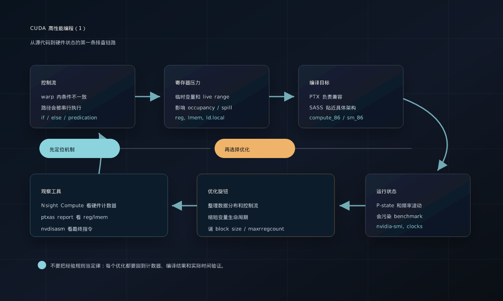

# CUDA 高性能编程（1）：从分支发散、寄存器到编译目标

CUDA 优化很容易被讲成一组零散技巧：少写 `if`、少用变量、调 block size、打开某个编译选项。但真正写 kernel 时，更重要的是理解这些现象背后的执行模型：GPU 不是 32 个线程随意各跑各的，而是以 warp 为基本执行单位；寄存器不是无限的，变量太多会挤到更慢的内存层级；编译出来的设备代码也不是一种形态，PTX 和 SASS 对兼容性、确定性和性能分析都有不同影响。

这篇是 CUDA 高性能编程系列的第一篇，先从四个基础但很常见的问题开始：分支发散、寄存器压力、PTX/SASS 编译目标，以及 NVIDIA GPU 的 P-state。



*图源：本站自绘重构图，参考文末论文、官方文档或项目资料绘制，用于突出文章主线和关键机制。*

这张图不是直接搬运论文截图，而是按本文讲解顺序重新整理的阅读图：先给出系统边界，再标出核心数据流、控制路径和性能瓶颈。后文会围绕这些节点逐层展开，从问题动机进入实现机制，再讨论工程取舍和适用场景。

## 1. if-else 为什么可能让 warp 变慢

先保留一个直观比喻：一个 warp 有 32 个线程，如果前 16 个线程走路径 A，后 16 个线程走路径 B，那么 GPU 没法在同一时刻让一半线程做加法、另一半线程做乘法。它更像是让同一个班级听同一个口令：先执行 A 路径，需要 B 的线程暂时不动；再执行 B 路径，需要 A 的线程暂时不动。两条路径都跑完后，warp 再汇合。

这就是 warp 内分支发散。它影响性能的原因不是 `if-else` 这个语法本身慢，而是**同一个 warp 内的线程走了不同控制流路径**。如果一个 warp 里的 32 个线程条件判断结果一致，那么它们仍然只走同一条路径，通常不会产生这种串行化成本。对于很短的分支，编译器还可能使用 predication，把分支变成带谓词的指令执行，实际影响也会不同。

一个典型例子如下：

```cuda
__global__ void branch_example(float *out, const float *x, const float *y, int n) {
    int i = blockIdx.x * blockDim.x + threadIdx.x;
    if (i >= n) {
        return;
    }

    // 如果同一个 warp 内有些 i 为偶数、有些 i 为奇数，就会产生分支发散。
    if ((i & 1) == 0) {
        out[i] = x[i] + y[i];
    } else {
        out[i] = x[i] * y[i];
    }
}
```

这个 kernel 的条件是 `i & 1`，相邻线程通常一半走加法、一半走乘法，所以每个 warp 内会高度发散。相比之下，如果条件是按大块数据划分，例如前半个数组走 A、后半个数组走 B，那么只有边界附近的少数 warp 可能发散，其他 warp 内部条件一致，代价就小很多。

### 如何观察和排查

可以从三个层面看：

- 用 Nsight Compute 看 branch efficiency、warp execution efficiency，以及 source view 里对应分支的执行情况。
- 用 `nvdisasm` 或 Nsight Compute 的 SASS 视图看编译器是否真的生成了分支，还是把短分支转换成了 predicated instruction。
- 用 microbenchmark 对比不同数据分布：随机条件、按 warp 对齐条件、按 block 对齐条件，通常能很快看出性能差异来自哪里。

### 如何优化

常见优化方向是让同一个 warp 内的线程尽量走同一路径：

- 调整数据布局或任务分配，把相同分支的数据聚在一起。
- 把严重分歧的任务拆成多个 kernel 或多个队列，分别处理不同路径。
- 对很短的分支，尝试用条件表达式或算术变换减少控制流，但要看编译结果和指令数量。
- 避免为了消灭一个小分支引入更多全局内存访问、同步或复杂调度。

容易踩的坑是把“少写 `if`”当成绝对规则。真正要避免的是 warp 内控制流分裂，并且要看分支体长度、数据分布、编译器 predication 和实际硬件计数器。

## 2. 寄存器不够时，变量会掉到 local memory

矩阵乘法、卷积、stencil 这类 kernel 中，每个线程经常会保存多个中间变量。理想情况下，这些临时值放在寄存器里，访问很快。但每个 SM 的寄存器文件是有限资源：每个线程用得越多，同一时间能驻留的 warp 或 block 就可能越少；如果编译器发现寄存器放不下，还可能把某些变量 spill 到 local memory。

这里的 “local” 很容易误导。CUDA 文档里的 local memory 不是离线程很近的一小块高速缓存，它的作用域是线程私有，但物理上位于片外内存路径上，访问成本接近 global memory，并且会受缓存、访存模式和带宽影响。如果频繁访问的中间变量被 spill 到 local memory，kernel 可能从计算受限变成访存受限。

可以用一个简化的矩阵乘法片段理解寄存器压力：

```cuda
__global__ void matmul_tiny_tile(float *c, const float *a, const float *b, int n) {
    int row = blockIdx.y * blockDim.y + threadIdx.y;
    int col = blockIdx.x * blockDim.x + threadIdx.x;

    float acc0 = 0.0f;
    float acc1 = 0.0f;
    float acc2 = 0.0f;
    float acc3 = 0.0f;

    for (int k = 0; k < n; ++k) {
        float av = a[row * n + k];
        float bv = b[k * n + col];
        acc0 += av * bv;
        acc1 += av * (bv + 1.0f);
        acc2 += (av + 1.0f) * bv;
        acc3 += (av - 1.0f) * (bv - 1.0f);
    }

    if (row < n && col < n) {
        c[row * n + col] = acc0 + 0.01f * (acc1 + acc2 + acc3);
    }
}
```

真实的高性能 GEMM 会用 shared memory、寄存器 tiling、向量化加载和更复杂的调度。这里的重点只是：每个线程保存的 accumulator、临时加载值、地址计算变量越多，寄存器需求就越高。变量多不一定错，但必须确认它们没有把 occupancy 和 spill 推到糟糕的位置。

### 如何观察和排查

最直接的第一步是让 `ptxas` 输出每个 kernel 的资源使用：

```bash
nvcc -O3 --ptxas-options=-v -arch=sm_86 kernel.cu -o kernel
```

输出里要重点看 `reg` 和 `lmem`。`reg` 是每线程寄存器数量，`lmem` 是 local memory 使用量。还可以用：

```bash
nvcc -O3 -keep -arch=sm_86 kernel.cu
```

然后检查生成的 PTX 是否出现 `.local`、`ld.local`、`st.local`。不过要注意，最终寄存器分配发生在面向具体架构的后端阶段，PTX 里没有看到 local memory，也不代表最终 SASS 一定没有 spill。更可靠的做法是结合 ptxas report、Nsight Compute 的 local memory 指标和 occupancy 信息一起判断。

### 如何优化

优化寄存器压力时，不要只盯着“变量个数”，要盯着 live range，也就是某个值从生成到最后一次使用之间占着寄存器多久：

- 删除不必要的临时变量，或者把只用一次的表达式合并。
- 复用中间变量，缩短变量生命周期，让编译器更容易回收寄存器。
- 调整线程块大小。更大的 block 不一定更快，可能让寄存器、shared memory 或调度资源成为限制。
- 适当降低每线程 tile 大小，少做一点寄存器 tiling，换取更高 occupancy。
- 用 Nsight Compute 看 achieved occupancy、eligible warps、local load/store、memory throughput，判断瓶颈是否真的来自寄存器压力。

`-maxrregcount=N` 可以限制每线程最多使用多少寄存器，例如：

```bash
nvcc -O3 -arch=sm_86 -maxrregcount=64 --ptxas-options=-v kernel.cu -o kernel
```

但它不是万能优化。限制寄存器可能提升 occupancy，也可能迫使编译器把更多变量 spill 到 local memory，最后更慢。正确用法是把它当成实验旋钮：每次改一个值，记录 ptxas 的 `reg/lmem`、Nsight Compute 的 occupancy 和实际 kernel 时间。

## 3. PTX 和 SASS：兼容性与确定性的取舍

`nvcc` 生成设备代码时，常见两类形态是 PTX 和 cubin/SASS。

PTX 可以理解为 NVIDIA GPU 的中间表示。它不是某一张具体 GPU 的最终机器码，而是面向虚拟架构的指令表示。好处是兼容性好：程序可以携带 PTX，运行时由驱动 JIT 编译到当前 GPU 的实际架构。代价是首次运行可能有 JIT 开销，并且最终机器码会受到驱动版本、目标 GPU 和 JIT 后端影响。

SASS 是具体 GPU 架构上的低级机器码，通常封装在 cubin 里。它针对特定 `sm_XX` 架构生成，例如：

```bash
nvcc -O3 -arch=sm_86 kernel.cu -o kernel
```

这里 `sm_86` 表示生成面向 Ampere 某类实际架构的设备代码。SASS 的优点是性能更确定、部署时不依赖运行时 JIT 生成同一段核心机器码，也便于用 `nvdisasm` 做底层分析。缺点是和架构绑定，发给不兼容的 GPU 就不能直接运行。

实际工程里经常会同时放入多个 code image：给当前主要部署架构准备 SASS，再额外带上 PTX 作为未来架构的 forward compatibility fallback。例如：

```bash
nvcc -O3 kernel.cu \
  --generate-code arch=compute_86,code=sm_86 \
  --generate-code arch=compute_86,code=compute_86
```

容易踩的坑有两个。第一，只放很老的 PTX 可能错过新架构特性；第二，只放某个 `sm_XX` 的 cubin 会让程序在其他 GPU 上失去兼容性。做性能分析时也要说清楚自己测的是哪一种路径：运行的是已经编好的 SASS，还是驱动从 PTX JIT 出来的代码。

## 4. P-state：先确认 GPU 是否真的在高性能状态

P-state 是 NVIDIA GPU 的性能状态等级，和核心频率、显存频率、电压、功耗策略有关。`nvidia-smi` 文档把 Performance State 描述为从 P0 到 P12 的范围，其中 P0 通常是最高性能状态，数字越大越偏向低功耗状态。

观察方式很简单：

```bash
nvidia-smi --query-gpu=name,pstate,clocks.sm,clocks.mem,power.draw,temperature.gpu --format=csv
```

做 benchmark 时，如果 GPU 长时间停在较低性能状态，或者频率因为温度、功耗、电源策略发生波动，那么 kernel 时间会混入硬件状态变化的影响。尤其是短 kernel、首次运行、桌面环境共享 GPU、笔记本独显和云主机限功耗场景，都可能让数据不稳定。

优化 CUDA 代码前，至少要确认：

- 是否做了 warm-up，排除了首次 JIT、缓存冷启动、GPU 升频延迟。
- benchmark 期间 `pstate`、SM clock、memory clock 是否稳定。
- 是否触发了 thermal throttling、power limit 或应用时钟限制。
- 多次运行的方差是否足够小。

P0 不等于“一定最快”，因为现代 GPU 还有 boost、功耗墙、温度墙、应用时钟等机制；但 P-state 是一个很好的信号，能提醒你不要把硬件频率变化误判为 kernel 优化效果。

## 小结：先定位机制，再选择优化旋钮

这一章可以归纳成四句话：

- `if-else` 不一定慢，慢的是同一个 warp 内线程走不同路径导致控制流串行化。
- 寄存器是高性能 kernel 的关键资源，过多临时变量可能降低 occupancy 或引发 local memory spill。
- PTX 偏兼容，SASS/cubin 偏确定和贴近硬件，部署与分析时要知道自己运行的是哪条路径。
- P-state 和频率会影响 benchmark 结果，做优化前要先保证观测环境稳定。

真正的 CUDA 优化不是把某条经验规则套到所有 kernel 上，而是建立一条排查链路：看执行模型、看编译结果、看硬件计数器，再决定要改控制流、改变量生命周期、改 block 配置，还是改编译目标。

## 参考资料

- NVIDIA CUDA C++ Programming Guide: SIMT Architecture. <https://docs.nvidia.com/cuda/cuda-c-programming-guide/index.html#simt-architecture>
- NVIDIA CUDA C++ Best Practices Guide: Local Memory, Registers, Occupancy. <https://docs.nvidia.com/cuda/cuda-c-best-practices-guide/index.html>
- NVIDIA CUDA Compiler Driver NVCC Documentation. <https://docs.nvidia.com/cuda/cuda-compiler-driver-nvcc/index.html>
- NVIDIA System Management Interface Documentation. <https://docs.nvidia.com/deploy/nvidia-smi/index.html>
- NVIDIA Nsight Compute Documentation. <https://docs.nvidia.com/nsight-compute/>
