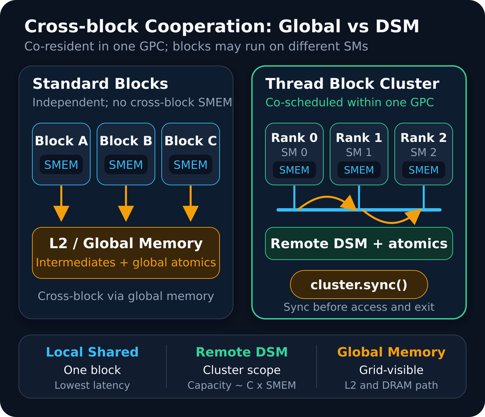

# CUDA Thread Block Clusters：跨 SM 协作与 Distributed Shared Memory

CUDA 长期把 thread block 作为可独立调度的基本单元：一个 block 的线程在同一 SM 上执行，可以通过 shared memory 交换数据并用 `__syncthreads()` 同步；不同 block 则必须假设彼此可能以任意顺序落到任意 SM。这个模型让硬件容易扩展，却也把许多算法的局部协作边界锁在单个 block 内。

当多个 block 需要反复交换中间结果时，传统实现通常只有三条路：把状态写入 global memory 并使用 atomics；拆成多个 kernel，利用 kernel 边界获得 grid 级完成保证；或采用 cooperative launch，让整个 grid 同驻并执行 grid barrier。前两种方案增加显存流量或 launch 开销，最后一种方案的同步与 residency 范围又可能过大。

从 compute capability 9.0 开始，CUDA 引入 **Thread Block Cluster**：一组 block 被保证并发调度在同一个 GPU Processing Cluster（GPC）中。cluster 内 block 可以执行 cluster 级同步，并访问彼此的 shared-memory segment，这个聚合地址空间称为 **Distributed Shared Memory（DSM）**。它填补了“单 block shared memory”和“整个 grid/global memory”之间的层次，但不是免费放大的 shared memory。



> **图源与许可：** 本站自绘，依据 NVIDIA [CUDA Programming Guide 的 Thread Block Clusters](https://docs.nvidia.com/cuda/cuda-programming-guide/01-introduction/programming-model.html#thread-block-clusters)、[Distributed Shared Memory](https://docs.nvidia.com/cuda/cuda-programming-guide/02-basics/writing-cuda-kernels.html#distributed-shared-memory) 与 [Hopper Tuning Guide](https://docs.nvidia.com/cuda/hopper-tuning-guide/index.html#thread-block-clusters) 的执行和内存语义整理。原创站点内容；未复用或描摹第三方图像。

## 为什么 block 边界会成为算法边界

一个普通 block 拥有三个重要保证：

1. block 内线程共同驻留在一个 SM；
2. block 内线程可访问同一个 shared-memory segment；
3. `__syncthreads()` 可以建立 block 范围的执行与内存顺序。

这些保证不会自然扩展到其他 block。即使两个 block 恰好同时驻留，它们也没有可移植的方式确认彼此位置，更不能把一个普通 shared-memory 指针直接交给对方。于是，跨 block 的 histogram、归约、halo exchange 或生产者—消费者流水通常要把中间状态放进 global memory。

这种做法并不总是慢。L2 缓存、合并访问以及足够大的工作量可以很好地摊薄 global memory 成本。问题出现在协作具有以下特征时：

- 数据只在邻近 block 之间复用，却被迫进入全局地址空间；
- 热点 atomic 在少数 global counters 上高度冲突；
- 为获得全局可见性而增加额外 kernel；
- 单 block shared memory 装不下局部工作集，但若把少量 block 的容量合并便足够。

Thread Block Cluster 面向的正是这段中间地带。它不把整个 grid 变成一个同步域，而是为一小组 block 提供更强的共驻和通信语义。

## Cluster 改变了哪些执行保证

cluster 是 grid 内的层级，原有 `blockIdx`、`threadIdx` 和 grid 组织方式仍然存在。新增的是三个约束：

- cluster 内所有 block 被保证**并发调度**；
- 它们位于同一个 GPC，但不意味着位于同一个 SM；
- cluster group 提供 cluster rank、cluster size、barrier 和 DSM 地址映射。

“同一 GPC 共驻”尤其不能写成“所有 block 在同一 SM”。cluster 的价值恰恰在于让分布于多个 SM 的 block 以受控方式协作。

CUDA 提供编译期和运行期两种 cluster dimension 指定方式。固定形状可直接标注 kernel：

```cpp
#include <cooperative_groups.h>
namespace cg = cooperative_groups;

__global__ __cluster_dims__(4, 1, 1)
void clustered_kernel(float *out) {
    cg::cluster_group cluster = cg::this_cluster();
    unsigned rank = cluster.block_rank();
    unsigned blocks = cluster.num_blocks();

    // cluster 内通信前，先让所有 block 完成初始化。
    cluster.sync();

    // ... 使用 rank / blocks 组织协作 ...

    // 在任何 block 退出前结束所有 DSM 访问。
    cluster.sync();
}
```

若 cluster size 需要运行时调优，可以通过 `cudaLaunchKernelEx` 和 `cudaLaunchAttributeClusterDimension` 设置：

```cpp
cudaLaunchConfig_t config{};
config.gridDim = dim3(grid_x);
config.blockDim = dim3(block_x);
config.dynamicSmemBytes = dynamic_smem_bytes;

cudaLaunchAttribute attr{};
attr.id = cudaLaunchAttributeClusterDimension;
attr.val.clusterDim.x = cluster_x;
attr.val.clusterDim.y = 1;
attr.val.clusterDim.z = 1;

config.attrs = &attr;
config.numAttrs = 1;

cudaError_t err = cudaLaunchKernelEx(
    &config, clustered_kernel, output);
if (err != cudaSuccess) {
    // 记录错误并切换到普通 kernel fallback。
}
```

每个 grid 维度都必须能被对应的 cluster 维度整除。可移植 cluster size 的 block 总数上限是 8；某些设备允许更大的非便携配置，但必须显式选择并查询设备能力。MIG 配置也可能改变可用上限，因此不能把某台 H100 上可运行的尺寸硬编码为普遍事实。

## DSM：聚合地址空间，不是统一缓存池

cluster 中每个 block 仍然只分配自己的 local shared-memory segment。DSM 把这些 segment 组成一个 cluster 可寻址集合：本 block 访问自己的 segment 是 local shared-memory access；访问其他 rank 的 segment 是 remote DSM access。

Cooperative Groups 的 `map_shared_rank()` 用目标 block rank 将一个本地 shared-memory 地址映射到对应远端 segment。概念上可以写成：

```cpp
extern __shared__ unsigned bins[];

cg::cluster_group cluster = cg::this_cluster();
unsigned dst_rank = bin_owner;
unsigned *remote_bins = cluster.map_shared_rank(bins, dst_rank);
atomicAdd(&remote_bins[local_bin], 1u);
```

这里有三个容易忽略的 correctness 条件。

### 1. 指针偏移必须在每个 block 的 shared-memory 布局内有效

`map_shared_rank(bins, r)` 映射的是“目标 rank 中与 `bins` 相同偏移的位置”。它不会替程序检查数组长度，也不会自动把任意全局指针变成 DSM 指针。所有 block 应采用一致、可推导的 shared-memory layout。

### 2. 远端访问前必须完成 cluster 初始化

若一个 block 已经开始 remote load/store/atomic，而目标 block 尚未完成 shared-memory 初始化，结果就存在竞争。初始化本地 segment 后执行一次 `cluster.sync()`，可建立清晰的开始边界。

### 3. 任何 block 退出前必须结束全部远端访问

DSM 的生命周期依赖 cluster 中所有 block 仍然存在。某个 block 提前 return，其他 block 随后访问它的 shared-memory segment，会破坏程序语义。常见结构是在 remote access 阶段后再次 `cluster.sync()`，再允许 block 写回并退出。分支也必须保证 cluster barrier 对所有成员可达。

这些规则使 DSM 更像“带显式生命周期的分布式 scratchpad”，而不是透明一致的共享缓存。

## 贯穿示例：把 global-atomic histogram 改造成 cluster-local histogram

考虑 bins 数量超过单 block shared memory、输入又高度偏斜的 histogram。普通方案让每个元素直接 `atomicAdd` 到 global bins；热点分布会使大量线程争用同一地址。另一种 two-pass 方案先生成 block-private histograms，再由第二个 kernel 合并，但会增加全局中间结果和一次 launch。

cluster 方案可以把 bins 分片到多个 block 的 shared-memory segment：

1. 每个 block 清零自己负责的 local bins；
2. `cluster.sync()`，确认整个 DSM histogram 已初始化；
3. 根据 `global_bin / bins_per_block` 计算 owner rank；
4. 通过 `map_shared_rank()` 定位目标 segment；
5. 对目标地址执行 local 或 remote DSM atomic；
6. `cluster.sync()`，确保没有 block 仍在更新；
7. 每个 block 仅把自己负责的分片合并到 global output。

关键路径可概括为：

```cpp
template <int ClusterBlocks>
__global__ __cluster_dims__(ClusterBlocks, 1, 1)
void histogram_cluster(const unsigned *input,
                       size_t count,
                       unsigned *global_bins,
                       unsigned bins_per_block) {
    extern __shared__ unsigned local_bins[];
    cg::cluster_group cluster = cg::this_cluster();
    const unsigned rank = cluster.block_rank();

    for (unsigned i = threadIdx.x; i < bins_per_block; i += blockDim.x) {
        local_bins[i] = 0;
    }
    cluster.sync();

    for (size_t i = blockIdx.x * blockDim.x + threadIdx.x;
         i < count;
         i += size_t(gridDim.x) * blockDim.x) {
        const unsigned bin = input[i];
        const unsigned owner = bin / bins_per_block;
        const unsigned offset = bin % bins_per_block;

        if (owner < cluster.num_blocks()) {
            unsigned *target = cluster.map_shared_rank(local_bins, owner);
            atomicAdd(&target[offset], 1u);
        }
    }
    cluster.sync();

    for (unsigned i = threadIdx.x; i < bins_per_block; i += blockDim.x) {
        const unsigned global_bin = rank * bins_per_block + i;
        atomicAdd(&global_bins[global_bin], local_bins[i]);
    }
}
```

这段代码用于说明映射与同步结构，生产实现仍需处理 cluster 在 grid 中的分组：每个 cluster 都拥有独立 DSM histogram，输入划分、输出归并和尾部 bins 必须与 cluster rank 和 cluster ID 一致。若不同 cluster 最终写同一 global output，最后一步仍然需要 global atomics 或单独归并阶段。

DSM 并没有消灭 atomic，只是把一部分竞争从 global memory 热点移到 cluster 内的 shared-memory segments。若输入接近均匀、global atomics 已被 L2 高效处理，或者 remote DSM atomics 仍集中在一个 owner block，改造可能没有收益。

## 性能模型：什么时候 DSM 值得用

不应为 DSM 填入一个跨架构固定的“多少周期”数字。更稳妥的定性层次是：

```text
local shared access  <  remote DSM access  <  经 L2 / global memory 的跨 block 往返
```

这只是建模起点，不是对所有访问模式的绝对排序。一个 cluster kernel 的每元素成本可粗略拆成：

```text
T_cluster ≈ T_local
          + p_remote × T_remote_DSM
          + T_cluster_barrier / useful_work
          + T_final_global_write
```

普通方案则可能包含：

```text
T_baseline ≈ T_global_load/store
           + T_global_atomic_contention
           + T_extra_kernel_launch
           + T_intermediate_materialization
```

只有当被移除的 global traffic、热点竞争或 kernel 边界大于 remote DSM 与 barrier 的新增成本时，cluster 才有机会获益。需要重点观察四个量。

### Remote 比例与访问形状

尽量让多数访问落在 local segment，把 DSM 用于真正需要跨 block 的少量边界或分片。若每个线程都随机访问远端 rank，cluster 内互连和远端 shared-memory bank/atomic 路径可能成为新瓶颈。连续、对齐且能形成规律分片的数据布局通常更易优化；32-byte 对齐是实用起点，但实际 transaction 与 bank 行为仍应由 profiler 验证。

### Cluster barrier 的摊销

`cluster.sync()` 比 block barrier 覆盖更大范围。每个 barrier 之间应有足够计算或数据复用；在短循环中高频调用，最慢 block 会反复拖住整个 cluster。不要为了“看起来同步安全”而在每个细小阶段都加 barrier，应先明确生产者、消费者和生命周期边界。

### Atomic contention 是否真正下降

把一个 global counter 机械搬到 DSM，若所有请求仍命中同一个 remote address，串行热点仍然存在。更有效的策略通常是先按 block、warp 或 rank 私有化，再进行树形或分层归并。

### 省掉了多少全局中间状态

DSM 最有吸引力的情况往往不是单次 load 更快，而是中间结果能在 cluster 生命周期内反复复用，最终只写回一次。若每个值只用一次，额外的映射和同步很难回本。

## 资源模型：容量增加，residency 也被绑定

设 cluster 含 `C` 个 blocks，每个 block 使用 `S` 字节 shared memory、`R` 个 registers/thread、`T` 个 threads。DSM 的逻辑容量约为 `C × S`，但硬件资源仍按每个 block 所在 SM 分配。cluster 必须让全部 `C` 个 blocks 同时可驻留，因此可用并行度受到以下条件共同约束：

- 每个 SM 的 blocks、warps、threads 上限；
- 每个 block 的 static + dynamic shared memory；
- registers footprint 与编译器分配粒度；
- 一个 GPC 内可用于共驻 cluster blocks 的 SM 与调度资源；
- 设备型号、MIG partition 和 nonportable cluster-size 支持。

增大 `C` 一方面扩大 DSM 容量并减少每个 block 负责的数据范围，另一方面也提高整组共驻门槛。增大 `S` 能留下更多局部状态，却可能让每个 SM 只能容纳一个 block。二者结合后，active clusters 数量可能骤降。

因此应在 launch 前调用 Runtime Occupancy API 查询，而不是只看传统 block occupancy。重点包括 `cudaOccupancyMaxPotentialClusterSize` 与 `cudaOccupancyMaxActiveClusters`：前者帮助确定给定 kernel/config 的可行 cluster size，后者估计某个 cluster 配置可同时驻留多少组。所有返回值都应检查，实际计数还需结合 profile 解释。

一个实用决策顺序是：

1. 先算单 block 工作集 `S`，确认 kernel 本身可启动；
2. 根据算法最小 DSM 容量得到候选 `C`；
3. 查询候选尺寸是否合法及 active clusters；
4. 检查 grid 是否能被 cluster dimensions 整除；
5. 扫描 `C={2,4,8}` 等少量候选，而不是默认越大越好；
6. 与非 cluster baseline 在同一输入和时钟条件下比较。

## Launch、架构与 fallback

Thread Block Clusters 要求 compute capability 9.0 或更高。工程代码至少应覆盖以下路径：

- 通过 `cudaGetDeviceProperties` 检查 capability；
- 查询 cluster launch 与目标 cluster size 是否受支持；
- 在运行期 launch 前验证 grid/cluster 整除关系；
- 检查 `cudaLaunchKernelEx` 的立即返回错误；
- 在适当位置调用 `cudaGetLastError` 和同步 API 捕获异步错误；
- 对不支持的设备、MIG 配置或资源组合切换普通 kernel；
- fallback 与 cluster 路径使用同一组 correctness tests。

编译期 `__cluster_dims__` 适合形状固定、模板化的 kernel；运行期属性适合 autotuning。两种方式不应对同一次 launch 给出互相冲突的 cluster dimension。

另一个常见误区是把 cluster barrier 当成 grid barrier。它只同步当前 cluster，grid 中其他 clusters 可以处于不同阶段。若算法最终仍要求全 grid 依赖，就需要 kernel 边界、cooperative grid synchronization，或重新设计分层归并。

## 可复现实验：不要只报告一个加速比

评估 DSM 应建立至少两条 baseline：

1. **global-atomic baseline**：直接对 global bins 或 counters 更新；
2. **two-pass baseline**：block-private 结果写入 global memory，再由第二个 kernel 归并。

cluster variant 与 baseline 必须产生逐项一致的结果。浮点归约还应定义容许误差，并区分数值顺序变化和真正错误。

建议扫描的维度包括：

- cluster size：1、2、4、8，以及设备允许时经显式 opt-in 的候选；
- 每 block dynamic shared memory；
- bins 或 tile 大小；
- 输入偏斜度与热点数量；
- block size、grid size 与每线程工作量；
- warm-up、重复次数和不同 GPU clocks/power state。

记录数据时至少包含 GPU 型号、MIG 状态、driver、CUDA Toolkit、编译参数、输入规模、均值与尾延迟。Nsight Systems 用来确认是否真的省掉 kernel 和 global-memory 阶段；Nsight Compute 则关注：

- achieved occupancy 与 active blocks/clusters；
- shared-memory 与 global-memory workload；
- atomic throughput 和热点；
- barrier/synchronization stalls；
- warp stall reasons；
- L2 traffic、DRAM bytes 与写回次数。

最重要的是先验证因果链：**global traffic 或 atomic pressure 是否下降，barrier/residency 成本是否可控，最终 kernel time 才是否改善。** 只看到 kernel 快了而没有对应的资源证据，很难判断结果能否迁移到其他输入。

## 局限与不适用场景

Thread Block Cluster 不是默认优化选项。以下情况通常应优先保留普通 block 或其他方案：

- 没有真实跨 block 数据复用，只是希望获得更大 shared memory；
- 工作集已经能装进单 block shared memory；
- 算法要求整个 grid 同步，而不是小组协作；
- remote DSM 访问高度随机且几乎没有 local 命中；
- 每 block registers/shared memory 已使 residency 很低；
- grid 很小或不规则，难以满足 cluster shape；
- 需要支持 Ampere 或更早 GPU，且维护双路径成本不可接受。

即使在 Hopper 上，L2 命中良好的 global-memory 方案也可能更简单、更快。cluster 带来的调试成本不可忽视：barrier 分支不一致、block 提前退出、remote pointer 越界和配置不整除都可能表现为挂起或间歇错误。

此外，portable cluster size 上限只是 API 可移植保证，不等同于性能推荐值。尺寸 8 可能减少 active clusters，尺寸 2 也可能已足够覆盖 halo 或局部归约。最终选择必须绑定具体 kernel 和设备。

## 实践检查表

### 正确性

- [ ] 目标 GPU 为 compute capability 9.0+，并有非 cluster fallback。
- [ ] grid 的每个维度可被对应 cluster dimension 整除。
- [ ] 所有 block 使用一致且不越界的 shared-memory layout。
- [ ] remote DSM 访问前，所有 segment 已初始化并执行 `cluster.sync()`。
- [ ] 任何 block 退出前，所有 DSM 访问已结束并完成 cluster 同步。
- [ ] 所有 cluster barrier 对 cluster 全体成员可达，没有分支失配。
- [ ] cluster ID、rank、尾部数据和最终 global 合并逻辑均有测试。
- [ ] 使用 Compute Sanitizer 覆盖竞态、越界与错误 launch。

### 资源与性能

- [ ] 记录每 block shared memory、registers、threads 和候选 cluster size。
- [ ] 用 cluster occupancy APIs 检查合法尺寸与 active clusters。
- [ ] 比较 global-atomic、two-pass 和 cluster 三条路径。
- [ ] 扫描数据偏斜、工作集大小和 local/remote DSM 比例。
- [ ] 用 profiler 证明 DRAM/L2 traffic 或 global atomic pressure 确实下降。
- [ ] 检查 barrier stalls 和 occupancy 损失是否抵消收益。
- [ ] 报告硬件、软件栈、MIG 状态、测量方法和结果误差。

### 可维护性

- [ ] 固定形状与运行时形状不会产生冲突。
- [ ] 所有 CUDA API 返回值都有处理。
- [ ] autotuning 结果按设备和 kernel 版本缓存，不跨设备盲用。
- [ ] fallback 与 cluster kernel 共用测试向量和结果校验。
- [ ] 代码注释明确 local shared、remote DSM 与 global memory 的区别。

## 小结

Thread Block Clusters 为 CUDA 增加了一个有用但严格受限的协作层级：一小组 block 被保证在同一 GPC 中共驻，通过 cluster barrier 管理阶段，并以 DSM 访问彼此的 shared-memory segment。它能减少某些 global-memory 中间结果、热点 atomics 和额外 kernel 边界，但代价是更强的同步义务和更紧的资源耦合。

正确的判断标准不是“DSM 比 global memory 快”，而是：算法是否存在 cluster 范围的真实复用；省掉的全局流量与同步是否大于 remote DSM 和 barrier 成本；cluster size 与每 block 资源是否仍保留足够 active clusters。先建立资源模型，再实现正确的生命周期，最后用 baseline 和 profiler 验证，这才是把 Thread Block Clusters 用成性能工具而不是复杂度来源的工程路径。

## 参考资料

- NVIDIA, **CUDA Programming Guide — Thread Block Clusters**：<https://docs.nvidia.com/cuda/cuda-programming-guide/01-introduction/programming-model.html#thread-block-clusters>
- NVIDIA, **CUDA Programming Guide — Distributed Shared Memory**：<https://docs.nvidia.com/cuda/cuda-programming-guide/02-basics/writing-cuda-kernels.html#distributed-shared-memory>
- NVIDIA, **CUDA Programming Guide — Launching Clusters**：<https://docs.nvidia.com/cuda/cuda-programming-guide/03-advanced/advanced-host-programming.html#launching-clusters>
- NVIDIA, **Hopper Tuning Guide — Thread Block Clusters**：<https://docs.nvidia.com/cuda/hopper-tuning-guide/index.html#thread-block-clusters>
- NVIDIA, **CUDA Runtime API — Occupancy**：<https://docs.nvidia.com/cuda/cuda-runtime-api/group__CUDART__OCCUPANCY.html>
- NVIDIA Technical Blog, **NVIDIA Hopper Architecture In-Depth**：<https://developer.nvidia.com/blog/nvidia-hopper-architecture-in-depth/>
