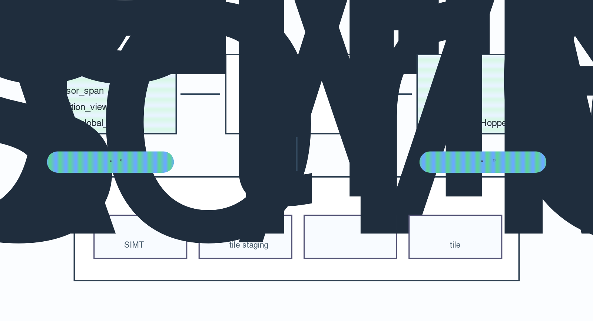

# CUDA Tile C++：把 Tensor Core Kernel 提升到 tile 级抽象

CUDA 编程长期以来的核心优势是“足够贴近硬件”。开发者能显式决定 block、thread、warp、shared memory、寄存器、同步和访存模式，因此可以把关键 kernel 调到非常接近硬件上限。但这个优势也带来一个越来越明显的成本：硬件代际变化越快，手写高性能 kernel 要理解的细节就越多。

从 Volta 到 Hopper、Blackwell，Tensor Core 的数据类型、矩阵指令、异步拷贝、TMA、shared memory 使用方式和 profiling 指标都在变化。对 AI/HPC kernel 来说，真正想表达的通常不是“第 17 个线程去搬第几个元素”，而是：把输入切成 tile，按某种数据流加载，做矩阵或逐元素操作，再写回输出。CUDA 13.1 引入 CUDA Tile，CUDA 13.3 进一步把 Tile 编程扩展到 C++，正是在试图把这层意图变成官方编程模型。

这篇文章讨论一个问题：**CUDA Tile C++ 想解决什么，它具体怎么把 tile 级算法映射到 GPU，又会给高性能 kernel 开发带来哪些取舍？**

*图源：本站自绘示意图，综合 NVIDIA CUDA Tile 官方技术博客、CUDA Tile 文档和 CUDA C++ Programming Guide 整理。*

CUDA Tile 相关官方资料更偏 API 和发布说明，直接复用单张截图不如把抽象层级画清楚。这里重点看 tile abstraction 如何把算法表达、编译器分析、Tensor Core 映射和自动调优串起来：它不是替代 CUDA kernel，而是把一部分硬件细节提升到更可组合的层级。

## 1. 要解决的问题：SIMT 很强，但 Tensor Core 时代的样板代码太多

传统 CUDA SIMT kernel 的基本单位是 thread。以向量加法为例，开发者计算 `threadIdx.x + blockIdx.x * blockDim.x`，判断边界，然后让每个线程处理一个元素。这个模型非常直接，也适合表达大量不规则逻辑。

但现代 AI/HPC workload 的热点越来越多地围绕 tile 组织：

- GEMM、attention、卷积和 batched linear algebra 都会把矩阵切成 tile；
- Tensor Core 消费的是固定形状的矩阵片段，而不是孤立标量；
- TMA / cp.async 这类机制要求按块搬运数据，才能有效隐藏 HBM 延迟；
- shared memory layout、bank conflict、double buffering、warp specialization 会显著影响吞吐；
- 不同架构上的最佳 tile shape、pipeline stage 和指令路径可能不同。

如果每个项目都直接在 SIMT 层手写这些细节，代码会很快被硬件专用优化淹没。CUTLASS、Triton、ThunderKittens 等工具已经证明了更高层 tile 抽象的价值；CUDA Tile 的不同之处在于，它把 tile 编程放进 CUDA 平台本身，并提供 Tile IR 作为类似“tile 版 PTX”的中间层。

## 2. CUDA Tile 的核心：描述 tile 操作，而不是逐线程执行路径

NVIDIA 对 CUDA Tile 的定位很明确：它不是替代全部 CUDA C++，而是在 SIMT 之外增加一条面向 tile 的编程路径。开发者把多维数组描述成 `tensor_span`，再用 `partition_view` 按固定形状切成 tile。kernel 内部对 tile 做 load、算术、store；至于 tile 内部具体由多少线程执行、如何使用 shared memory、如何选择 Tensor Core 路径，则交给编译器和 runtime。

CUDA Tile C++ 中，一个 tile kernel 用 `__tile_global__` 标记。它仍然像普通 CUDA kernel 一样从 host 侧 launch，但 launch 语义有一个重要差异：`<<<grid, 1>>>` 的第一个参数表示 tile block 数量，第二个参数必须为 1；每个 tile block 内部实际用多少线程由编译器决定。这体现了 Tile 模型的边界：开发者控制 tile 级并行结构，而不是控制每个 thread 的工作分配。

从编程接口看，几个概念最关键：

- `tensor_span`：给原始指针附加形状和布局信息，类似 C++23 `mdspan` 的角色；
- `partition_view`：把 span 切成不重叠的固定大小 tile；
- `load` / `load_masked`：按 tile block index 加载当前 tile，并处理边界；
- tile arithmetic：直接对 tile 做逐元素或矩阵级操作；
- `store` / `store_masked`：把结果 tile 写回对应分区；
- `ct::bid()`：取得当前 tile block 的坐标。

这样写出来的代码不一定比最简单的 SIMT 向量加法更短；对小例子甚至会更啰嗦。它的价值不在“少写几行”，而在于把高性能 kernel 中真正重要的抽象对象固定为 tile，让编译器有机会接管内部并行、异步搬运和硬件指令选择。

## 3. Tile IR：为什么 NVIDIA 要做一层新的虚拟 ISA

CUDA Tile 的底座是 CUDA Tile IR。可以把它理解成 PTX 的补充：PTX 面向 SIMT 程序，Tile IR 面向 tile 程序。高层语言或 DSL 不一定直接生成机器码，而是先生成 Tile IR，再由 CUDA 工具链映射到具体 GPU 架构。

这件事的系统意义比语法本身更大。

第一，Tile IR 给了编译器一个更高层的优化空间。SIMT 代码已经把很多执行细节固定在 thread 层，编译器能做的重排受限；Tile IR 保留了“这是一个 tile 级操作”的信息，因此更容易针对不同 Tensor Core、TMA 和 memory hierarchy 做映射。

第二，它为 Python、C++ 和未来 DSL 提供共同后端。CUDA 13.1 首先推出 cuTile Python，CUDA 13.3 增加 C++ 支持。两种前端都能建立在 Tile IR 上，这意味着 CUDA 平台开始把“tile kernel”作为一等编译目标，而不是某个单独库的私有实现。

第三，它让可移植性目标更明确。NVIDIA 官方资料强调，CUDA Tile 代码面向当前和未来 Tensor Core 架构。开发者当然仍要关心性能验证，但至少不必在每次架构变化时从头改写所有底层指令路径。

## 4. 一个实际开发流程会怎么变

假设要写一个向量或矩阵 tile kernel，传统 SIMT 流程通常是：

1. 选择 block size、thread mapping 和 grid；
2. 手动计算每个 thread 对应的数据范围；
3. 设计 coalesced load/store；
4. 如有矩阵运算，再安排 shared memory、warp-level MMA、同步和流水线；
5. 针对不同架构调 tile shape、stage、寄存器和 occupancy。

CUDA Tile C++ 的流程更像：

1. 用 `tensor_span` 描述输入/输出数组的维度；
2. 用 `partition_view` 规定 tile shape；
3. 通过 `ct::bid()` 选择当前 tile；
4. 对 tile 执行 load、计算、store；
5. 用 `nvcc --enable-tile` 编译，并用 Nsight Compute 查看 Tile Statistics。

这里的变化是，开发者从“线程调度员”变成“tile 数据流设计者”。这很适合表达规则张量计算：例如 elementwise fusion、小型 stencil tile、矩阵块操作、attention 子步骤、或某些需要和 Tensor Core 对齐的科学计算 kernel。

当然，Tile 模型不是魔法。tile size 仍然重要，内存对齐仍然重要，`__restrict__`、16 字节对齐、masked load/store 这些细节仍会影响生成代码质量。官方 C++ 示例里也强调，`cudaMalloc` 返回指针有足够对齐，开发者可以用 `ct::assume_aligned` 给编译器更多信息。也就是说，CUDA Tile 提升了抽象层级，但没有取消性能工程。

## 5. 和 Triton、CUTLASS、ThunderKittens 怎么区分

CUDA Tile 很容易让人联想到已有工具。我的理解是，它们处在相邻但不同的位置。

CUTLASS 是高度工程化的模板库，适合构建 GEMM、卷积、attention 等高性能组件。它给了大量已经调好的 kernel 配方，但学习曲线也不低。

Triton 是更高层的 Python DSL，强调用 block/tile 风格快速写出可优化 kernel，并被 PyTorch 编译栈广泛使用。它非常适合机器学习系统里的自定义算子开发。

ThunderKittens / ParallelKittens 更像研究和工程之间的 CUDA 嵌入式 DSL，强调用少量 tile primitive 直接控制高性能 AI kernel，甚至把多 GPU 通信写进 kernel。

CUDA Tile 的潜在定位则更底层、更平台化：它提供官方 Tile IR 和 C++/Python 前端，让 tile 编程成为 CUDA 工具链的组成部分。未来这些生态并不一定互斥；一个 DSL 可以选择生成 Tile IR，一个 C++ 项目可以在关键路径局部使用 CUDA Tile，CUTLASS 类库也可能继续吸收新的硬件路径。

## 6. 适用场景：什么时候值得尝试 CUDA Tile C++

我会优先在三类场景尝试 CUDA Tile C++。

第一类是规则 tile 计算，但不想手写过多 Tensor Core/TMA 细节的 kernel。比如小型矩阵块、batched 线性代数、某些 attention 前后处理、按块的 elementwise fusion。

第二类是已有 C++ CUDA 代码库。CUDA 13.3 的重要性就在于 C++ 支持：许多 HPC 和工业 GPU 程序并不想把核心 kernel 迁到 Python DSL，Tile C++ 给了它们在原有 C++ 架构内试验 tile 抽象的入口。

第三类是需要跨 NVIDIA 架构维护的 kernel。若同一套算法要跑在 Ampere、Hopper、Blackwell 及后续 GPU 上，让编译器处理更多硬件映射细节，可能比每代维护一套手写路径更可持续。

但有几类场景未必适合。强不规则分支、复杂指针追踪、图算法中高度数据依赖的遍历，仍然更适合 SIMT。极限性能库也不会因为 Tile C++ 出现就立刻放弃手写 microkernel；在最高性能路径上，开发者可能仍要直接控制 warp、寄存器和指令。

## 7. 局限与风险

CUDA Tile C++ 目前仍是一个很新的模型，使用时要保守看待它的边界。

首先是生态成熟度。CUDA C++ SIMT 有二十年经验、文档、示例和调试习惯；Tile C++ 的最佳实践还需要积累。开发者需要用 profiler 验证生成代码，而不是只相信抽象。

其次是可移植性的范围。CUDA Tile 追求的是 NVIDIA GPU 架构之间的可移植，而不是跨厂商 GPU 可移植。对需要 AMD/Intel/NVIDIA 多后端的项目，仍要考虑 HIP、SYCL、Triton、Kokkos/RAJA 等路线。

第三是控制权让渡。Tile 模型让编译器决定 block 内线程数量和低层映射，这会提升可移植性，但也意味着某些手工调度策略可能更难直接表达。对 kernel 作者来说，这是一种取舍：用更少底层控制换取更高层语义和未来硬件适配。

第四是性能可解释性。Tile kernel 在 Nsight Compute 中已有 Tile Statistics 支持，这是好事；但当性能不如预期时，开发者仍需要理解 tile shape、内存访问、compiler mapping 和硬件 pipeline。抽象提高后，debug 的问题也会从“我这个线程在干什么”变成“编译器为什么这样映射我的 tile”。

## 8. 对 CUDA/HPC 开发者的启发

CUDA Tile C++ 传递出的信号是：GPU 编程正在从“只暴露线程”走向“线程和 tile 共存”。SIMT 仍然是 CUDA 的基础，因为它提供最大灵活性；但在 Tensor Core 主导的计算路径上，tile 才是更自然的算法单位。

这也改变了学习 CUDA 的重点。过去我们常从 thread index、coalescing、shared memory 和 occupancy 开始；未来还需要同时理解：tile shape 如何影响数据复用，compiler IR 如何保留高层语义，TMA/Tensor Core 如何被编译器调度，以及 profiler 中 tile 统计如何对应算法瓶颈。

对个人项目来说，我会把 CUDA Tile C++ 当作一个值得跟踪的新层次：它不一定马上替代现有手写 kernel，但很可能成为官方 CUDA 生态中连接“高层算法表达”和“底层硬件能力”的重要桥梁。

## 小结

CUDA Tile C++ 的核心价值，是把 GPU kernel 的表达单位从 thread 提升到 tile。开发者描述数组形状、tile 分区和 tile 操作，CUDA Tile IR、编译器与 runtime 负责把这些操作映射到线程、shared memory、TMA 和 Tensor Core。

它适合规则张量计算、C++ CUDA 代码库迁移和跨 NVIDIA 架构维护；它不适合所有不规则 SIMT workload，也不能免除 profiling 和性能验证。更准确地说，CUDA Tile C++ 不是“更简单的 CUDA”，而是 CUDA 在 Tensor Core 时代新增的一条抽象路径：当算法天然以 tile 为单位时，就不要再强迫开发者只用逐线程语言来表达它。

## 参考资料

- NVIDIA Technical Blog. NVIDIA CUDA 13.3 Enhances GPU Development with Tile Programming in C++, Compiler Autotuning, and Python. <https://developer.nvidia.com/blog/nvidia-cuda-13-3-enhances-gpu-development-with-tile-programming-in-c-compiler-autotuning-and-python-updates/>
- NVIDIA Technical Blog. Develop High-Performance GPU Kernels in C++ with NVIDIA CUDA Tile. <https://developer.nvidia.com/blog/develop-high-performance-gpu-kernels-in-cpp-with-nvidia-cuda-tile/>
- NVIDIA Technical Blog. NVIDIA CUDA 13.1 Powers Next-Gen GPU Programming with NVIDIA CUDA Tile and Performance Gains. <https://developer.nvidia.com/blog/nvidia-cuda-13-1-powers-next-gen-gpu-programming-with-nvidia-cuda-tile-and-performance-gains/>
- NVIDIA Technical Blog. Focus on Your Algorithm—NVIDIA CUDA Tile Handles the Hardware. <https://developer.nvidia.com/blog/focus-on-your-algorithm-nvidia-cuda-tile-handles-the-hardware/>
- NVIDIA Developer. CUDA Tile. <https://developer.nvidia.com/cuda/tile>
- NVIDIA CUDA C++ Programming Guide. Writing Tile Kernels. <https://docs.nvidia.com/cuda/cuda-programming-guide/02-basics/writing-tile-kernels.html>
- NVIDIA CUDA Tile IR documentation. <https://docs.nvidia.com/cuda/tile-ir/latest/>
