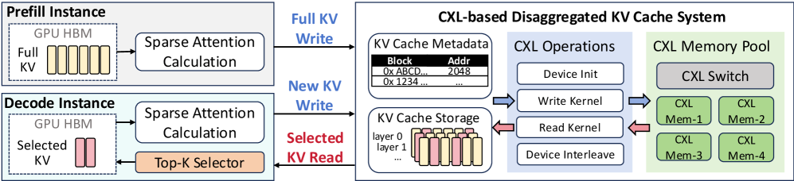

# SAC：用 CXL 重新设计稀疏注意力的 KV Cache

长上下文 LLM 的系统瓶颈，正在从“算不动”快速转向“放不下、搬不快”。在自回归推理中，KV cache 避免了重复计算历史 token 的 key/value，是吞吐和延迟优化的基础设施；但上下文长度从几千扩展到几十万甚至百万 token 以后，KV cache 本身就会变成巨大的状态。模型越能处理长上下文，服务系统越需要回答一个很现实的问题：这些 KV 到底应该放在哪里，又应该在什么时候被取回来？

最近看到的 SAC（Sparse Attention on CXL）很适合作为这个问题的切入口。它关注的是一个比“KV cache 很大”更具体的矛盾：**稀疏注意力模型每一步只访问少量 top-k KV 条目，但很多 disaggregated KV cache 系统仍然会把完整 prefix KV 先搬回本地。** 对 dense attention 来说，这种全量预取是合理的；对 sparse attention 来说，它会同时制造传输瓶颈和本地内存浪费。

*图源：SAC 论文 Figure 6（arXiv:2606.19746），用于说明 CXL 稀疏 KV cache 系统工作流。*

这张图的核心是把“KV cache 在哪里”和“每一步读多少 KV”分开看。SAC 不再把完整 prefix KV 预取到本地，而是让稀疏注意力按 top-k 需求访问 CXL 池；因此后文的重点会从 attention kernel 本身，逐步转向远端内存语义、访问粒度和状态管理。

## 要解决的问题：稀疏注意力改变了 KV cache 的访问形态

传统 Transformer 解码时，每个新 token 通常需要和历史 token 做注意力交互。KV cache 的访问模式相对密集：既然大部分历史 KV 都要参与计算，把一个请求的 prefix KV 整体搬到本地 GPU/CPU 内存中，再进行后续 decode，是一个直接且有效的系统设计。

但新一代长上下文模型正在大量使用 sparse attention 或 latent attention 的变体。以 SAC 论文讨论的 DeepSeek Sparse Attention 为例，系统会先用轻量 indexer 根据当前 query 计算相关性，再从历史 KV 中选择 top-k 条目进入真正的注意力计算。这样做的收益是把注意力计算从对完整上下文的密集扫描，转成对少量相关条目的访问；但它也让 KV cache 系统面临新的错配：

1. 计算路径只需要一小部分 KV；
2. 需要哪一部分 KV 是每层、每步动态决定的；
3. 如果仍然全量预取 prefix KV，就会搬运大量本轮根本不会用到的数据；
4. 如果想按需取稀疏 KV，传统 RDMA 的消息式、小包访问开销又太高。

这也是 SAC 的核心观察：稀疏注意力不是简单地让 attention FLOPs 下降，它同时改变了系统层的数据移动粒度。优化目标不能只盯着 GPU kernel，还要重新审视远端内存、网络和本地缓存之间的边界。

## RDMA 全量预取为什么在这里变得别扭

很多现有 disaggregated KV cache 方案会使用 RDMA 内存池。它的基本模式是：prefix KV 存在远端池中，请求到达某个 decode worker 后，由 CPU/NIC 协调，把对应 prefix KV 取回本地内存，再让 GPU 开始解码。这样可以扩展容量，也方便跨请求复用 prefix。

问题在于，RDMA 更擅长相对粗粒度、连续或批量的数据搬运，而稀疏注意力需要的是延迟敏感、细粒度、动态索引的读取。SAC 论文把这里的瓶颈拆成两类。

第一类是 **transmission bottleneck**。长上下文请求的 KV cache 可以达到 GB 级；如果高并发请求都要在 decode 前搬回完整 prefix KV，网络和本地 layout 转换就会成为 time to first token 的主要组成部分。哪怕后续每一步 sparse attention 计算很快，请求也可能先排队等数据搬运。

第二类是 **local memory wasting**。稀疏注意力每层只访问 top-k KV 条目，但全量预取要求本地内存保留完整 prefix KV。论文中对 DeepSeek-V3.2 的 profiling 显示，在 128K context 场景下，实际被使用的 KV 只占一部分；但为了维持并发，本地仍然要准备 TB 级内存容量。这会把稀疏注意力节省下来的计算优势，转化成系统层的内存压力。

换句话说，RDMA 池解决了“远端有容量”的问题，却没有很好解决“稀疏、动态、低延迟地读一小部分”的问题。

## SAC 的方法：让完整 KV 常驻 CXL 池，解码时只读 top-k

SAC 的设计思路可以概括为一句话：**不要把完整 prefix KV 搬回本地，而是把完整 KV cache 放在 CXL disaggregated memory 中，在 sparse attention 计算时按需读取每层需要的 top-k KV。**

CXL（Compute Express Link）的关键价值不只是“又一种更快的互连”。对这个场景来说，更重要的是它提供接近内存语义的访问方式：处理器可以通过 load/store 访问 CXL-attached memory，并且访问粒度可以细到 cache line。这和 RDMA 的消息式传输模型很不同。对于稀疏 KV 来说，每一步需要的不是一个巨大连续块，而是由 indexer 动态选出的很多小片段；CXL 的细粒度读更接近这种访问形态。

从系统框架看，SAC 大致包含三条路径：

- **KV 常驻路径**：完整 prefix KV cache 保存在共享 CXL 内存池中，而不是每次请求都完整复制到本地 worker；
- **索引路径**：GPU decode 过程中，轻量 indexer 计算当前 query 对历史 token 的相关性，得到每层需要访问的 top-k KV 索引；
- **按需读取路径**：worker 根据 top-k 索引，从 CXL 内存池读取少量实际参与 attention 的 KV 条目，再进入 MLA / sparse attention 计算。

这样一来，数据移动的单位从“请求级完整 prefix”变成“层级、步级的稀疏条目”。系统不再为可能不会访问的数据提前付出网络和本地内存成本。

## 系统收益：TTFT、TBT 和吞吐一起受影响

这类设计最直接影响的是 TTFT（time to first token）。在 RDMA 全量预取模式下，请求开始 decode 前要等待 prefix KV 到位；上下文越长、并发越高，等待越明显。SAC 避免了这个前置全量搬运，把数据访问分散到实际 attention 计算路径中，因此能显著降低首 token 延迟。

第二个影响是 TBT（time between tokens）。如果 CXL 的细粒度访问足够低延迟，按需读取 top-k KV 不会把每个 decode step 拖慢太多；相反，它减少了本地内存压力，让系统可以维持更高 batch size 和更稳定的并发。SAC 在 SGLang 上用 DeepSeek-V3.2 做端到端评估，论文报告相对 RDMA baseline 达到 2.1 倍吞吐、9.7 倍更低 TTFT、1.8 倍更低 TBT；相对非 disaggregated 的上界，吞吐只下降约 9%。

这些数字的含义不是“CXL 在所有场景都替代 RDMA”，而是说明当访问模式变成细粒度稀疏读时，内存语义互连和消息式网络的适配度不同。RDMA 仍然适合很多批量传输路径；CXL 更适合被当成扩展内存来做小粒度、低延迟访问。

## 和多层 KV cache 管理放在一起看

SAC 不是唯一关注 KV cache 内存墙的工作。另一篇 2026 年的 Predictive Multi-Tier Memory Management for KV Cache 把问题推到更一般的层面：KV cache 不应该只存在 GPU HBM 这一层，而应该跨 HBM、CPU DRAM、CXL memory、NVMe、RDMA fabric 甚至并行文件系统做分层管理。它强调三个点：根据 attention 架构精确估算 KV 大小、把冷热 KV 放到不同层级、用复用预测和预取减少重新计算。

把这两类工作放在一起，可以看到一个很清楚的趋势：LLM serving 的性能优化正在从单个推理 kernel，转向**状态管理系统**。KV cache 不是临时 buffer，而是跨请求、跨节点、跨内存层级流动的系统资源。未来的 serving runtime 可能需要同时具备：

- 理解不同 attention 架构的 KV 形态，例如 MHA、GQA、MLA、sparse attention；
- 判断哪些 KV 会被复用，哪些应该被淘汰或下沉到慢层；
- 根据访问粒度选择不同数据路径，大块走 RDMA，小粒度稀疏读走 CXL 或本地缓存；
- 把调度、batching、prefetch 和 eviction 放在同一个代价模型中考虑。

SAC 的价值在于，它把“访问粒度”这个维度讲得很明确：不是所有远端 KV cache 都应该被当成一个大对象搬来搬去。对于 sparse attention，KV cache 更像一个可查询的远端数据结构。

## 适用场景与局限

SAC 最适合的场景是长上下文、稀疏注意力、KV 访问比例较低但请求并发较高的推理服务。典型例子包括长文档问答、代码仓库级上下文、agent 记忆检索、多轮对话压缩后仍保留长历史的服务。在这些场景中，全量 prefix KV 的大小很容易压过本地内存和网络，而每一步真正参与 attention 的条目相对有限。

它的局限也很明显。

首先，SAC 依赖 CXL 硬件生态。CXL memory pooling、交换、NUMA 拓扑和一致性模型都不是纯软件系统可以直接假设的能力。实际部署中，CXL 设备延迟、带宽、交换结构和与 GPU 的数据路径都会决定收益上限。

其次，按需读取并不等于免费读取。如果 top-k 选择过于分散、每层访问次数太多，或者 CXL 池被多个 worker 高并发争用，细粒度访问仍然可能累积成瓶颈。系统需要认真协同设计 layout、batching 和 prefetch，否则会把全量搬运的问题换成大量随机读的问题。

第三，SAC 的优势和模型架构强相关。Dense attention 或访问比例很高的模型，未必适合用同样方式处理；如果大部分 KV 最终都会被访问，提前批量搬运可能仍然更好。

## 对我的启发：AI 系统会越来越像内存系统

这篇工作给我的启发是，AI serving 的核心资源正在变得更“数据库化”。过去讨论 LLM 推理，容易集中在算子优化、量化、张量并行、speculative decoding 这些直接影响 token 生成速度的技术上；但长上下文和多轮 agent 场景会让状态本身变得庞大而长期存在。KV cache、prefix、检索结果、工具调用上下文，都需要被放置、迁移、复用和淘汰。

SAC 代表的是一种很系统的思路：先观察模型架构改变后的真实访问模式，再选择匹配的数据移动机制。稀疏注意力让计算只看 top-k，那么存储系统也应该避免按 dense attention 的假设去搬完整 prefix。这个原则听起来朴素，但在系统设计里非常重要：**算法层的稀疏性，只有传递到内存层和调度层，才会真正变成端到端收益。**

## 小结

如果用一句话概括 SAC：它把稀疏注意力的 KV cache 从“每个请求开始前全量搬回本地”改成“完整 KV 常驻 CXL 池，解码时按需读取 top-k 条目”。这个设计利用了 CXL 的低延迟、细粒度 load/store 语义，避免 RDMA 全量预取在 sparse attention 场景下的带宽和内存浪费。

对长上下文 LLM serving 来说，这类工作提醒我们：未来的推理系统不只是更快地跑模型，还要更聪明地管理模型运行过程中产生的状态。谁能把 KV cache 放在合适的位置、以合适的粒度移动，谁就更可能在吞吐、延迟和成本之间取得更好的平衡。

## 参考资料

- Ruiyang Ma, Teng Ma, Junru Li, Hantian Zha, Xuchun Shang, Qingda Hu, Zheng Liu, Xinjun Yang, Tao Ma, Guojie Luo. SAC: Disaggregated KV Cache System for Sparse Attention LLMs with CXL. arXiv:2606.19746, 2026. <https://arxiv.org/abs/2606.19746>
- Sanjeev Ganjihal. Predictive Multi-Tier Memory Management for KV Cache in Large-Scale GPU Inference. arXiv:2604.26968, 2026. <https://arxiv.org/abs/2604.26968>
- Compute Express Link Consortium. CXL Overview and Specifications. <https://www.computeexpresslink.org/>
- SGLang Project. Fast serving framework for large language models and vision language models. <https://github.com/sgl-project/sglang>
