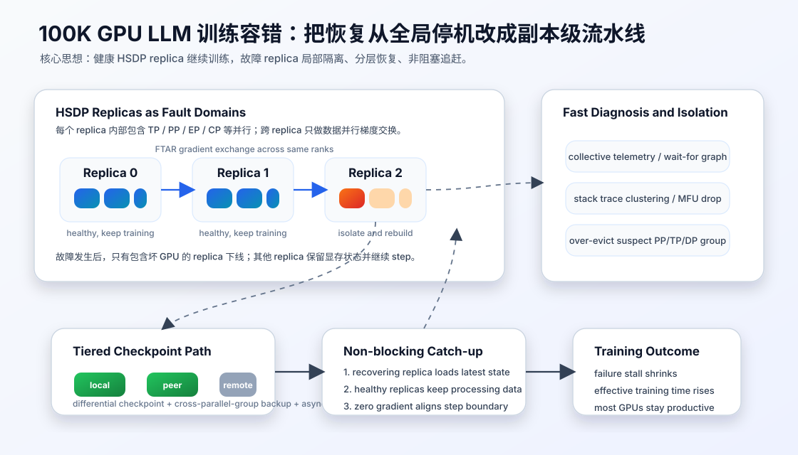

# 100K GPU 训练容错：从全局重启到副本级异步恢复

最近两年的大模型训练系统论文里，一个很明显的变化是：系统不再只追求单次运行的高 MFU，而是开始把**故障当成常态路径**来设计。

在几千 GPU 规模时，某台机器坏掉、NCCL hang、checkpoint 回滚，通常还能靠全局暂停和重启勉强接受。但当训练规模进入数万到十万 GPU，故障间隔会变短，重启成本会变长。此时同步训练的基本假设被击穿：如果每次都要求所有 GPU 同时健康，训练系统会把大量 wall-clock 时间花在等待恢复上，而不是花在有效 token 上。

2026 年的 FT-HSDP 论文把这个问题说得很直接：在 O(100K) GPU 训练场景下，生产估计大约每 18 分钟发生一次故障；如果同步恢复一次要停 10 分钟，有效训练时间只剩约 44%。它提出的方向是：不要把整个训练作业当成一个不可分割的容错单元，而是把 Hybrid-Shared Data Parallelism 里的 data-parallel replica 变成容错单元，让健康副本继续训练，失败副本局部恢复并追赶。

## 要解决的问题：同步训练把一个局部故障放大成全局停机

大规模 LLM 训练通常同时使用多种并行：

- tensor parallelism 负责切分矩阵计算；
- pipeline parallelism 负责切分层；
- data parallelism 负责复制训练副本并聚合梯度；
- expert/context/sequence parallelism 继续处理 MoE、长上下文和显存压力。

这些并行策略叠在一起后，系统行为高度同步。一次 GPU HBM 错误、PCIe 设备异常、NCCL watchdog timeout、网络线缆问题，甚至一次 silent data corruption，都可能让 collective 卡住。传统恢复流程通常是：

1. 检测到 hang、CUDA error、NaN 或性能异常；
2. 停掉整个 job；
3. 定位故障机器或保守替换一批机器；
4. 重新分配资源并初始化通信；
5. 从最近 checkpoint 读回模型、优化器和 dataloader 状态；
6. 重新跑丢失的 step。

问题在于，GPU 数量越大，这个流程越不经济。FT-HSDP 报告在 98K GPU 上，NCCL 连接初始化本身就可能接近 200 秒；再叠加资源替换、PyTorch 启动、checkpoint 加载和 first-step overhead，同步恢复很容易来到分钟级。ByteRobust 的生产观察也说明，隐式故障、性能抖动和人工代码调整会让“停止、诊断、重启”变成长期训练里的常见事件。

所以容错训练的目标不是“永远不失败”，而是更现实的三件事：

1. 故障检测足够快，不等默认超时把集群空转掉；
2. 隔离粒度足够小，不让一个坏节点拖死所有 GPU；
3. checkpoint 和恢复路径足够贴近故障域，不把远端存储读回变成主瓶颈。

## FT-HSDP 的核心方法：把 DP replica 做成容错边界

FT-HSDP 的设计可以理解成四步。

第一步，训练被拆成多个 HSDP replica。每个 replica 内部仍然可以有 TP、PP、EP、CP 等复杂并行，负责处理一部分数据；不同 replica 之间周期性做同 rank 梯度交换。这样，延迟敏感的通信尽量留在 replica 内部，跨 replica 通信主要承担数据并行聚合。

第二步，故障发生时只重建包含故障 GPU 或服务器的 replica。健康 replica 不销毁进程、不释放模型状态，也不等待整个作业重新初始化。失败 replica 下线后，系统寻找替换资源、重建通信连接、加载 checkpoint，而其他 replica 继续推进训练。

第三步，用 Fault Tolerant All Reduce 代替普通跨副本 NCCL all-reduce。FTAR 的要点是 CPU 负责复杂控制逻辑，例如动态增删参与者、错误分类、连接重建和拥塞控制；GPU 负责实际数据传输，以保留高吞吐。这个分工很关键：NCCL 的 fast path 很强，但大规模容错需要更多控制面能力，全部塞到 GPU-driven collective 里并不自然。

第四步，恢复中的 replica 通过 non-blocking catch-up 追上健康副本。FT-HSDP 利用训练语义做了一个巧妙处理：如果恢复副本在 step n 加载 checkpoint，而健康副本已经在训练 step n，那么恢复副本可以在该 step 末尾发送 zero gradient，通过梯度交换把状态重新对齐。checkpoint 获取也尽量和健康副本训练重叠，减少全局 stall。

这套机制的关键收益不是单个 all-reduce 更快，而是**故障恢复不再默认阻塞整个训练系统**。论文在接近 98K GPU 的实测场景里报告，FT-HSDP 把故障恢复 stall 从同步方案的 10 分钟降到约 3 分钟，使有效训练时间从 44% 提升到 80%。

## ByteRobust 的启发：快速隔离比完美定位更重要

FT-HSDP 更像训练范式和通信协议的改造，ByteRobust 则更偏生产基础设施。它强调一个很工程化的原则：在超大规模训练里，很多时候不应该追求立即找到“唯一根因”，而应该先快速隔离可疑故障域，让训练继续跑。

ByteRobust 把控制面和数据面分开：

- 控制面负责事件编排、故障处理、热更新、warm standby 和恢复决策；
- 数据面在训练 pod 内运行 agent，收集进程、日志、I/O、stack trace、checkpoint 状态等信息；
- runtime analyzer 把分散信号聚合成统一事件，尤其关注 hang、MFU 下降、NaN、SDC 和网络异常。

对隐式故障，ByteRobust 会聚合训练进程的 stack trace。多数 rank 的栈被视为健康模式，偏离主模式的 rank 被标记为 outlier，然后按 PP/DP/TP 等并行组寻找共同故障域。系统宁可 over-evict 一个并行组，也不让几千甚至上万 GPU 长时间等一个精确根因。

这个思路对工程实践很有价值：大规模训练的控制目标不是把每次故障诊断成教科书案例，而是在可接受误杀成本下最大化 ETTR，也就是有效训练时间占 wall-clock 时间的比例。

## Checkpoint 也要按故障域设计

只做副本级恢复还不够。如果 checkpoint 仍然完全依赖远端对象存储或 HDFS，每次恢复都要跨慢速前端网络拉回 TB 级状态，局部恢复仍会变慢。

ByteRobust 的做法是高频 checkpoint 与 cross-parallel-group backup。每个 rank 把本地分片状态备份到不共享同一 PP/DP/TP 组的机器上，避免一次并行组 over-eviction 把原始状态和备份一起拿掉。保存过程使用独立 CUDA stream、CPU 双缓冲、D2H copy、序列化和 rank 间发送重叠，尽量把 checkpoint I/O 放到训练计算之外。

TierCheck 则把这个思想抽象成三层：

1. local memory 保存轻量 differential checkpoint，用于最快本地恢复；
2. peer memory 保存跨故障域副本，应对单机或局部故障；
3. remote persistent storage 保存 heavyweight base checkpoint，应对更大范围故障。

这三层的本质是按故障概率和恢复成本分层：常见小故障走内存与邻居备份，少见大故障才走远端持久化。这样可以提高 checkpoint 频率，同时避免每一步都付出远端写入成本。

## 一个可落地的系统流水线

如果把这些论文组合成一个工程方案，我会按下面的流水线理解：

1. **训练拓扑设计**：先把 replica 放在网络局部性更好的区域内，例如同一 AI Zone 或同一数据中心；跨 replica 的 DP 梯度交换承受更高延迟。
2. **快速观测**：每 5 到 20 秒采集 collective telemetry、rank 进度、stack trace、MFU 和数值异常信号，不等默认超时。
3. **故障域隔离**：用 wait-for graph 或 stack 聚类找出可疑 rank，再映射到机器、GPU、PP/TP/DP group。
4. **副本摘除**：如果故障影响某个 replica，就将该 replica 下线；其他 replica 保留显存状态并继续训练。
5. **容错 all-reduce**：跨 replica 梯度交换使用可重构通信组，健康 rank 能够移除失败参与者并继续完成通信。
6. **分层 checkpoint**：每 step 或高频保存轻量状态到 local/peer memory，异步迁移 base checkpoint 到远端存储。
7. **非阻塞追赶**：恢复 replica 加载最新可用 checkpoint，发送 zero gradient 或执行 catch-up 协议，逐步重新加入训练。
8. **代码与环境控制**：对训练中常见的算法或 kernel 更新，使用 hot-update 和 rollback，把“人为修改”也纳入容错路径。

这里最容易被低估的是第 8 点。长达数月的 LLM 预训练不是一个静态二进制一直跑到底，训练中会不断调整数据配比、并行策略、融合 kernel、长上下文配置和评测逻辑。系统必须承认代码变化本身就是故障来源，并给它设计可回滚、可验证、可隔离的路径。

## 对 HPC/GPU 系统读者的几个实现提醒

第一，容错单元要和并行策略一起设计。不要只在 scheduler 层面谈“替换坏节点”，还要问：这个节点属于哪个 PP stage、哪个 TP group、哪个 ZeRO shard、哪个 expert group？如果 checkpoint 备份和故障隔离使用同一个分组边界，恢复时很容易一起失效。

第二，跨副本通信需要控制面能力。普通 collective 的目标是 failure-free fast path，而 FTAR 这类协议还要处理成员变化、连接重建、错误分类和恢复中的一致性。CPU/GPU 混合控制不是倒退，而是把复杂分支放在更适合的位置。

第三，checkpoint 频率不应该只由远端存储吞吐决定。内存级 differential checkpoint、peer backup、异步迁移和 base/delta 分离，可以把“高频保存”和“持久可靠”拆开。

第四，诊断系统要为隐式故障准备。CUDA error 很直接，job hang、MFU 下降、NaN、SDC 更麻烦。只靠日志关键词或进程退出码会太慢，collective telemetry、rank-level wait-for graph、deterministic replay 和 stack clustering 会越来越重要。

## 小结

100K GPU 训练容错的核心变化，是把故障从异常路径改成常态路径。同步训练要求所有 GPU 一起健康，规模越大越脆弱；副本级容错则承认局部失败会频繁发生，并通过局部摘除、可重构 all-reduce、非阻塞追赶和分层 checkpoint，把恢复成本限制在更小的范围内。

对未来 LLM 训练系统来说，性能优化不只是在没有故障时把 step time 降低几毫秒，也是在出现故障、代码更新、网络抖动和数值异常时，仍然让绝大多数 GPU 继续贡献有效训练时间。

## 参考资料

- Omkar Salpekar et al. Training LLMs with Fault Tolerant HSDP on 100,000 GPUs. arXiv:2602.00277, 2026. <https://arxiv.org/abs/2602.00277>
- Shujie Han et al. TierCheck: Tiered Checkpointing for Fault Tolerance in Large Language Model Training. arXiv:2605.17821, 2026. <https://arxiv.org/abs/2605.17821>
- Robust LLM Training Infrastructure at ByteDance. arXiv:2509.16293, 2025. <https://arxiv.org/abs/2509.16293>
- Ziheng Jiang et al. MegaScale: Scaling Large Language Model Training to More Than 10,000 GPUs. NSDI 2024. <https://arxiv.org/abs/2402.15627>
