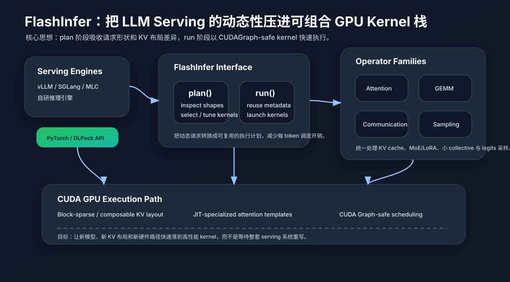

# FlashInfer：把 LLM Serving 的动态性压进可组合 GPU Kernel 栈

LLM 推理系统这两年出现了一个很有意思的变化：瓶颈不再只是“有没有一个最快的 attention kernel”，而是**serving 引擎能不能快速吸收新的模型结构、KV cache 布局、量化格式、采样策略和通信模式**。

训练时代的 GPU kernel 往往服务于相对固定的 batch shape；推理 serving 则完全不同。线上请求长度差异很大，prefill 和 decode 的计算形态不同，prefix cache 命中情况不断变化，KV cache 可能分页、压缩、复用或跨实例迁移，MoE 与 LoRA 又引入大量小 GEMM 和 all-to-all。一个静态的“万能 attention kernel”很难长期跟上这些变化。

FlashInfer 试图解决的正是这个问题：它不是再发明一个单点算子，而是把 LLM serving 中最常见的 GPU 热路径抽象成一套**可组合、可定制、对 serving 引擎友好**的 kernel stack。论文《FlashInfer: Efficient and Customizable Attention Engine for LLM Inference Serving》已被 MLSys 2025 接收；NVIDIA 也在官方博客中说明，正在把高性能 LLM inference kernels 通过 FlashInfer 释放给 vLLM、SGLang 和自研引擎使用。

## 要解决的问题：推理请求太动态，kernel 又必须足够静态

LLM serving 的核心矛盾可以概括为一句话：**系统输入高度动态，但 GPU 最喜欢规则、静态、可复用的执行形态**。

几个典型例子：

1. **序列长度动态**：同一批请求里，有的 prompt 很短，有的带长上下文；decode 阶段每个请求的活跃长度也不同。
2. **KV cache 布局动态**：为了减少碎片和提高复用，系统会使用 paged cache、block-sparse 表示、prefix sharing，甚至在多实例间共享或迁移 KV。
3. **attention 变体增加**：GQA/MQA、sliding window、RoPE/ALiBi、MLA、稀疏 attention 等都会改变 kernel 的访问模式。
4. **服务端调度动态**：为了降低 inter-token latency，serving 引擎希望使用 CUDA Graph；但 CUDA Graph 又偏好静态 launch 配置。

如果每出现一个新需求就手写一套 CUDA kernel，工程迭代会很慢；如果完全依赖通用 compiler 后端，又很难吃满具体场景下的带宽、寄存器、共享内存和 tensor core 路径。FlashInfer 的定位就在这两者之间：提供足够底层的高性能 kernel，又把 shape inspection、layout metadata、kernel specialization 暴露成 serving 引擎能控制的接口。

## 核心方法一：用统一 KV 表示吸收布局差异

FlashInfer 论文强调的第一件事，是把 KV cache 的多种布局统一成 block-sparse 与 composable formats。直觉上，paged KV cache、prefix sharing、长上下文分块、不同 head layout 都可以看成“逻辑 token 到物理块”的映射问题。

这样做的好处是：

- attention kernel 不需要为每种 cache layout 重新定义一套完全不同的数据结构；
- serving 引擎可以在调度层维护 block table、offset、长度等 metadata；
- kernel 侧通过统一表示进行访存，减少冗余搬运和特殊分支；
- 后续如果引入 KV reuse、KV offload 或更复杂的 cache sharing，也可以优先扩展 metadata，而不是重写整条热路径。

这点和 vLLM 的 paged attention 思路有相似背景，但 FlashInfer 更像一个独立的 kernel/runtime 层：它希望成为不同 serving 引擎都能调用的 GPU operator library。

## 核心方法二：JIT attention template，而不是固定 attention 黑盒

第二个关键是 JIT。FlashInfer 提供 customizable attention template，根据模型和请求形态在运行前生成或选择更合适的 kernel 变体。

这里的“定制”不是简单地把参数传进 kernel，而是把一些会影响性能结构的选择提前固化，例如 head dimension、query/key/value dtype、mask 规则、position encoding、KV block size、GQA 关系等。这样 kernel 在真正执行时可以减少动态分支，让编译器更好地安排寄存器、访存和指令路径。

这解决了一个工程上的痛点：LLM 架构变化很快，如果 kernel library 只提供固定函数，serving 引擎很快会在新模型上退回慢路径；但如果每次都让业务方自己写 CUDA，迭代速度又不现实。JIT template 把“高性能”和“可扩展”放到同一个接口里。

## 核心方法三：plan / run，把动态调度从热路径里拿出来

NVIDIA 官方博客里给出的 API 很能说明 FlashInfer 的设计：attention 调用通常分成 `plan()` 和 `run()` 两步。

`plan()` 阶段读取请求的 offset、KV length、block table、head 数、dtype 和各种 variant 参数，完成 shape inspection、kernel 选择、调度信息构造等工作。`run()` 阶段则复用这些 metadata，直接发起真正的 GPU kernel。

这个拆分的意义在于：

- 多层 Transformer 在同一个 generation step 往往共享相同的请求 metadata，计划可以跨层复用；
- 动态请求带来的 CPU 侧分析不必反复进入每个 kernel launch；
- 对 CUDA Graph 更友好，因为 run 阶段可以尽量保持固定的 launch 形态；
- serving 引擎仍然保留调度控制权，不需要把整个请求生命周期交给一个封闭 runtime。

换句话说，FlashInfer 并不是替代 vLLM 或 SGLang，而是为这些系统提供一条更薄、更快、更容易换新的 GPU hot path。

## 从 Attention 扩展到四类 operator family

早期讨论 FlashInfer 时，大家很容易把它理解成 attention library。但 NVIDIA 的介绍里已经把它扩展成四类 operator family：Attention、GEMM、Communication 和 Sampling。

这很重要，因为现代 LLM serving 的瓶颈越来越分散：

- **Attention** 负责处理不同 KV cache 布局、长上下文和各种 mask；
- **GEMM** 需要覆盖 fp4/fp8、grouped GEMM、LoRA adapter、小 batch decode 等路径；
- **Communication** 在 tensor parallel、expert parallel 和多 GPU decode 中决定 tail latency；
- **Sampling** 如果还在对整个 vocabulary 排序，Top-K/Top-P 会成为大词表模型的额外瓶颈。

把这些 operator 放在同一套接口和发布节奏里，实际是在降低 serving 系统采用新优化的摩擦。一个引擎可以先接入 FlashInfer attention，再逐步替换 sampling、grouped GEMM 或通信 kernel；不同组件不需要一次性重构。

## 适用场景：什么时候 FlashInfer 最有价值

我觉得 FlashInfer 最适合三类场景。

第一类是**快速变化的线上推理栈**。如果模型经常变化，既要支持新 attention 变体，又要维持低延迟，那么一个可 JIT、可组合的 kernel library 比固定算子更灵活。

第二类是**长上下文和 KV cache 密集型场景**。这类 workload 的性能很大程度取决于 KV layout、block table、cache reuse 和访存效率。FlashInfer 把 KV metadata 变成一等公民，正好对准这个问题。

第三类是**多框架或自研 serving 引擎**。研究团队和基础设施团队经常希望在 vLLM、SGLang、MLC 或自研系统之间迁移优化。如果 kernel 通过 PyTorch/DLPack API 暴露，就更容易被不同 runtime 复用。

## 局限：kernel stack 不能单独解决所有 serving 问题

FlashInfer 的边界也很清楚。

首先，它依赖上层 serving 引擎提供好的调度策略。batching、admission control、prefix cache policy、KV eviction、跨节点路由这些问题不可能只靠 kernel library 自动解决。

其次，JIT 和 plan/run 会引入工程复杂度。系统需要管理编译缓存、metadata 生命周期、CUDA Graph 兼容性和不同硬件上的 fallback。对于小模型、短请求、低并发服务，直接使用成熟 serving 框架的默认路径可能已经足够。

第三，越靠近硬件的优化越容易随 GPU 代际变化。FlashInfer 的优势恰恰在于追赶新 kernel，但这也意味着使用方要接受更频繁的版本验证和性能回归测试。

## 对 AI 系统设计的启发

FlashInfer 给我的最大启发是：LLM serving 的模块边界正在重新划分。

过去我们常把系统分成“框架调度层”和“底层算子库”。但在推理场景里，KV cache layout、请求调度、CUDA Graph、JIT kernel specialization 之间耦合很强。真正高效的设计不是把这些层完全隔离，而是设计一个足够窄的接口，让上层可以传递关键 metadata，下层可以据此生成高性能执行路径。

这也是为什么 FlashInfer 值得关注：它代表了一种中间层思路——不把 serving 引擎做成单体黑盒，也不把 CUDA kernel 留给每个团队重复手写，而是把动态性收束成 plan，把硬件执行收束成 run。对于未来的长上下文、多模态、MoE 和分布式推理系统，这种接口可能比单个 kernel benchmark 更有长期价值。

## 参考资料

- FlashInfer 论文：[*FlashInfer: Efficient and Customizable Attention Engine for LLM Inference Serving*](https://arxiv.org/abs/2501.01005)
- NVIDIA Developer Blog：[*Run High-Performance LLM Inference Kernels from NVIDIA Using FlashInfer*](https://developer.nvidia.com/blog/run-high-performance-llm-inference-kernels-from-nvidia-using-flashinfer/)
- FlashInfer GitHub 项目：<https://github.com/flashinfer-ai/flashinfer>
- vLLM 项目：<https://github.com/vllm-project/vllm>
- SGLang 项目：<https://github.com/sgl-project/sglang>
