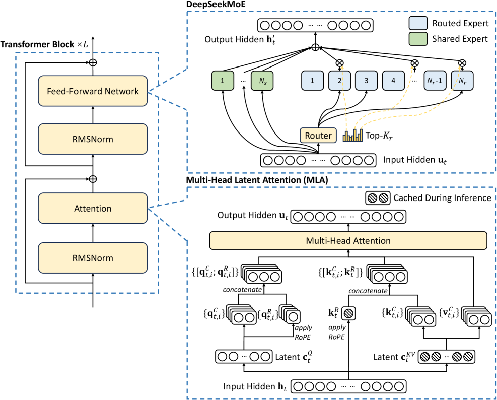

# FlashMLA 与 MLA 解码：把长上下文推理的带宽账算清楚

长上下文 LLM 推理的性能瓶颈，经常不是某一个矩阵乘法算得不够快，而是 decode 阶段每生成一个 token 都要反复读取历史 KV cache。上下文越长，KV cache 越大；batch 越小，Tensor Core 越难吃满；请求越动态，paged KV cache、CUDA Graph 和调度器之间越难保持稳定形状。

DeepSeek 系列模型把这个问题推到了系统前台。DeepSeek-V2/V3/R1 采用 Multi-head Latent Attention，也就是 MLA，用低秩 latent KV 表示减少缓存体积。MLA 从模型结构上降低了 KV cache 压力，但也给 GPU kernel 带来新的约束：latent KV、decoupled RoPE、矩阵吸收、head 切分、paged cache、BF16/FP8 混合精度都要在同一条 decode 路径里协调。

这篇文章整理 2025-2026 年几项相关工作：DeepSeek 的 FlashMLA，面向 H20 的 FlashMLA-ETAP，FlashInfer 的可定制 attention engine，以及 SnapMLA 的 FP8 长上下文 MLA decoding。核心问题是：**当 MLA 把 KV cache 变小后，GPU 系统还要怎么组织内存访问、Tensor Core 形状和量化流水线，才能真正把 decode 跑快？**

*图源：DeepSeek-V3 Technical Report Figure 2（arXiv:2412.19437），用于说明 MLA 与 DeepSeekMoE 在模型结构中的位置。*

FlashMLA 这类 kernel 不能脱离 MLA 模型结构理解。原图先给出 MLA 如何降低 KV cache，再看后面的 paged latent KV、Tensor Core tile、online softmax 和 FP8 量化，就能区分“结构上省显存”和“系统上跑得快”是两层不同问题。

## 1. 要解决的问题：MLA 省 KV，但 decode 仍然可能不快

标准 Multi-Head Attention 在 decode 时需要为每一层缓存历史 token 的 key 和 value。假设层数、head 数、head dimension 和上下文长度都很大，KV cache 会线性增长，并且每个新 token 都要访问大量历史 KV。对长上下文服务来说，这会带来三类压力：

- 显存容量压力：KV cache 占用可能限制并发请求数；
- 显存带宽压力：decode 每步读取历史 KV，容易变成 memory-bound；
- 系统调度压力：paged KV cache、prefix reuse、P/D 分离会让 KV 地址和长度高度动态。

MLA 的思路是把 key/value 投影到更小的 latent 空间里缓存，再通过矩阵吸收等方式把部分权重合并到查询或输出路径中。这样做可以显著降低每个 token 需要缓存的数据量。DeepSeek-V3 技术报告也把 MLA 和 DeepSeekMoE 一起作为高效训练与推理的关键结构。

但从 kernel 角度看，MLA 不是“KV 小了，所以自动快了”。它至少引入四个工程问题。

第一，latent KV 和 RoPE 组件的数据布局不同。MLA 通常会把低秩 latent KV 与 decoupled RoPE 信息分开处理，直接套标准 MHA/GQA kernel 会产生额外搬运或不匹配的计算形状。

第二，decode 的 query 维度很小。每步生成少量 token，`Q` 方向通常很短，而 `K/V` 上下文很长。Tensor Core 喜欢规整的大 tile，小 batch decode 却容易让矩阵乘的某个维度太小，造成 padding 和低利用率。

第三，paged KV cache 是必须面对的系统现实。在线服务里 KV 往往按 page/block 管理，物理地址不连续。kernel 既要通过 page table 找到正确 KV，又要尽量保持 coalesced load、shared memory staging 和 L2 命中。

第四，FP8 量化不是把 BF16 kernel 的类型改掉就结束。每 token scale、RoPE 数值敏感性、FP8 Tensor Core operand layout、PV 阶段的 scale 对齐，都会影响正确性和流水线。

所以 MLA 解码优化的目标不是单一的“减少 KV cache”，而是把模型结构节省下来的字节数，真正转换成 GPU 时间线上的吞吐和延迟收益。

## 2. FlashMLA：面向 Hopper 的 MLA decode fast path

DeepSeek 开源的 FlashMLA 是一组优化 attention kernels，用于支撑 DeepSeek-V3 和后续模型。它的定位很清楚：针对 MLA 的 dense/sparse prefill 与 decoding 路径，提供高性能 kernel，而不是只依赖通用 attention 实现。

从工程角度看，FlashMLA 类 kernel 通常要围绕下面几件事组织。

第一是 **paged KV cache**。decode worker 不可能假设所有请求的 KV 连续排布。kernel 需要读取 page table，把逻辑 token 位置映射到物理 KV block，同时尽量让同一 warp 或 thread block 访问连续数据。DeepSeek FlashMLA README 里明确提到 dense decoding 与 sparse decoding，并在早期版本中强调 BF16、paged KV cache 和 variable-length sequence。

第二是 **split-KV / sequence 维度并行**。decode 的 query 数很少，如果只按 batch/head 并行，GPU 很容易吃不满。Flash-Decoding 和后续内核常用的思想是沿 KV sequence length 再切分，把长上下文拆成多个 block 并行计算局部 softmax 统计量，最后再做归约。MLA decode 也需要类似思路，把长 KV 方向暴露成足够多的并行任务。

第三是 **online softmax 与少写全局内存**。attention 不能简单地先把完整 score 矩阵写出来再 softmax。FlashAttention 系列的核心经验是分块读 K/V，在寄存器或 shared memory 中维护 running max 和 running sum，避免把中间 score 落到 HBM。FlashMLA 继承的是这个系统哲学：能在片上完成的统计和归约，不要写回全局内存。

第四是 **针对 Hopper 的 Tensor Core 路径**。Hopper 上 WGMMA、TMA、异步拷贝、warp-group 调度都影响 tile 设计。一个 MLA kernel 是否快，不只看算法复杂度，还取决于 `M/N/K` 维度能否贴合 Tensor Core 指令形状，shared memory 双缓冲是否能盖住全局内存延迟，以及寄存器压力是否会压低 occupancy。

这也是为什么 FlashMLA 更像一个专用 CUDA 系统组件，而不是普通 PyTorch operator。它把模型结构、KV cache layout 和 GPU 指令形状绑在一起优化。

## 3. FlashMLA-ETAP：用转置流水线修复 H20 上的 WGMMA 形状浪费

FlashMLA-ETAP 关注一个非常具体但很有代表性的问题：在 NVIDIA H20 这类中端 GPU 上部署 DeepSeek-R1 671B 单实例推理时，每张 GPU 分到的 head 数可能太少，导致 WGMMA 的某些维度低于最小高效形状。论文指出，当 128 个 heads 在 8 GPU 上切分后，每 GPU 只有 16 个 heads，而 WGMMA 的相关维度可能需要 padding 到 64，结果大量计算花在填充上，利用率甚至会低于 25%。

ETAP 的解决思路是转置 attention 的计算组织方式，把长 KV context length 对齐到 WGMMA 更适合的 `M` 维度。直观地说，它不是让短 head 维度硬凑 Tensor Core，而是重排计算，让“长上下文”这件事本身成为 Tensor Core 能吃下去的并行维度。

这个设计有几个启发。

第一，长上下文不只是负担，也可以是并行资源。如果 kernel 能把 sequence length 方向组织成合适的 tile，长 KV 就能提供足够大的矩阵维度，让 Tensor Core 保持忙碌。

第二，硬件约束会反过来决定算法形式。MLA 从数学上定义了 attention 计算，但真正高效的实现要看目标 GPU 的 WGMMA 形状、SM 数量、HBM 带宽和显存容量。H100/H800 与 H20 的最优 kernel 组织方式可能不同。

第三，系统部署形态会改变 kernel 瓶颈。单机 8 卡跑一个 671B MoE/MLA 模型，和云上多实例 serving 的 batch 结构不同；head 切分、batch size、sequence length、page size 都会改变最佳 tile。

论文报告 FlashMLA-ETAP 在 64K sequence length、batch size 16 的设置下，相比 FlashMLA 有 2.78x speedup，并显著超过 FlashAttention-3 与 FlashInfer 的相关 baseline。这个数字更应该被理解成一个系统信号：当硬件资源和模型并行切分把原 kernel 推入低利用率区间时，重排计算维度可能比微调几个 tile 参数更有效。

## 4. FlashInfer：把 attention kernel 做成可定制 engine

FlashInfer 提供了另一个角度。它不是只为 MLA 写一个固定 kernel，而是把 LLM serving 中多种 attention 形态抽象成可 JIT 编译、可调度、可适配 KV layout 的 engine。

它解决的问题和 FlashMLA 很互补：线上服务不只有一种 attention。不同请求可能有 paged KV、ragged query、shared prefix、speculative decoding tree、不同 block size、不同模型 attention 变体。FlashInfer 用 block-sparse format 统一这些 KV cache 结构，并用 composable formats 表达共享前缀等场景，让 kernel 可以在 shared memory/register 中复用公共 KV，而不是每个请求重复从 global memory 读。

对 MLA decode 来说，这个思路很重要。MLA kernel 不应该只在单个离线 benchmark shape 上快，还要能放进真实服务系统：

1. page size 和 block size 需要跟 KV manager 对齐；
2. CUDA Graph 需要稳定配置，但请求长度又是动态的；
3. prefix cache 命中时，共享 KV 应该被更高效地访问；
4. attention 变体可能随模型结构变化，需要模板化而不是每次重写。

FlashInfer 论文里有一个很工程化的设计点：把 compile-time tile selection 和 runtime scheduling 分开，用动态负载均衡处理输入长度变化，同时保持与 CUDA Graph 静态配置要求兼容。对服务系统来说，这比单纯追求某个 kernel 的峰值 TFLOPS 更关键，因为线上 tail latency 经常来自不均匀请求和调度开销。

## 5. SnapMLA：FP8 不是类型替换，而是量化、布局和流水线协同

2026 年的 SnapMLA 把 MLA decode 进一步推到 FP8。动机很直接：长上下文 decode 读取 KV cache 的字节数很大，如果能把 latent KV cache 和部分计算路径压到 FP8，就能降低 HBM 带宽压力，并利用 Hopper FP8 Tensor Core 提高吞吐。

但 SnapMLA 强调的问题也很现实：FlashMLA 的 BF16 kernel 不能直接改成 FP8。原因包括：

- MLA 有共享 latent KV cache 和 decoupled RoPE，RoPE 部分对数值误差更敏感；
- per-token quantization 的 scale layout 需要和 kernel 访问模式匹配；
- FP8 Tensor Core 对 operand layout 有硬件约束；
- PV 阶段既要处理量化值，又要处理 scale，对流水线和寄存器布局都有影响。

SnapMLA 的思路是硬件感知的 algorithm-kernel co-design：RoPE-aware KV cache quantization、scale-aware FP8 PV computation、fused data movement 一起设计。它把“哪些数据可以 FP8，哪些必须更保守”放进 MLA 结构里，而不是一刀切量化。

论文报告 SnapMLA 在长输出 decode workload 上最高获得 1.91x throughput improvement，同时在评估的推理和代码生成 benchmark 上保持接近 BF16 baseline 的质量。这说明 FP8 MLA 的收益不只是减少存储，而是要把 scale、layout、Tensor Core 和数值敏感组件一起排进 kernel。

## 6. 工程落地时怎么判断该用哪类 MLA kernel

如果在实际 LLM serving 系统里评估 MLA/FlashMLA 路径，我会按下面的顺序看。

第一，先确认模型结构是否真的给了 MLA 优势。MLA 对 DeepSeek 系列这类原生结构很自然；如果是从 MHA/GQA 模型转换到 MLA，要额外评估质量、微调成本和生态支持。

第二，测 decode 是否被 KV 读取支配。用 Nsight Systems/Compute 看 HBM throughput、L2 hit、SM occupancy、Tensor Core utilization、kernel launch 频率。如果 decode 已经明显 memory-bound，latent KV、FP8 KV 或更好的 page layout 才会有明显收益。

第三，区分 prefill 与 decode。Prefill 通常 query length 大，更容易吃满 Tensor Core；decode query 少、KV 长，更依赖 split-KV、paged cache 和在线 softmax。不要用 prefill benchmark 直接替代 decode 结论。

第四，把 page size、batch size、context length 和并行切分一起扫。FlashMLA-ETAP 的例子说明，同一个 MLA 算法在不同 GPU/head 切分下可能进入完全不同的低效区间。benchmark 只测一个 shape，很容易得出误导结论。

第五，量化要从 kernel 到质量端到端验证。FP8 KV cache 不只看 perplexity 或单个 kernel TFLOPS，还要看 reasoning/code 任务质量、long-context 稳定性、scale storage overhead、decode tail latency，以及和 CUDA Graph/prefix cache 的兼容性。

第六，关注 fallback 路径。真实线上系统总会遇到非常短上下文、异常长上下文、page table 碎片、batch 过小、CUDA Graph bucket miss 等情况。专用 kernel 的收益越高，越要清楚它在什么 shape 下退回通用路径。

## 小结

MLA 的价值是从模型结构上减少 KV cache，但系统收益要靠 kernel 和 runtime 把这个结构优势兑现。FlashMLA 说明 MLA decode 需要专用 fast path；FlashMLA-ETAP 说明硬件和并行切分会决定计算组织方式；FlashInfer 说明 attention kernel 必须适配服务系统里的动态 KV layout；SnapMLA 则说明 FP8 MLA 需要量化、布局和流水线协同设计。

对 GPU 系统工程来说，这类工作最重要的启发是：长上下文推理不能只问“attention 算法复杂度是多少”，而要把 KV cache 字节数、page table、Tensor Core tile、softmax 归约、量化 scale、CUDA Graph bucket 和服务 batch 一起放到时间线上看。真正的优化不是单点 kernel trick，而是让模型结构、内存布局和硬件执行形状互相对齐。

## 参考资料

- DeepSeek-AI. FlashMLA: Efficient Multi-head Latent Attention Kernels. GitHub, 2025. <https://github.com/deepseek-ai/FlashMLA>
- Pengcuo Dege, Qiuming Luo, Rui Mao, Chang Kong. FlashMLA-ETAP: Efficient Transpose Attention Pipeline for Accelerating MLA Inference on NVIDIA H20 GPUs. arXiv:2506.01969, 2025. <https://arxiv.org/abs/2506.01969>
- Zihao Ye et al. FlashInfer: Efficient and Customizable Attention Engine for LLM Inference Serving. arXiv:2501.01005, 2025. <https://arxiv.org/abs/2501.01005>
- DeepSeek-AI et al. DeepSeek-V3 Technical Report. arXiv:2412.19437, 2024. <https://arxiv.org/abs/2412.19437>
- SnapMLA: Efficient Long-Context MLA Decoding via Hardware-Aware FP8 Quantized Pipelining. arXiv:2602.10718, 2026. <https://arxiv.org/abs/2602.10718>
- FlashInfer Documentation: Attention Kernels and MLA page layout. <https://docs.flashinfer.ai/api/attention.html>
