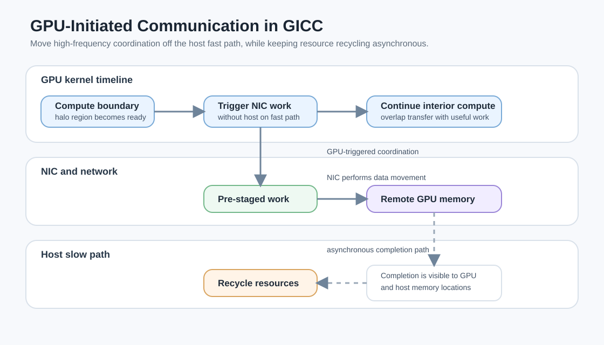

# GPU-Initiated Communication：把通信控制权交还给 GPU

最近读高性能计算方法相关论文时，一个很清晰的趋势是：大规模 GPU 程序的瓶颈不再只是“单个 kernel 跑得够不够快”，而是**计算、通信、同步、资源回收能不能在正确的时间发生**。

传统写法里，GPU 完成一段计算之后，经常需要 CPU/host 侧介入：检查状态、发起通信、推进 runtime、等待完成，再让 GPU 继续下一段工作。这个模式容易理解，也和 MPI 时代的程序结构很一致。但在现代 GPU 集群上，它会带来两个问题：

1. kernel 与通信之间存在额外 launch 或 host progress 延迟；
2. 细粒度数据依赖下，边界数据已经算出来了，却不能立刻被远端使用。

2026 年 4 月提交的 GICC 论文正是在解决这个问题：让 GPU kernel 在 fast path 上直接触发 NIC 级别的通信与协调，把一部分原本由 host 驱动的动作下沉到 GPU 侧。

## 要解决的问题：GPU 算得很快，但通信控制还不够贴近计算

在 stencil、PDE 求解、图计算或分布式深度学习里，很多操作都有类似结构：

- 每个 GPU 负责一块局部数据；
- 内部区域可以独立计算；
- 边界区域算完后，要把 halo 或中间结果发给邻居；
- 下一轮迭代依赖远端边界数据。

如果把边界通信放到整个 kernel 结束之后再由 CPU 发起，那么通信就被人为推迟了。理想情况是：GPU 线程一旦算完某个边界块，就立刻触发对应的 network operation，同时其他线程继续算内部区域。这样通信时间可以被计算时间遮住，整体迭代更接近流水线。

这个思想并不是第一次出现。FLUX 用 kernel fusion 和细粒度拆分来隐藏 GPU 间通信；Lagom 针对分布式大模型训练，尝试联合调节通信参数，让计算和通信资源保持平衡。GICC 的特点在于，它更靠近 HPC runtime 和网络层：它不是只调整通信参数，也不是只把算子融合，而是把“谁来发起通信”这件事从 host 移到 GPU kernel。

## GICC 的核心方法：GPU 发起，NIC 执行，host 异步回收

GICC 可以理解成三个层次的组合。

第一层是 **GPU-triggered coordination**。GPU kernel 中的线程在计算到某个阶段后，不需要退出 kernel 等 CPU 判断，而是直接触发预先准备好的 NIC work。对 stencil 来说，边界区域一完成，就可以发起 halo exchange；内部区域的计算继续推进，形成更细粒度的 compute-communication overlap。

第二层是 **decouple coordination from data movement**。通信语义和数据搬运被拆开：GPU 侧负责在正确的时刻触发协调动作，NIC 负责真正的数据传输。这避免了每次都让 host 重新参与 fast path，也减少了同步和锁带来的额外开销。

第三层是 **asynchronous resource reclamation**。NIC 的工作队列和状态不是无限的，GPU 如果一直触发通信，runtime 必须能安全回收已完成的资源。GICC 的做法是让 NIC 完成后同时向 GPU 和 host 可见的位置写 completion 信息；一个轻量 host 线程在后台回收和重新布置 NIC 资源，但它不阻塞 GPU 的关键路径。

换句话说，host 没有完全消失。它仍然负责资源管理和慢路径维护。但真正高频、低延迟、和 kernel 进度强相关的部分，尽量留在 GPU 与 NIC 之间完成。

## 一个 stencil 迭代可以怎么跑

用二维 stencil 举例，传统流程通常是：

1. GPU 计算本地 tile；
2. kernel 结束；
3. host 发起 halo exchange；
4. 等通信完成；
5. 下一轮 kernel 开始。

GICC 风格的流程更像：

1. GPU kernel 开始处理 tile；
2. 边界线程先完成某些 halo 数据；
3. GPU 线程直接触发 NIC put/send；
4. 内部线程继续计算，不等待 host；
5. NIC 完成后写 completion；
6. host 后台回收资源，下一轮触发仍可继续使用。

这里的关键不是“通信更快”这么简单，而是**通信发生得更早**，并且不用把 GPU 的执行节奏切碎成大量 host 可见的阶段。

## 为什么这对现代 HPC 系统重要

论文特别提到 OFI-based interconnect，例如 HPE Slingshot。很多超级计算机使用这类网络，但 GPU kernel 不能天然、稳定地直接驱动分布式协调。InfiniBand 上虽然已经有一些 GPU-initiated communication 机制，但现有实现仍可能引入额外同步和锁。

GICC 在 NVIDIA 和 AMD GPU、InfiniBand 与 Slingshot 上做了实现和评估。论文报告的结果包括：

- 在 Slingshot 上，每次协调的延迟最高降低 229x；
- weak scaling efficiency 最高提升 25%；
- 在 InfiniBand 上，相比 NVSHMEM 的 put latency 最高降低到 1.95x；
- 在 64 个 AMD MI250X GCD 的工业 stencil proxy 上，GPU-aware MPI 的通信时间比 GICC 高 52% 以上，而 GICC 的并行效率为 42%，MPI 为 35.4%。

这些数字说明 GICC 更像一种 runtime 层面的路径优化：它不改变 stencil 本身的数学结构，却改变了计算和通信之间的调度关系。

## 和 FLUX、Lagom 放在一起看

把几篇论文放在一起看，会发现它们关注的是同一个大问题的不同侧面。

FLUX 关注的是算子内部的细粒度切分与 kernel fusion。它把通信和依赖计算拆得更细，再融合进更大的 kernel 里，目标是在 GPU 内部尽可能隐藏通信延迟。

Lagom 关注的是分布式大模型训练中的通信参数调优。它用统一 cost model 和 priority-based search 来避免在巨大配置空间里暴力搜索，使计算和通信资源占用更加平衡。

GICC 关注的是 runtime 和网络 fast path。它要解决的是：当 GPU 已经知道通信应该发生时，为什么还要让 CPU 来决定和推进？

这三类方法可以形成一条很自然的路线：

- 算子层：把计算和通信拆细、融合、重排；
- 调度层：选择合适通信参数和并行策略；
- runtime/网络层：减少 host 介入，让 GPU 更直接地驱动通信。

## 我的理解：HPC 优化正在从“加速 kernel”走向“整理时间线”

这篇论文给我的启发是，HPC 方法优化越来越像是在整理一条时间线。单点 kernel 优化仍然重要，但当程序跑到多 GPU、多节点和复杂网络上时，真正的性能损失经常来自空隙：

- GPU 等 CPU 发起下一步；
- CPU 等 GPU 暴露状态；
- 通信等计算结束后才开始；
- 资源回收挡在关键路径上；
- runtime 的同步粒度比算法依赖更粗。

GICC 的价值就在于缩短这些空隙。它让边界计算完成和网络传输发起之间的距离变短，让 host 从关键路径上退到后台，最终让程序更接近“边算边传”的理想状态。

当然，这种方法也带来工程复杂度。开发者需要面对 NIC 资源有限、completion 可见性、GPU 与 host 内存一致性、不同网络后端差异等问题。它不是一个随手加几行代码就能得到的优化，而更像是 runtime 系统需要长期维护的一层能力。

## 小结

如果用一句话概括 GICC：它把分布式 GPU 程序里的通信触发从 CPU/host 侧前移到 GPU kernel 内部，让通信更早发生，并通过异步资源回收避免把管理成本塞回关键路径。

对我来说，这类工作很适合作为理解现代 HPC 的入口：高性能不只是 FLOPS，也不只是带宽，而是让计算、通信、同步和资源生命周期都在尽可能合适的位置发生。

## 参考资料

- Baodi Shan, Mauricio Araya-Polo, Barbara Chapman. GICC: A High-Performance Runtime for GPU-Initiated Communication and Coordination in Modern HPC Systems. arXiv:2604.22126, 2026. <https://arxiv.org/abs/2604.22126>
- Guanbin Xu et al. Lagom: Unleashing the Power of Communication and Computation Overlapping for Distributed LLM Training. arXiv:2602.20656, 2026. <https://arxiv.org/abs/2602.20656>
- Li-Wen Chang et al. FLUX: Fast Software-based Communication Overlap On GPUs Through Kernel Fusion. arXiv:2406.06858, 2024. <https://arxiv.org/abs/2406.06858>
