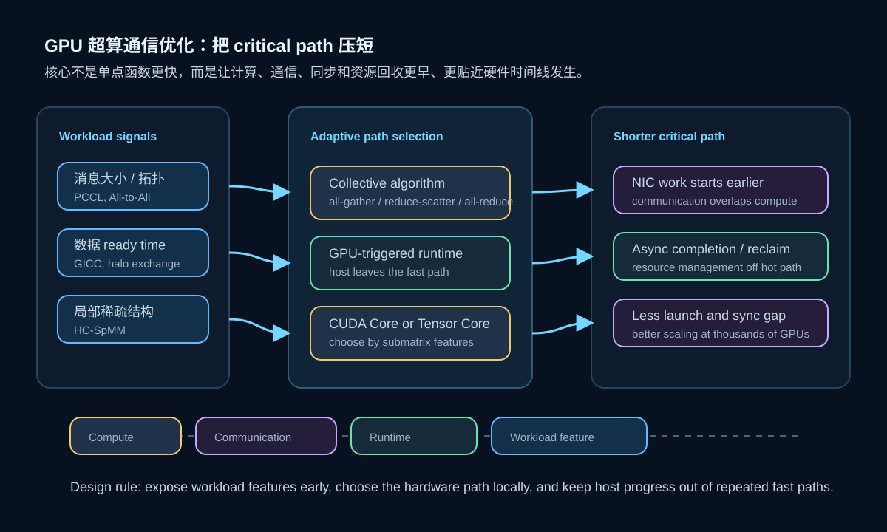

# 2025-2026 GPU 超算通信优化：从 Collective Library 到 GPU-Driven Runtime

最近几篇高性能计算方法论文给我一个很强的感觉：GPU 超算上的性能优化，正在从“单个 kernel 怎么写得更快”转向“整条执行时间线怎么排得更紧”。

在单 GPU 上，我们关心 occupancy、访存合并、寄存器压力、Tensor Core 利用率；但在多节点 GPU 系统上，真正拖慢程序的往往是另一类空隙：GPU 算完了但 CPU 还没发起通信，collective 算法和消息规模不匹配，All-to-All 在极大规模下被启动延迟吞掉，或者 runtime 为了回收网络资源把同步塞回关键路径。

这篇文章主要阅读和整理四类近期工作：

- PCCL / The Big Send-off：面向分布式深度学习的高性能 collective library。
- Frontier-scale large-message All-to-All：在 8192 节点 Frontier 上优化大消息 All-to-All。
- GICC：让 GPU kernel 在 fast path 上直接触发 NIC 级别通信。
- HC-SpMM：用 CUDA Core 和 Tensor Core 的异构选择优化图计算 SpMM。

它们解决的问题不完全相同，但共同点很明显：**不要只看算子本身，要把计算、通信、调度和资源生命周期放到同一条时间线上优化。**



## 1. 问题：GPU 很快，但系统时间线不够紧

现代 GPU 集群里，通信不再是一个可以随便放在计算后面的附属步骤。以分布式训练和科学计算为例，常见模式包括：

- data parallel 训练里的 all-reduce、reduce-scatter、all-gather；
- ZeRO/FSDP 这类参数分片训练里的频繁 collective；
- stencil/PDE 求解里的 halo exchange；
- MoE、图计算、FFT 或粒子模拟中的 All-to-All；
- 多 GPU 图神经网络训练里的 SpMM 和邻居特征聚合。

这些 workload 的共同问题是：单个 GPU kernel 可能已经很快，但全局执行时间被通信和同步切开了。一次迭代的真实耗时往往不是：

```text
compute_time + communication_time
```

而更接近：

```text
critical_path(compute, communication, synchronization, resource_reclaim)
```

如果通信启动太晚，或者 runtime 必须回到 host 侧推进，那么即使网络带宽很高，也会在时间线上留下空洞。近期几篇工作基本都在回答同一个问题：如何让通信更早发生、更贴近 GPU 执行进度，并且让不同规模、不同拓扑、不同消息模式用到更合适的算法。

## 2. PCCL：collective 不应该只靠一个固定算法

The Big Send-off 提出了 PCCL，一个面向分布式深度学习 workload 的 collective communication library。它重点优化 all-gather、reduce-scatter 和 all-reduce，这三类操作正好是数据并行、ZeRO-3、FSDP 和张量/流水并行中最常见的通信模式。

这篇论文要解决的问题是：NCCL、RCCL、Cray-MPICH 这类库虽然已经很成熟，但在现代 GPU 超算上仍会遇到性能和扩展性限制。不同机器的网络层级、GPU 拓扑、节点内/节点间带宽、消息大小和并行规模差异很大，一个固定 collective 实现很难在所有场景都接近最优。

PCCL 的方法可以拆成三步：

1. **分层设计。** 把 collective 拆成节点内、节点间等层级，分别利用更适合的通信路径。
2. **为 DL 常用 collective 做专门优化。** 重点覆盖 all-gather、reduce-scatter、all-reduce，而不是把所有 MPI collective 都平均优化一遍。
3. **自适应选择算法。** 根据规模、消息大小和平台特征选择更合适的 collective 算法。

论文报告 PCCL 在 Frontier 的 2048 个 GCD 上，相比 RCCL 对 reduce-scatter 最高有 168x 加速，对 all-gather 最高 33x，对 all-reduce 最高 10x；在 Perlmutter 上相比 NCCL 也有最高 5.7x 的收益。更重要的是，这些通信收益能传导到训练系统：DeepSpeed ZeRO-3 最高 4.9x，DDP 最高 2.4x。

这里的核心启发是：collective library 不是一个薄薄的 API wrapper，而是分布式训练的调度器之一。它必须理解硬件层级和 workload 模式，否则通信函数本身就会变成训练时间线上的瓶颈。

## 3. Frontier All-to-All：大消息也可能被 latency 支配

直觉上，我们常把 latency 看成小消息问题，把 bandwidth 看成大消息问题。但 2025 年 SC Workshops 的 Frontier-scale All-to-All 工作提醒我们：在接近 exascale 的规模下，即使是大消息 All-to-All，latency 也会主导成本。

这篇工作在 Frontier 上使用 65536 个 task、8192 个节点评估 GPU-aware All-to-All 实现。它的目标不是重新定义 All-to-All 语义，而是为极大规模和大消息场景设计更低延迟的实现，并观察不同消息大小下哪种实现更合适。论文提到两个实现分别在不同消息范围表现最好，并且都超过 vendor-provided `MPI_Alltoall`。

这个结果有两个很实际的意义：

- 第一，极大规模下 collective 的启动、调度和进度开销会被放大，不能只看单链路峰值带宽。
- 第二，`MPI_Alltoall_init` 这类持久 collective 接口值得重视，因为重复通信模式可以预先准备状态，减少每轮迭代的启动成本。

对科学计算 workload 来说，这一点很关键。很多应用的通信 pattern 在迭代间高度重复：网格分区、halo 邻居、FFT transpose、粒子交换、稀疏块分布通常不会每一步都彻底变化。如果 runtime 能把这些模式提前实例化，就有机会把控制成本从热路径里移出去。

## 4. GICC：让 GPU 直接触发网络 fast path

PCCL 和 All-to-All 主要还是在 collective library 和 MPI 通信实现层面优化。GICC 更进一步：它把通信触发这件事从 host 侧移到 GPU kernel 的 fast path 上。

传统流程里，GPU 计算完一段数据后，经常要退出 kernel 或暴露状态，让 CPU/host 发起通信、推进 runtime、等待完成，再启动下一段 GPU 工作。这个模式清楚但偏粗粒度。对于 stencil 这类 workload，边界区域一旦算完就应该尽快发送 halo，而不是等整个 kernel 结束。

GICC 的方法可以理解成三个组件：

1. **GPU-triggered coordination。** GPU kernel 内的线程在边界数据 ready 后直接触发预先准备好的 NIC work。
2. **Coordination 与 data movement 解耦。** GPU 负责在正确时刻触发动作，NIC 负责真正的数据搬运。
3. **异步资源回收。** NIC completion 同时对 GPU 和 host 可见，轻量 host 线程在后台回收有限的 NIC 状态，不把回收成本塞回关键路径。

这套机制的目标不是让 CPU 完全消失，而是让 CPU 从高频通信触发路径上退出来。host 仍负责资源管理、预注册和慢路径维护；但每轮迭代中最敏感的“边界算完后立刻发通信”尽量由 GPU 和 NIC 直接完成。

论文在 NVIDIA/AMD GPU、InfiniBand 和 HPE Slingshot 上实现并测试 GICC。报告结果包括：在 Slingshot 上每次 coordination latency 最高降低 229x，weak scaling efficiency 最高提升 25%；在 InfiniBand 上相比 NVSHMEM 的 put latency 最高降低到 1.95x；在 64 个 AMD MI250X GCD 的工业 stencil proxy 上，GPU-aware MPI 的通信时间比 GICC 高 52% 以上。

我的理解是，GICC 的价值不只是“通信 API 更快”，而是它改变了时间线结构。通信不再被整个 kernel 边界粗暴截断，而是能在更细粒度的数据依赖 ready 时发生。

## 5. HC-SpMM：同样的思想也出现在计算侧

HC-SpMM 不是通信论文，但它和上面的趋势很像。它处理的是图计算/GNN 中的 SpMM。真实图的邻接矩阵非常不规则：有的区域稀疏、适合 CUDA Core 灵活跳过零元素；有的区域经过重排后更密集、适合 Tensor Core 做矩阵乘。

如果只用 CUDA Core，可能吃不到 Tensor Core 的矩阵吞吐；如果强行用 Tensor Core，又会在稀疏区域计算大量零。HC-SpMM 的思路是把稀疏矩阵切成 row window / submatrix，根据 sparsity 和 non-zero columns 等特征选择 CUDA Core 或 Tensor Core，并通过 kernel fusion 和轻量图布局重排减少 GNN 训练中的额外访存和 launch 开销。

它和 PCCL/GICC 的共同点是：不再相信单一路径适合所有数据。更好的方法是根据局部特征做选择：

- PCCL 根据规模、消息大小和平台选择 collective 算法；
- Frontier All-to-All 根据消息范围选择实现；
- GICC 根据 GPU kernel 的数据 ready 时刻触发通信；
- HC-SpMM 根据矩阵局部稀疏结构选择 GPU core 类型。

这其实是同一种工程哲学：把 workload 拆细，识别局部特征，再把每一段放到最合适的硬件路径上。

## 6. 一个统一视角：优化 critical path，而不是优化孤立函数

把这些工作放在一起，我会把现代 GPU 超算优化分成四层：

```text
算法语义层：哪些数据依赖必须等待，哪些可以重排或提前？
算子/内核层：局部计算用 CUDA Core、Tensor Core 还是融合 kernel？
通信库层：collective 算法如何适配消息大小、拓扑和规模？
runtime/网络层：谁来触发通信？资源什么时候回收？host 是否在关键路径上？
```

传统优化容易停在第二层：把 kernel 写快。但近期方法越来越明显地往第三层和第四层推进。原因很简单：当 GPU 数量从 8 张变成几千张时，系统瓶颈不只在 FLOPS，也在所有组件之间的缝隙。

一个理想的多 GPU 迭代应该像流水线：

1. 边界数据一 ready 就发出；
2. 内部计算继续覆盖通信；
3. collective 根据当前规模选择合适算法；
4. 重复通信模式尽量预实例化；
5. completion 和资源回收放到后台；
6. 下一轮迭代不被 host progress 卡住。

这就是我说的“整理时间线”。优化目标不是让某个函数在 microbenchmark 里更快一点，而是让整条 critical path 更短。

## 7. 对实际开发的启发

如果要把这些论文的思想落到日常 HPC / AI 系统开发里，我会优先检查几个问题。

第一，通信是否真的和计算重叠了。不要只看代码里有没有 async API，要用 timeline 看通信是否被计算覆盖，是否存在 launch gap、host callback gap 或同步点。

第二，collective 是否适配 workload。all-reduce、reduce-scatter、all-gather 的最佳实现可能随消息大小、节点规模、拓扑和分片策略变化。对 ZeRO/FSDP/MoE 来说，通信库选择和并行策略是一体的。

第三，重复通信模式是否被预处理。stencil halo、FFT transpose、固定分区 All-to-All、GNN 聚合这类模式都有机会复用计划、描述符、buffer 和 NIC 状态。

第四，host 是否在高频路径上。CPU 做控制没错，但如果每个小阶段都必须等 host 判断和推进，就很难在几千 GPU 上保持紧凑时间线。

第五，局部数据特征是否被利用。稀疏矩阵、图结构、消息大小、rank 拓扑、边界区域 ready time 都是优化信号。好的 runtime 应该把这些信号转成路径选择，而不是把所有输入塞进同一个实现。

## 小结

2025-2026 年这些工作共同说明了一件事：GPU 超算的性能优化正在从“写快一个 kernel”走向“组织好一整条执行时间线”。

PCCL 告诉我们，collective library 必须针对分布式深度学习和 GPU 超算层级做自适应选择；Frontier-scale All-to-All 告诉我们，大消息在极大规模下也会被 latency 和启动成本限制；GICC 告诉我们，通信触发应该尽量贴近 GPU kernel 的数据 ready 时刻；HC-SpMM 则从计算侧说明，局部异构选择比单一路径更适合不规则 workload。

对 HPC / GPU 系统方向的开发者来说，这类论文很值得持续跟踪。它们的共同核心不是某个单点 trick，而是一个更系统的判断：**高性能来自更短的 critical path，而 critical path 由计算、通信、同步和资源管理共同决定。**

## 参考资料

- Siddharth Singh, Keshav Pradeep, Mahua Singh, Cunyang Wei, Abhinav Bhatele. The Big Send-off: Scalable and Performant Collectives for Deep Learning. arXiv:2504.18658, 2025/2026. <https://arxiv.org/abs/2504.18658>
- James Buford White. Large-Message All-to-All Communication at Frontier Scale. SC 2025 Workshops, 2025. <https://doi.org/10.1145/3731599.3767389>
- Baodi Shan, Mauricio Araya-Polo, Barbara Chapman. GICC: A High-Performance Runtime for GPU-Initiated Communication and Coordination in Modern HPC Systems. arXiv:2604.22126, 2026. <https://arxiv.org/abs/2604.22126>
- Zhonggen Li, Xiangyu Ke, Yifan Zhu, Yunjun Gao, Yaofeng Tu. HC-SpMM: Accelerating Sparse Matrix-Matrix Multiplication for Graphs with Hybrid GPU Cores. arXiv:2412.08902, ICDE 2025. <https://arxiv.org/abs/2412.08902>
