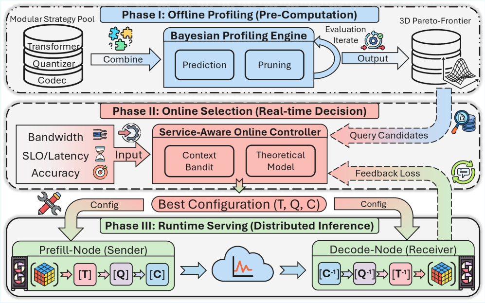

# KVServe：让 KV Cache 压缩跟着服务状态走

过去一两年，LLM 推理系统里一个很明显的变化是：大家不再只把注意力放在单卡算子、batching 或 CUDA kernel 上，而是在重新拆分整条服务路径。尤其是长上下文、RAG、多轮 agent 和 reasoning workload 变多之后，推理的瓶颈经常不是“某个矩阵乘法不够快”，而是**prefill、decode、KV cache、网络和存储之间的数据流动是否被安排在正确的位置**。

Prefill/Decode 分离就是这个趋势里的代表。Prefill 负责把输入 prompt 并行算成 KV cache，偏计算密集；decode 逐 token 生成，持续读取 KV cache，偏显存带宽和状态访问。把这两段放到不同 GPU 或不同 worker pool 上，可以减少阶段间干扰，也能按阶段独立扩缩容。NVIDIA Dynamo 的文档也把 disaggregated serving 归纳成三件基础能力：调度、KV cache 的内存管理，以及低延迟数据传输。

但这也引入一个很实际的问题：以前 KV cache 是 GPU 内部状态；分离之后，它变成了要跨节点、跨网络、甚至跨 CPU/SSD/远端 KV 池移动的显式负载。2026 年 5 月提交、已被 SIGCOMM 2026 接收的 KVServe 论文正是在处理这个问题：**当 KV cache 变成通信负载时，压缩不能再是固定开关，而应该随 workload、有效带宽、SLO 和质量预算动态选择。**



*图源：KVServe 论文 Figure 6（arXiv:2605.13734），用于说明服务感知 KV cache 压缩架构。*

这张原图把 KVServe 的三件事摆在一起：压缩策略空间、离线 profiling 和在线 controller。后文会从“KV 传输为什么贵”讲到“为什么压缩不能是固定开关”，最终落到服务状态、带宽、质量预算和 SLO 共同决定 profile 选择。

## 要解决的问题：KV cache 成了分离式推理的通信账单

传统 colocated serving 里，prefill 和 decode 在同一组 GPU 上执行，KV cache 通常留在本地显存里。系统需要处理 batching、显存管理、调度公平性等问题，但 KV 本身还没有被显式搬来搬去。

分离式推理把这个假设打破了。典型路径变成：

1. prefill worker 接收 prompt；
2. prefill 算出 prompt 对应的 KV cache；
3. KV cache 被传给 decode worker，或者写入远端 KV pool；
4. decode worker 读取这些 KV，并继续生成后续 token。

这个结构在长上下文场景里很有吸引力。Mooncake 把它称为 KVCache-centric disaggregated architecture：prefill 和 decoding cluster 分离，同时利用 CPU、DRAM、SSD 等资源构建分布式 KV cache pool。DistServe 则从 goodput 角度说明，分离 prefill 和 decode 可以减少阶段干扰，并为 TTFT 与 TPOT 分别做资源规划。

问题在于，KV cache 的体积很大，而且增长方式很直接：层数越多、hidden dimension 越大、上下文越长，需要移动的 KV 就越多。KVServe 论文里举了一个很直观的量级：Llama 3.1-70B 在 128K token 上会产生约 39.06 GB KV cache；在 32K-token 请求、Qwen3-235B、64 节点 prefill 集群的例子里，KV egress 需求可到 2.1 Tbps。真实云环境里的跨节点带宽往往远低于这个量级，于是 KV 传输很容易进入关键路径。

这就是 KVServe 关注的核心：分离式推理把资源池拆开了，但也把 KV cache 变成了必须认真调度和压缩的网络负载。

## 为什么“固定压缩策略”不够

一个自然想法是：既然 KV 太大，那就压缩。已有 KV compression 方法很多，包括量化、变换、熵编码、按层或按 head 的混合精度，以及部分 pruning。问题是，在在线服务系统里，“压缩率最高”并不等于“请求最快”。

KVServe 论文强调了两个现象。

第一，不同任务对 KV 压缩的敏感度不同。数学推理、代码生成、长文摘要、问答检索的 KV 分布和质量容忍度不一样。同一种压缩方法可能在一个 workload 上质量保持很好，在另一个 workload 上明显掉点。论文的实验中，KIVI、CacheGen、DuoAttention 等方法在不同数据集上的准确率和压缩率排序并不稳定。

第二，带宽变化会改变最优策略。压缩带来的收益来自“少传数据”，但压缩也要付出 encode/decode 成本。如果有效带宽很低，压缩通常划算；如果网络足够快，压缩和解压的计算开销可能超过省下的通信时间，反而让请求变慢。KVServe 把这个称为 negative optimization：优化方法本身在某些服务状态下会变成负优化。

所以这不是一个固定算法选择问题，而是一个在线约束决策问题：在当前 workload、当前有效带宽、当前 SLO 和质量预算下，选择哪个 KV 压缩 profile 才真的值得用。

## KVServe 的核心方法：离线找候选，在线做选择

KVServe 的设计可以分成三层。

第一层是 **Modular Strategy Pool**。它把 KV cache 压缩拆成一个可组合流水线：

- Transformer：先改变数据分布，例如 Delta、Hadamard、Affine 这类预处理；
- Quantizer：做位宽压缩，例如 KIVI 风格量化、混合精度、按 layer/head/token 的精细分配；
- Codec：进一步编码压缩后的数据流，例如使用 nvCOMP 一类高性能库。

这样做的意义是把过去彼此独立的压缩方法拆成模块，然后重新组合。一个 profile 不再只是“KIVI”或“CacheGen”，而是一组可以枚举、评估和替换的组件参数。

第二层是 **Bayesian Profiling Engine**。模块化之后，策略空间会爆炸。论文提到，细粒度参数打开后候选可到接近 `10^4`，而每个候选都做完整端到端评估会非常贵。KVServe 用 Gaussian Process 形式的 Bayesian Optimization，加上异构参数编码、exploration/exploitation 调节、双向剪枝和 early stopping，把离线搜索从约 1000 小时级别压到约 20 小时级别。最后得到的不是单个最优点，而是质量、压缩率、延迟三维上的 Pareto 候选集合。

第三层是 **Service-Aware Online Controller**。在线阶段，它不重新暴力搜索，而是根据服务上下文快速选 profile。论文把上下文抽象成：

```text
c = (workload, effective bandwidth, SLO, minimum quality)
```

对于一个压缩 profile，它关心三个量：压缩率 `cr`、压缩/解压吞吐 `s`、质量 `q`。直观延迟模型是：

```text
T = model_time + compression_time + compressed_transfer_time
```

也就是把“压缩少传的数据”与“压缩本身的开销”放在一起比较。论文进一步给出一个很有用的阈值直觉：某个 profile 是否有收益，主要取决于有效带宽是否低于由压缩率和压缩吞吐决定的阈值。带宽低于阈值，压缩更可能有利；带宽高于阈值，压缩可能不如直接传 BF16 KV。

在线 controller 先用解析模型过滤明显无收益的候选，再在 lower envelope 上查当前带宽区间对应的最优 profile。由于离线画像和真实线上负载会有偏差，KVServe 又加了一个轻量 residual-corrected bandit：只在当前最优 profile 附近的 2-3 个邻居里探索，用运行时观测修正模型残差。

这个组合很工程化：大搜索留给离线，线上只做常数级选择；模型给可解释的边界，bandit 负责处理漂移。

## 它放在系统路径里怎么工作

以 Prefill/Decode 分离为例，KVServe 插入的位置很清楚。

Prefill worker 算出 prompt KV cache 后，不是无脑把 BF16 KV 全量传给 decode worker，也不是永远套同一个压缩方法，而是：

1. 读取请求类型、当前有效带宽、SLO 和质量预算；
2. 在线 controller 从 Pareto 候选表里选一个 profile；
3. prefill 侧按该 profile 压缩 KV；
4. 网络或存储路径传输压缩后的 KV；
5. decode 侧解压，进入后续 attention 和 token generation。

在 KV state disaggregation 或 prefix caching 场景里也类似：当系统从远端 KV pool 读取可复用 KV 时，KVServe 决定这个 KV 应该以什么 profile 存取和传输。低带宽时选择更激进的压缩，高带宽或短上下文时可能选择低开销压缩甚至不压缩。

这里最重要的不是“压缩算法更复杂”，而是**压缩策略变成了 serving control plane 的一部分**。它和路由、SLO、队列状态、带宽观测一起工作。

## 实验结果说明了什么

论文把 KVServe 集成到 vLLM 0.10.1，并在 PD separation 与 prefix caching 两类场景下评估。模型包括 Qwen2.5-7B-Instruct、Llama-3.1-8B-Instruct 和 Qwen2.5-32B-Instruct，任务覆盖 GSM8K、HumanEval、Multi-News、Qasper、2WikiMQA、HotpotQA 等。

几个结果比较值得记：

- 在 PD-separated serving 中，KVServe 报告最高 9.13x JCT speedup；
- 在 KV-disaggregated/prefix caching 场景中，TTFT 最高降低 32.8x；
- 离线 profiling 搜索开销从约 1000 小时量级降到约 20 小时量级；
- 在线选择开销小于 1 ms；
- 在带宽较高或短上下文场景里，KVServe 可以选择绕开无收益压缩，避免静态方法出现负优化。

这些数字的启发是：KV compression 的价值不只在于把 KV 变小，而在于它能不能在正确的服务状态下被使用。固定压缩方法在论文里经常要么质量不稳，要么在某些带宽区间拖慢请求；KVServe 的优势来自“知道什么时候该压，压到什么程度，以及什么时候不该压”。

## 和 Dynamo、Mooncake、DistServe 放在一起看

如果把这些系统放在同一张图里，分工会比较清楚。

DistServe 解决的是 prefill 和 decode 是否应该分离，以及分离后如何针对 TTFT/TPOT 做资源与并行规划。它把阶段干扰和阶段资源耦合问题讲得很清楚。

Mooncake 更进一步把 KV cache 当成系统中心。它强调分布式 KV pool、KV cache reuse、跨 CPU/DRAM/SSD/GPU 的状态管理，以及在真实长上下文服务里用更多存储换更少重复计算。

Dynamo 是更靠近生产框架的一层，把 disaggregated serving 做进实际可部署的 router、worker、KV block manager 和 NIXL 数据传输组件里。它关心的是多 backend、多 worker pool、低延迟传输和运行时可重配置。

KVServe 则更像嵌入这些系统的一颗“KV 移动优化器”。它不替代路由器、不替代 KV pool、不替代 P/D 调度，而是在 KV 必须跨边界移动时，选择一个满足质量与 SLO 的压缩 profile，减少通信瓶颈。

这几类工作拼在一起，可以看到 LLM serving 正在从“把模型跑起来”走向“把状态流动管理起来”。

## 适用场景与局限

KVServe 最适合的场景是 KV movement 已经明显进入关键路径的服务：

- 长上下文 RAG、文档问答、多轮 agent；
- prefill 与 decode 分离部署；
- GPU 节点之间带宽受限，或跨机房、跨云、混合硬件部署；
- 远端 KV pool、prefix caching、KV offloading 频繁命中；
- workload 类型可被上游 router 粗粒度识别，且有明确 SLO/质量预算。

但它也不是免费午餐。

首先，离线 profiling 仍然有成本。20 小时比 1000 小时小很多，但仍需要稳定的模型、数据集、硬件和代表性 workload。如果模型版本或 workload 分布经常变化，候选表就需要更新。

其次，质量度量本身不总是简单。GSM8K、HumanEval 这类 benchmark 可以给分，但真实产品里的“回答质量”可能更主观，还可能和安全、风格、业务指标绑定。KVServe 假设系统能给出最低质量约束，工程上要把这个约束定义好。

第三，它依赖有效带宽和运行时状态观测。如果观测噪声很大，或者网络抖动比请求粒度还细，controller 就需要更保守，bandit 也可能需要更长时间收敛。

最后，压缩/解压实现必须足够快。论文把压缩吞吐显式放进模型里，这是对的：如果 codec 或量化 kernel 本身很慢，再高的压缩率也可能不划算。

## 我的理解：AI 系统优化正在从算力优化转向状态优化

KVServe 给我的一个很强的信号是，现代 AI 系统的核心瓶颈正在从“怎么更快地算”扩展到“怎么更少、更准、更及时地移动状态”。

LLM 推理里最贵的状态之一就是 KV cache。它既是计算结果，也是后续生成的依赖；既占显存，也占网络；既能被复用，也可能拖慢请求。Prefill/Decode 分离、KV pool、prefix caching、remote offload 这些技术都在试图利用 KV，但它们同时也制造了 KV movement 这条新关键路径。

KVServe 的价值在于，它没有把压缩当成一个孤立算法，而是把它放回服务系统里：带宽、SLO、质量、workload、线上漂移都会影响决策。这个思路可能比具体某个量化组件更重要。

对后续系统设计来说，一个值得借鉴的模式是：

- 先把跨边界移动的状态抽象出来；
- 把优化策略做成可组合 profile；
- 离线建立质量、体积、延迟的 Pareto 集合；
- 在线根据服务状态做低开销选择；
- 用少量反馈修正离线模型与线上现实之间的偏差。

这套模式不只适用于 KV cache。参数 offloading、embedding retrieval、MoE expert dispatch、跨节点 activation 或 checkpoint 移动，都可能遇到类似问题：数据该不该压缩、该压到什么程度、是否值得跨层级搬运，答案都取决于服务状态。

## 小结

如果用一句话概括 KVServe：它把分离式 LLM 推理中的 KV cache 压缩，从固定运行时配置变成了服务感知的在线控制问题。

在 KV cache 已经成为网络和存储关键负载的系统里，真正重要的不是永远压缩，也不是追求最高压缩率，而是在质量与 SLO 约束下，选择当前最合适的 profile。KVServe 的贡献就在于把这件事系统化：离线找 Pareto 候选，在线根据 workload、带宽和约束快速选择，并用轻量反馈适应漂移。

对我来说，这类工作很适合作为理解下一代 AI serving 的入口：模型越来越大，上下文越来越长，推理系统最终拼的不只是 GPU 算得快不快，而是状态能不能被聪明地放置、移动、压缩和复用。

## 参考资料

- Zedong Liu et al. KVServe: Service-Aware KV Cache Compression for Communication-Efficient Disaggregated LLM Serving. arXiv:2605.13734, 2026. <https://arxiv.org/abs/2605.13734>
- NVIDIA Dynamo Documentation: Introduction. <https://docs.dynamo.nvidia.com/dynamo/getting-started/introduction>
- NVIDIA Dynamo Documentation: Disaggregated Serving. <https://docs.nvidia.com/dynamo/components/router/disaggregated-serving>
- Ruoyu Qin et al. Mooncake: A KVCache-centric Disaggregated Architecture for LLM Serving. arXiv:2407.00079. <https://arxiv.org/abs/2407.00079>
- Mooncake GitHub Repository. <https://github.com/kvcache-ai/Mooncake/>
- Yinmin Zhong et al. DistServe: Disaggregating Prefill and Decoding for Goodput-optimized Large Language Model Serving. OSDI 2024. <https://www.usenix.org/conference/osdi24/presentation/zhong-yinmin>
