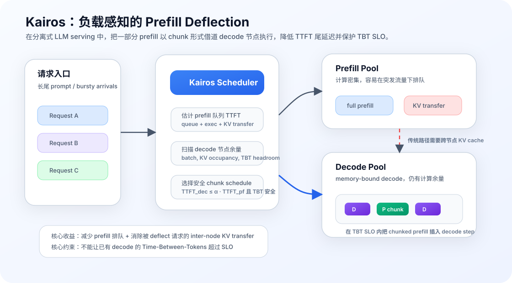

# Kairos：分离式 LLM Serving 里的负载感知 Prefill Deflection

LLM serving 的经典拆法是把一次请求分成两个阶段：**prefill** 处理完整输入 prompt、生成 KV cache 和首 token；**decode** 之后逐 token 自回归生成。两者的资源特征很不一样：prefill 更偏计算密集，decode 更偏内存带宽和 KV cache 访问。因此，近几年 Splitwise、DistServe、Mooncake、Dynamo 这类系统都在推动 prefill-decode disaggregation：让 prefill 和 decode 跑在不同 GPU pool 上，分别扩缩容，避免两个阶段在同一张 GPU 上互相干扰。

但 2026 年 7 月提交的 **Towards Load-Aware Prefill Deflection for Disaggregated LLM Serving** 提醒了一个很现实的问题：分离之后，系统不一定就平衡了。突发流量和长尾 prompt 会让 prefill 节点排队，而 decode 节点虽然在生成 token，却常常还有计算余量。更麻烦的是，传统分离式路径里 prefill 完成后还要把 KV cache 跨节点传给 decode 节点；当队列和 KV 传输进入 P95 TTFT 的主路径时，真正的 prefill 计算反而只占很小一部分。

这篇论文提出的 Kairos 可以理解成一个负载感知调度器：当 prefill pool 堵住、decode pool 仍有 TBT 余量时，它把一部分请求的 prefill 阶段“借道”到 decode 节点上，用 chunked prefill 插入已有 decode batch 之间执行。这样既利用了 decode 侧未用完的计算资源，又因为 KV cache 直接生成在 decode 节点本地，避免了跨节点 KV 传输。



## 要解决的问题：分离式架构也会制造新的不均衡

Splitwise 的核心观察是，prompt computation 和 token generation 是两种不同 workload。prompt 阶段有大量 token 并行计算，比较适合高算力 GPU；decode 阶段每步只生成一个 token，要反复读 KV cache，计算资源经常用不满。把两者拆到不同机器上，可以独立配置资源，论文报告在一些设置下能提高吞吐、降低成本或功耗。

这个思路非常自然，也已经成为 LLM serving 系统的重要方向。但 Kairos 论文指出，真正上线后会出现新的不均衡：

1. **prefill 节点面对突发和长尾 prompt 更容易排队。** 生产 trace 里的 prompt length 往往 heavy-tailed，请求到达也不是平滑 Poisson；几个长 prompt 叠在一起，就可能把 prefill queue 拉长。
2. **decode 节点并不一定计算饱和。** Decode 是 memory-bound，尤其并发 decode batch 不够大时，SM 和 Tensor Core 利用率可能很低。
3. **KV cache transfer 被放到了 TTFT 关键路径上。** 分离式系统必须把 prefill 产生的 KV 从 prefill 节点传到 decode 节点；长上下文时这部分数据很大，网络拥塞或 decode 端内存压力都会放大首 token 延迟。
4. **静态 prefill/decode 配比无法适应瞬时负载。** 固定 2P2D、3P1D 或 1P3D 都只是长期资源配置；在突发窗口里，瓶颈可能快速转移。

论文在一个生产风格的 A100 2P2D 集群上做了分解：在多类 workload 中，prefill execution 只占 P95 TTFT 的 2–23%，剩下 77–98% 主要来自 prefill queue 和 inter-node KV-cache transfer。这个数字很有启发：如果尾延迟主要不是算 prefill 本身，而是“等 prefill”与“搬 KV”，那么优化方向就不应该只盯着 prefill kernel，而应该重新设计请求路径。

## Kairos 的核心思路：让 decode 节点在安全范围内帮忙做 prefill

Kairos 的做法不是推翻分离式 serving，而是放松一个假设：请求进入 prefill pool 后，未必必须在那里完成 prefill。对于某些排队请求，如果某个 decode 节点还有足够 TBT 余量，就可以把它的 prefill 以 chunked-prefill 的形式搬到 decode 节点执行。

这里有两个关键点。

第一，**deflected request 的 KV cache 会直接生成在 decode 节点上**。这意味着它不需要经历“prefill 节点算完 → 跨节点传 KV → decode 节点开始生成”的路径。对长 prompt 来说，省掉 KV transfer 本身就可能明显降低 TTFT。

第二，**prefill 不能粗暴塞进 decode 节点**。Decode 节点上已经有正在服务的请求，用户关心的是 Time-Between-Tokens（TBT）不能突然变长。如果把一个大 prompt 的 prefill 一口气放进去，decode step 会被阻塞，老请求的流式体验会变差。因此 Kairos 使用 chunked prefill：把 prompt 拆成多个 chunk，在多个 decode step 中穿插执行，并且每一步都要满足 TBT SLO。

可以把它看成一个小型实时调度问题。每次面对排队请求，Kairos 都要回答：

```text
留在 prefill node：预计 TTFT 是多少？
放到某个 decode node：哪些 chunk size 安全？预计 TTFT 是多少？
如果 decode path 更好，且不会破坏已有 decode 的 TBT SLO，就 deflect。
```

## 调度算法：同时估计 TTFT 与 TBT headroom

论文把 Kairos 的决策拆成三类估计。

第一类是 **prefill-side TTFT estimate**。如果请求继续留在 prefill pool，调度器根据当前队列、请求顺序和预估执行时间，估计它什么时候能完成 prefill，再加上 KV cache transfer 和 decode 端等待，得到一个预期 TTFT。这个值不是精确预测未来，而是用来判断当前路径是否已经被排队和传输拖慢。

第二类是 **decode-side chunk schedule search**。对每个 decode 节点，Kairos 会尝试一组候选 chunk size sequence。一个 prompt 不一定每一步都用相同 chunk；如果当前 decode batch 小、KV occupancy 低，可以用更大的 chunk；如果 decode 负载升高，则应该缩小 chunk 或停止 deflection。论文强调这是和 Sarathi 式固定 chunk size 的区别：Kairos 的 chunk schedule 是 per-request、state-aware 的。

第三类是 **TBT safety check**。Kairos 用部署时 profiling 得到的模型，估计在当前 in-flight decode batch、KV cache 占用和新增 prefill chunk size 下，每一步 latency 是否会超过 TBT SLO。只有当所有相关 step 都安全时，这个 decode node 和 chunk schedule 才可用。

最终决策条件可以概括为两条：

1. **TBT 安全**：加入 chunked prefill 后，已有 decode 请求的 step latency 不超过 SLO；
2. **TTFT 有收益**：decode 路径预估 TTFT 不高于 `α × prefill 路径预估 TTFT`。

这里的 `α ≥ 1` 是一个操作员可调旋钮。`α = 1` 表示只有 decode path 严格更快才 deflect；更大的 `α` 允许某个被 deflect 的请求略微不占便宜，只要这能缓解 prefill queue、让后面的请求收益，并且仍然满足它自己的 TTFT SLO。这个设计很像服务系统里的 admission control：不是看到空闲资源就用，而是在 SLO 约束下决定是否借用。

## 系统框架：调度比 kernel 更重要

Kairos 的工程实现建立在 vLLM 上，论文提到约 2000 行 Python 修改，per-request routing cost 低于 1ms。这个规模说明它的核心并不是写一个全新的 GPU kernel，而是把已有 serving runtime 的调度路径改得更聪明。

系统里有三个时间线需要协调。

第一条是 prefill pool 的队列时间线。它决定哪些请求正在排队、哪些请求排在长 prompt 后面、当前 prefill 节点是否已经成为 TTFT 尾延迟来源。

第二条是 decode pool 的 step 时间线。Decode 节点每一步都在服务已有请求，TBT SLO 是硬约束。Kairos 要把 prefill chunk 插在这些 step 里，而不是让 prefill 反客为主。

第三条是 KV cache 的位置时间线。传统分离式架构中，KV 先在 prefill 节点生成，再转移到 decode 节点；Kairos deflection 则让 KV 一开始就落在 decode 节点上。这个位置变化是它降低 TTFT 的关键，因为它把一次跨节点状态迁移变成了本地状态生成。

从这个角度看，Kairos 的贡献不是“prefill 和 decode 可以混跑”这个简单结论，而是给出了一个判断混跑何时安全、何时值得的系统方法。

## 和 BulletServe、Splitwise 放在一起看

Kairos 和 BulletServe 都关注 prefill/decode 资源互补，但切入点不同。

BulletServe 做的是 **intra-device disaggregation**：在同一张 GPU 上通过空间-时间资源共享让 prefill 与 decode 并发执行，例如利用 SM masking / MPS 等机制把计算资源细粒度分给两个阶段。它更像是在单设备内部重新切分资源，目标是提升 GPU utilization 和 goodput。

Splitwise 做的是 **inter-device / inter-node disaggregation**：把 prefill 和 decode 分到不同机器或不同 GPU pool，利用两种阶段的不同特征做硬件与资源配比。它解决的是长期资源异构和 phase splitting 问题。

Kairos 则处在中间：默认仍然采用分离式架构，但在负载不均衡时允许 decode pool 临时接管一部分 prefill。它不是把系统退回完全 colocated serving，也不是固定把某些 decode 节点改成 prefill 节点，而是针对每个请求、每个时刻做 deflection。

这三个方向合起来说明一件事：LLM serving 已经不再是“prefill 一边、decode 一边”这么简单。真正高效的 runtime 需要同时理解：

- 阶段的计算/内存资源需求；
- 请求长度和到达时间的长尾分布；
- KV cache 的生成位置与迁移成本；
- TBT/TTFT 两类 SLO 的不同优先级；
- 资源共享的粒度是 GPU、node、SM，还是 batch step。

## 适用场景

Kairos 最适合的场景是：系统已经采用 prefill-decode disaggregation，但线上 workload 有明显突发、长尾 prompt，并且 decode pool 经常存在计算余量。典型例子包括 RAG 摘要、长文档问答、代码仓库级上下文、agent 任务批量进入系统等。这些场景下 prompt 可能很长，prefill queue 容易在短时间内堆积，KV transfer 也会变成 TTFT 的重要组成部分。

它也特别适合首 token 延迟敏感但 decode TBT 有明确 SLO 的服务。因为 Kairos 的目标不是盲目最大化吞吐，而是在保护已有流式输出的前提下改善 tail TTFT。如果一个服务的用户非常在意“开始回复要快”，但也不能接受回复中间卡顿，那么这种双指标调度就比单纯排队策略更有意义。

## 局限与风险

Kairos 的局限同样清楚。

首先，它依赖可靠的 latency model。TBT safety check 如果过于乐观，就会伤害已有 decode 请求；如果过于保守，又会错过 deflection 机会。不同模型、GPU、attention backend、batching 策略、KV cache layout 都会影响模型精度，因此部署时 profiling 和持续校准很重要。

其次，deflection 会增加调度复杂度。请求不再只有“prefill pool → KV transfer → decode pool”一条路径，而是可能在进入系统时被放到 decode 节点做 chunked prefill。runtime 需要维护更复杂的状态：哪些 decode 节点有余量、哪些请求已经 deflect、chunk schedule 还剩多少、如果负载突变如何回退。

第三，它并不适合 decode 已经饱和的场景。如果 decode pool 本身 TBT 已经接近 SLO，继续插入 prefill chunk 只会破坏用户体验。Kairos 的价值来自 decode 侧计算 slack；当这个 slack 不存在时，它应该自动退回传统 prefill 路径。

第四，收益和 KV transfer 成本强相关。如果部署在高速互连、短 prompt、低并发且 prefill queue 很浅的环境里，deflection 省下的东西可能不够抵消 chunked prefill 的复杂性。

## 对我的启发：LLM serving 的瓶颈越来越像“状态调度”

这篇工作给我的最大启发是，LLM serving 的优化对象正在从单个 kernel、单个 batch，扩展到**请求状态在集群中的生命周期**。Prefill 产生 KV，decode 消费 KV；KV 放在哪个节点、什么时候转移、是否需要转移，都会直接影响用户可见延迟。

传统分离式架构把 phase boundary 画得很清楚：prefill pool 负责 prefill，decode pool 负责 decode。Kairos 说明，边界太硬也会浪费机会。更好的系统应该把边界看成可调度资源：平时保持分离，拥塞时允许安全借道，负载恢复后再回到常规路径。

这也提醒我，未来 LLM serving runtime 可能会越来越像一个带 SLO 的操作系统调度器。它不仅要决定 batch 怎么组，还要决定：

- 请求应该在哪个阶段、哪个节点开始；
- KV cache 应该在哪里创建、复用、迁移或淘汰；
- 哪些资源余量可以被临时借用；
- 哪些 SLO 是硬约束，哪些可以作为全局优化目标；
- 何时为了尾延迟牺牲一点局部吞吐。

这些问题比“把某个 attention kernel 优化快 10%”更系统，也更接近线上服务的真实痛点。

## 小结

如果用一句话概括 Kairos：它在分离式 LLM serving 中加入一个负载感知的 prefill deflection 调度器，当 prefill pool 排队而 decode pool 仍有 TBT 余量时，把部分 prefill 以 chunked-prefill 的形式放到 decode 节点本地执行，从而减少 TTFT 尾延迟并避免跨节点 KV cache transfer。

它的意义不在于否定 prefill-decode disaggregation，而是让分离式架构变得更弹性。真正的系统边界不应该固定写死在“这个节点只做 prefill、那个节点只做 decode”上，而应该由队列状态、KV 位置、TBT headroom 和 TTFT 目标共同决定。

## 参考资料

- Shrikara Arun et al. Towards Load-Aware Prefill Deflection for Disaggregated LLM Serving. arXiv:2607.02043, 2026. <https://arxiv.org/abs/2607.02043>
- Esha Choukse et al. Efficient generative LLM inference using phase splitting. arXiv:2311.18677, 2023/2024. <https://arxiv.org/abs/2311.18677>
- vLLM Project Documentation. <https://docs.vllm.ai/>
- Zejia Lin et al. Bullet: Boosting GPU Utilization for LLM Serving via Dynamic Spatial-Temporal Orchestration. ASPLOS 2026 / arXiv:2504.19516. <https://github.com/zejia-lin/BulletServe>
- SGLang Project. High-performance serving framework for large language models and multimodal models. <https://github.com/sgl-project/sglang>
