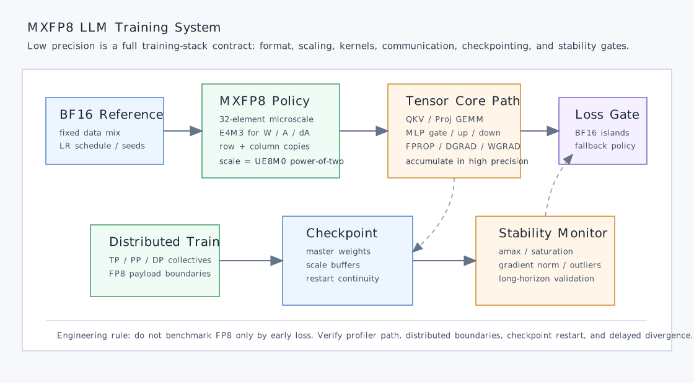

# MXFP8 训练 LLM：从低精度算力到稳定预训练配方

大模型训练的瓶颈并不只是 FLOPS。对 Transformer 来说，GEMM 是核心计算路径，但权重、激活、梯度、optimizer state 和通信 buffer 也会持续消耗 HBM 容量、HBM 带宽、NVLink/IB 带宽以及 checkpoint I/O。BF16 让训练比 FP32 更可行；FP8/MXFP8 继续把数据宽度压到 8 bit，目标是在不牺牲收敛质量的前提下，让 Tensor Core 吞吐、显存占用和通信流量都更接近硬件上限。

难点在于，FP8 不是“把 dtype 改成 float8”这么简单。它更像一个带缩放因子的量化系统：scale 的粒度、scale 何时更新、E4M3/E5M2 怎么选择、哪些张量保留高精度、outlier 如何被抑制，都会影响训练是否稳定。近两年的工作说明，低精度训练真正的工程问题是：**如何把 FP8 的硬件吞吐转化成长期预训练可复现的系统配方。**

*图源：本站自绘重构图，参考文末论文、官方文档或项目资料绘制，用于突出文章主线和关键机制。*

这张图不是直接搬运论文截图，而是按本文讲解顺序重新整理的阅读图：先给出系统边界，再标出核心数据流、控制路径和性能瓶颈。后文会围绕这些节点逐层展开，从问题动机进入实现机制，再讨论工程取舍和适用场景。

## 1. 问题：FP8 算得快，但训练稳定性更难

在 Hopper、Blackwell、Gaudi 等 AI 加速器上，FP8 GEMM 的理论吞吐和内存效率都很诱人。对一个训练 step 来说，如果 QKV、attention output projection、MLP up/down/gate projection、反向 DGRAD/WGRAD 都能使用 FP8，那么同样的 HBM 带宽可以搬运更多元素，同样的 Tensor Core 周期可以完成更多矩阵乘。

但 LLM 预训练是长周期优化问题。一个配置在几百亿 token 上稳定，不代表在 1T 或 10T token 上稳定；一个 1B 模型稳定，也不代表 8B、70B 或 MoE 稳定。2024 年关于 FP8 稳定性的分析提醒我们，低精度方案必须在随机种子、学习率、训练长度和模型尺度上接近 BF16 的鲁棒性，否则节省下来的算力会被反复试错抵消。

工程上会遇到几个具体问题：

- activation 和 activation gradient 的动态范围会随训练阶段变化；
- SwiGLU、attention score、LM head 等位置可能放大 outlier；
- per-tensor scale 太粗，容易被少数极值支配；
- per-row/per-block scale 更稳定，但会增加 scale 计算、存储和 dequant 开销；
- 反向传播比前向更敏感，梯度格式选择错误会造成迟发散；
- 分布式训练还要考虑 FP8 tensor 的 all-gather、reduce-scatter 和 checkpoint 兼容性。

所以 FP8 训练的核心不是单点 kernel 优化，而是训练栈协同：模型结构、数值格式、scale 策略、kernel library、通信、监控指标和 fallback path 都要同时设计。

## 2. MXFP8：把 scale 粒度固定到 32 元素块

MXFP8 的关键变化是 microscaling。普通 FP8 通常需要软件维护 per-tensor、per-channel、per-row 或 per-block scale；MXFP8 把数据切成连续的 32 元素块，每个块带一个 8 bit 的 power-of-two scale。Blackwell Tensor Core 可以直接消费这种格式，让更细粒度的 scale 不再完全依赖额外软件 dequant 路径。

这带来三个工程好处。

第一，scale 粒度更细。每 32 个元素共享一个 scale，比 per-tensor scale 更能覆盖局部动态范围，outlier 对整个 tensor 的污染更小。

第二，scale 表示更便宜。scale 用 UE8M0 这类 8 bit power-of-two 编码，不需要为每个块存一个 FP32 scale，也减少了乘法形式的复杂 dequant。

第三，配方更统一。NVIDIA 的 MXFP8 预训练论文报告，使用 MXFP8-E4M3 量化权重、激活和 activation gradient，并在 GEMM 路径中覆盖所有 Transformer block 的主要线性层，可以在 8B 模型、15T token 训练中与 BF16 perplexity 和下游任务表现对齐。论文同时指出，Blackwell 上 MXFP8 Tensor Core math 相对 BF16 有 2x 吞吐潜力。

这个结果的系统意义很明确：低精度训练不再只是“少数线性层用 FP8，敏感部分退回 BF16”，而是可以把更多 GEMM 纳入统一的 8 bit 训练路径。

## 3. 具体怎么做：一条可执行的训练落地流程

如果要把一个 BF16 LLM 训练栈迁移到 FP8/MXFP8，我会按下面顺序推进。

第一步，先做 BF16 reference。固定 tokenizer、数据混合、global batch size、学习率 schedule、warmup、weight decay、gradient clipping、并行策略和 checkpoint 策略。低精度实验必须和这个 reference 对齐，否则无法判断差异来自数值格式还是训练配置。

第二步，切 GEMM 路径而不是全图盲切。优先处理 Transformer block 内的线性层：attention 的 QKV/Proj，MLP 的 gate/up/down。Softmax、normalization、residual add、loss、embedding 和最终 output projection 可以先保留 BF16/FP32 accumulator，等主路径稳定后再评估。

第三步，选择张量格式。对传统 FP8，常见做法是权重和激活用 E4M3，梯度用 E5M2 以换取动态范围；但 MXFP8 论文给出的配方是权重、激活、activation gradient 都使用 E4M3，因为 32 元素块级 scale 已经足够捕捉局部范围，E4M3 的精度收益更重要。

第四步，明确 scale 生命周期。在线 amax reduction 会增加读写和同步成本；delayed scaling 可以降低开销但可能滞后；microscaling 可以用更细粒度 scale 降低 outlier 风险。系统实现时要把 scale buffer 放进训练状态，保证 checkpoint/restart、pipeline stage 切换和 activation recompute 都能复现。

第五步，处理双轴量化。MXFP8 训练中，同一个 tensor 在 FPROP、DGRAD、WGRAD 里可能以转置和非转置形式参与 GEMM，因此需要按 reduction axis 准备不同布局或不同量化副本。这会引入额外存储，需要 allocator 和 activation checkpoint 策略提前规划。

第六步，做长期稳定性监控。不要只看前 10B token 的 loss。至少跟踪 validation perplexity、amax/scale 分布、overflow/saturation 计数、梯度范数、attention logits 范围、SwiGLU 中间激活、loss landscape sharpness 代理指标，以及不同 seed 下的方差。

第七步，保留局部高精度 fallback。某些层、某些阶段或某些模型结构可能仍需要 BF16。生产训练系统要支持 per-module policy，而不是把 FP8 作为全局开关。

## 4. Outlier 是低精度训练的系统问题

FP8 训练最容易被低估的风险是 outlier。SwiGLU、attention、残差路径和 embedding 分布都可能在长训练中形成极端值。scale 粒度越粗，outlier 越容易迫使大多数普通值落到较差的有效精度区间；scale 粒度越细，数值更稳，但实现成本更高。

近期几条路线其实都在围绕 outlier 做取舍：

- FP8-LM 这类系统尝试把更多训练变量放进 FP8 自动混合精度框架；
- trillion-token FP8 训练工作指出，短训练看不到的 SwiGLU outlier 可能在长训练中触发不稳定；
- FOG 通过结构设计降低极端 activation，让 attention 内部 GEMM 也能进入 FP8；
- MXFP8 用 32 元素 microscaling 和硬件 scale 支持，把细粒度量化成本压低；
- MOSS 进一步讨论 microscaling 与自动 scaling，目标是在少做在线 max-reduction 的情况下维持稳定。

这说明“稳定 FP8”不是一个单独 kernel 能解决的问题。它需要模型结构让 outlier 不那么尖锐，数值格式让局部动态范围可表达，runtime 让 scale 计算成本可控，监控系统让迟发散尽早暴露。

## 5. 与分布式训练系统的结合点

FP8/MXFP8 会改变分布式训练的资源模型。

首先是显存。权重、激活和部分梯度压缩后，activation checkpoint、sequence length、micro-batch size 和 ZeRO/FSDP 分片策略都有重新调参空间。但 MXFP8 双轴副本和 scale metadata 也会吃掉一部分收益，不能只按“8 bit 是 BF16 一半”估算。

其次是通信。tensor parallel 的 all-gather/reduce-scatter、pipeline parallel 的 activation send/recv、data parallel 的 gradient reduce 都可能从低精度 payload 获益。但通信前后是否需要 cast、scale 是否随 payload 传输、reduction accumulator 用什么精度，都要在 collective 边界明确。

再次是 checkpoint。训练中最好保存足够高精度的 master weights 或可恢复状态，避免 checkpoint 成为数值误差累积点。optimizer state 是否 FP8 化要特别谨慎，Adam moment 的低精度化需要单独验证。

最后是 kernel/library 版本。Transformer Engine、cuDNN、cuBLAS、Megatron-LM、PyTorch/TorchAO、NCCL 的具体版本会决定 FP8 path 是真实高性能路径，还是隐式 cast 后绕回 BF16。落地前必须用 profiler 确认 Tensor Core 指令、kernel 名称、HBM 流量和通信 payload。

## 6. 一个工程检查表

| 检查项 | 推荐动作 |
| --- | --- |
| BF16 baseline | 固定数据、超参、并行策略和 evaluation pipeline |
| FP8 覆盖范围 | 先覆盖 Transformer block GEMM，softmax/norm/loss 保持高精度 |
| Scale 粒度 | 从 framework 支持的 delayed/current scaling 开始，Blackwell 上优先评估 MXFP8 |
| E4M3/E5M2 | MXFP8 可优先全 E4M3；传统 FP8 需单独评估梯度 E5M2 |
| Outlier 监控 | 记录 amax、saturation、梯度范数、SwiGLU 激活和 attention logits |
| 长训练验证 | 至少跨 seed、跨 LR，并拉长到足以暴露迟发散的 token horizon |
| 分布式边界 | 明确 collective payload dtype、accumulator dtype 和 scale 传递方式 |
| Checkpoint | 保存可恢复的 master state，验证 restart 后 loss 曲线连续 |

这张表的重点是让 FP8 实验变成可审计流程。低精度训练的失败不一定马上表现为 NaN，也可能是 perplexity 慢慢偏离、seed 方差变大、某些任务掉点，或者训练到后段才突然发散。

## 小结

MXFP8 的价值不只是把 LLM 训练从 16 bit 降到 8 bit，而是把低精度训练从手工调 scale 的软件技巧推进到硬件、格式和训练配方共同设计的阶段。32 元素 microscaling 降低了 outlier 对全 tensor 的影响，E4M3 全路径配方简化了张量格式选择，Blackwell Tensor Core 则让细粒度 scale 更接近真正可用的高吞吐路径。

对 HPC/GPU 系统开发者来说，值得记住的是：FP8/MXFP8 优化的是训练系统的端到端数据路径。只有当 GEMM、scale、allocator、communication、checkpoint 和长期稳定性监控一起闭环时，低精度算力才会变成真实的训练成本下降。

## 参考资料

- Asit Mishra, Dusan Stosic, Simon Layton, Paulius Micikevicius. Recipes for Pre-training LLMs with MXFP8. arXiv:2506.08027, 2025. <https://arxiv.org/abs/2506.08027>
- NVIDIA Technical Blog. Faster Training Throughput in FP8 Precision with NVIDIA NeMo, 2025. <https://developer.nvidia.com/blog/faster-training-throughput-in-fp8-precision-with-nvidia-nemo/>
- Alejandro Hernandez-Cano, Dhia Garbaya, Imanol Schlag, Martin Jaggi. Towards Fully FP8 GEMM LLM Training at Scale. arXiv:2505.20524, 2025. <https://arxiv.org/abs/2505.20524>
- Maxim Fishman, Brian Chmiel, Ron Banner, Daniel Soudry. Scaling FP8 training to trillion-token LLMs. arXiv:2409.12517, 2024. <https://arxiv.org/abs/2409.12517>
- Joonhyung Lee, Jeongin Bae, Byeongwook Kim, Se Jung Kwon, Dongsoo Lee. To FP8 and Back Again: Quantifying Reduced Precision Effects on LLM Training Stability. arXiv:2405.18710, 2024. <https://arxiv.org/abs/2405.18710>
- Yu Zhang, Hui-Ling Zhen, Mingxuan Yuan, Bei Yu. MOSS: Efficient and Accurate FP8 LLM Training with Microscaling and Automatic Scaling. arXiv:2511.05811, 2025. <https://arxiv.org/abs/2511.05811>
