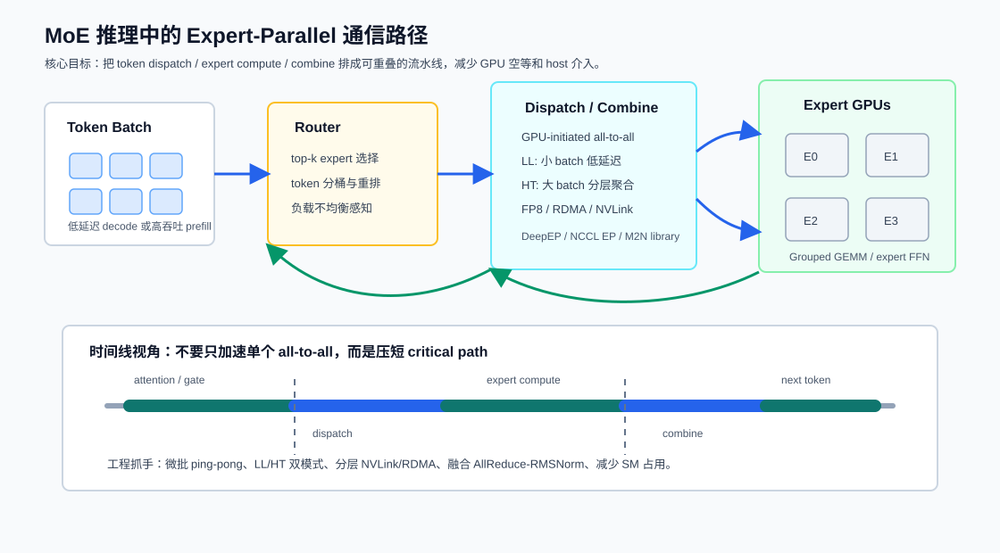

# MoE 推理的 Expert Parallel 通信：从 DeepEP 到 NCCL EP

过去两年，大模型推理系统里最值得关注的变化之一，是 Mixture-of-Experts（MoE）把瓶颈从单纯的矩阵乘吞吐，推向了更复杂的 **expert dispatch / expert compute / combine** 流水线。

MoE 的好处很直观：每个 token 只激活少量专家，模型总参数可以很大，但单 token FLOPs 不必同比例增长。问题也同样直观：一旦专家被切到多张 GPU 甚至多节点上，token 必须先按 expert 路由做 all-to-all dispatch，专家 FFN 算完后再 all-to-all combine 回原来的 token 顺序。于是 MoE 推理的关键路径变成：

```text
router -> token dispatch -> expert FFN -> token combine -> next layer
```

这篇文章整理几项近期工作：DeepEP、MegaScale-Infer、TokenWeave 和 NCCL EP。它们切入点不同，但都在回答同一个工程问题：**如何让 MoE/LLM 推理中的通信不要把 GPU 时间线切碎。**



## 1. 问题：MoE 把 FFN 变稀疏，也把通信变成主路径

传统 dense Transformer 的每层主要由 attention、MLP、norm 和通信组成。如果使用 tensor parallel，常见通信是 all-reduce 或 reduce-scatter / all-gather；通信模式比较规则，消息大小和参与 rank 也相对稳定。

MoE 层不同。每个 token 由 router 选择 top-k experts，然后 token 会被动态分发到持有这些 experts 的 GPU 上。这样会带来几个麻烦：

- **通信形态变成 all-to-all。** dispatch 和 combine 都涉及 token 在 expert parallel group 内重排。
- **负载不均衡。** 热门 expert 会收到更多 token，尾部 expert 可能空闲。
- **decode 和 prefill 的需求不同。** decode 小 batch、延迟敏感；prefill 大 batch、更看重吞吐。
- **通信会吃掉 SM。** GPU 侧通信 kernel、packing/unpacking、同步和拷贝都会占用本来能用于 GEMM 的资源。
- **host 介入成本更明显。** 每层都做高频 token exchange 时，CPU 侧初始化、同步或 group 管理很容易进入关键路径。

所以 MoE expert parallel 不是“调用一个通用 all-to-all”就结束了。它更像一个小型 runtime：要理解 token 分布、GPU 拓扑、NVLink/RDMA 层级、SM 预算、batch 大小和服务 SLO。

## 2. DeepEP：把 MoE dispatch/combine 做成专用通信库

DeepEP 是 DeepSeek 开源的 expert-parallel 通信库。它的定位很清晰：面向现代训练和推理里的 expert parallelism，提供高吞吐和低延迟 all-to-all GPU kernels，也就是 MoE 里的 dispatch 和 combine。

从工程角度看，DeepEP 值得关注的点不只是“有一套更快的 all-to-all kernel”，而是它把 MoE 通信抽象成专门的路径：

1. **把 dispatch/combine 作为一等接口。** MoE 层真正需要的是把 token 发到 expert、再把结果合回来，而不是裸 all-to-all 字节流。
2. **区分低延迟与高吞吐模式。** decode 阶段 token 数少，目标是降低 per-token latency；prefill 或训练阶段 token 数多，目标是提高带宽利用率。
3. **支持低精度数据路径。** FP8 等低精度格式能减少通信字节数，也更贴近 MoE FFN 的实际部署方式。
4. **尽量降低 SM 占用。** 通信不应该占掉太多计算资源，否则所谓 overlap 会变成通信 kernel 和 GEMM 争抢 GPU。

DeepEP V2 的 README 还提到，它用 JIT 编译 kernel，引入 NCCL Gin backend，统一 high-throughput 和 low-latency API 到 `ElasticBuffer`，并把部分传统训练场景的 SM 使用从 24 个降低到 4-6 个。这个方向很重要：MoE 通信库不能只看链路带宽，还要看它在 GPU 上“花掉多少执行资源”。

## 3. MegaScale-Infer：把 attention 和 FFN 分离，再用 ping-pong pipeline 喂满 GPU

MegaScale-Infer 从更上层的 serving architecture 入手。它观察到，MoE 的 FFN 在推理时因为稀疏激活，常常从 compute-intensive 变成 memory-intensive，导致 GPU 利用率下降。它的解法是把每层里的 attention 和 FFN 模块做 disaggregation：attention 和 experts 可以独立扩缩容、使用不同并行策略，甚至部署在不同硬件配置上。

这个设计的难点在于，attention 和 FFN 被拆开后，token 必须在两个模块之间来回移动。如果只是粗暴拆分，通信成本会吞掉收益。MegaScale-Infer 的方法主要有三块：

1. **按模块选择不同并行策略。** attention 和 FFN 的计算/访存特征不同，不必强行使用同一套 TP/EP 划分。
2. **ping-pong pipeline parallelism。** 把请求 batch 切成 micro-batches，让一部分 micro-batch 在 attention 侧执行时，另一部分在 FFN/expert 侧执行，减少阶段间空泡。
3. **M2N 通信库。** 针对模块到模块的 token 传输，去掉不必要的 GPU-to-CPU 拷贝、group 初始化和 GPU 同步。

论文报告 MegaScale-Infer 相比已有方案最高有 1.90x per-GPU throughput。这个结果背后的关键不是单个 kernel trick，而是把稀疏 expert 的“不均匀性”变成可调度对象。MoE 的 sparse activation 既是机会，也是系统负担；只有 pipeline、通信库和并行策略一起设计，才能把机会兑现。

## 4. TokenWeave：不是所有 overlap 都值得做，粒度太细会反噬

TokenWeave 关注的是 tensor-parallel LLM inference 中的计算通信重叠。它的结论对 MoE 也很有启发：通信重叠不是越细越好。

在在线推理里，每轮迭代的 token 数通常不大。为了低延迟，系统会避免把一次计算拆成太多小 kernel，因为拆分会增加 launch、同步和调度成本。TokenWeave 指出，已有许多细粒度 overlap 方法在服务系统里没有默认开启，原因正是小 batch 下拆得太细会变慢。

TokenWeave 的方法是更粗粒度的 token splitting：把 batch 中 token 分成两个子集，让一个子集的计算覆盖另一个子集的通信。同时，它把 AllReduce 和 RMSNorm 融合，利用 Hopper/Blackwell 上的 Multimem / NVSHARP 能力，让通信和 RMSNorm 只使用 2-8 个 SM。论文在 8xH100 DGX 上报告最高 1.28x latency speedup 和 1.19x throughput improvement。

对 MoE expert parallel 来说，这里有两个直接启发：

- overlap 的粒度要由 serving batch、kernel launch 成本和 SM 占用共同决定；
- 通信优化最好顺手融合临近的 memory-bound 操作，否则节省下来的时间可能又被小 kernel 开销吃掉。

也就是说，MoE dispatch/combine 的目标不是把每个步骤拆到最细，而是找到能覆盖通信、又不破坏 GPU 执行效率的粒度。

## 5. NCCL EP：把 expert parallel 做进更统一的通信 API

NCCL EP 是 NVIDIA 在 2026 年提交的 expert parallel communication 工作。它的意义在于：MoE dispatch/combine 正在从各家自研 fast path，逐渐变成需要统一 API 和长期维护的基础能力。

NCCL EP 基于 NCCL Device API，从头构建 MoE 通信库，提供 `ncclEpDispatch` 和 `ncclEpCombine` 两类接口，并区分两种模式：

- **LL mode。** 面向 inference decoding 的小 batch，例如 1-128 tokens，使用直接 all-to-all RDMA + NVLink mesh 和 double buffering 来重叠 dispatch/combine。
- **HT mode。** 面向 training 或 inference prefill 的大 batch，例如 4096+ tokens，先在 NVLink domain 内聚合 token，再做跨节点 RDMA 传输。

这正好对应 MoE 系统里的两个常见运行区间：decode 要低延迟，prefill/训练要高吞吐。把这两种路径放到同一个受支持的通信库中，能降低框架集成和跨平台维护成本。

我的理解是，NCCL EP 的价值不是替代所有专用实现，而是给 expert parallel 提供更稳定的“公共底座”。当 vLLM、SGLang、TensorRT-LLM 或内部 serving runtime 集成 MoE 时，统一的 dispatch/combine API 会比每个系统各自拼一套通信 fast path 更容易维护。

## 6. 一个工程化执行清单

如果要在真实 MoE inference stack 里落地这些思路，我会按下面的顺序检查。

第一，先把时间线量出来。用 Nsight Systems 或等价工具看每层 MoE 是否出现这些空隙：router 后等待 dispatch、dispatch 后 expert GEMM 未启动、combine 后下一层空等、host callback 或 stream sync 插入关键路径。

第二，把 prefill 和 decode 分开优化。decode 的关键是 p50/p99 token latency，优先选择低延迟 dispatch/combine、double buffering 和更小的通信 SM 预算；prefill 的关键是吞吐和带宽利用率，优先选择分层聚合、更大的 micro-batch 和 grouped GEMM。

第三，检查 expert 负载均衡。router 的 top-k 分布、capacity factor、token dropping 或 padding 策略都会影响 dispatch 消息大小。通信库再快，也无法完全掩盖极端 expert skew。

第四，控制通信占用的 SM。overlap 只有在通信和计算不严重抢资源时才成立。DeepEP、TokenWeave 和 NCCL EP 都在强调低 SM 占用，本质上是在保护 GEMM 的执行资源。

第五，避免不必要的 host 往返。高频 MoE 层里，GPU-to-CPU 拷贝、group 初始化、同步和元数据重排都应从热路径移走。能预注册的 buffer、能复用的 communicator、能 JIT 固化的 kernel 配置，都应该尽量复用。

第六，把 dispatch/combine 当成模型层的一部分做融合设计。MoE 的通信不是框架外部的“网络开销”，而是 MoE layer 的组成部分。router、permute、dispatch、expert GEMM、combine、unpermute 和 norm 应该一起看。

## 7. 小结

MoE 推理的性能优化，本质上是在整理一条更复杂的 GPU 时间线。dense 模型里，通信多半是 tensor parallel 的规则 collective；MoE 模型里，通信变成 token 级动态路由，dispatch/combine 直接站上关键路径。

DeepEP 说明 MoE 需要专用的 expert-parallel 通信库；MegaScale-Infer 说明 attention 和 FFN 可以拆开并用 pipeline 隐藏通信；TokenWeave 提醒我们 overlap 粒度和 SM 占用同样关键；NCCL EP 则说明 expert parallel 正在成为 GPU 通信栈需要原生支持的能力。

对 HPC / CUDA / LLM 系统开发者来说，这类工作最有价值的启发是：不要把 MoE 通信看成一次普通 all-to-all。真正要优化的是从 router 到 combine 的完整 critical path，以及这条路径上每一次 GPU、NIC、NVLink、RDMA 和 host 之间的交接。

## 参考资料

- DeepSeek-AI. DeepEP: an efficient expert-parallel communication library. <https://github.com/deepseek-ai/DeepEP>
- Ruidong Zhu et al. MegaScale-Infer: Serving Mixture-of-Experts at Scale with Disaggregated Expert Parallelism. arXiv:2504.02263, 2025. <https://arxiv.org/abs/2504.02263>
- Raja Gond, Nipun Kwatra, Ramachandran Ramjee. TokenWeave: Efficient Compute-Communication Overlap for Distributed LLM Inference. arXiv:2505.11329, MLSys 2026. <https://arxiv.org/abs/2505.11329>
- Amos Goldman et al. NCCL EP: Towards a Unified Expert Parallel Communication API for NCCL. arXiv:2603.13606, 2026. <https://arxiv.org/abs/2603.13606>
