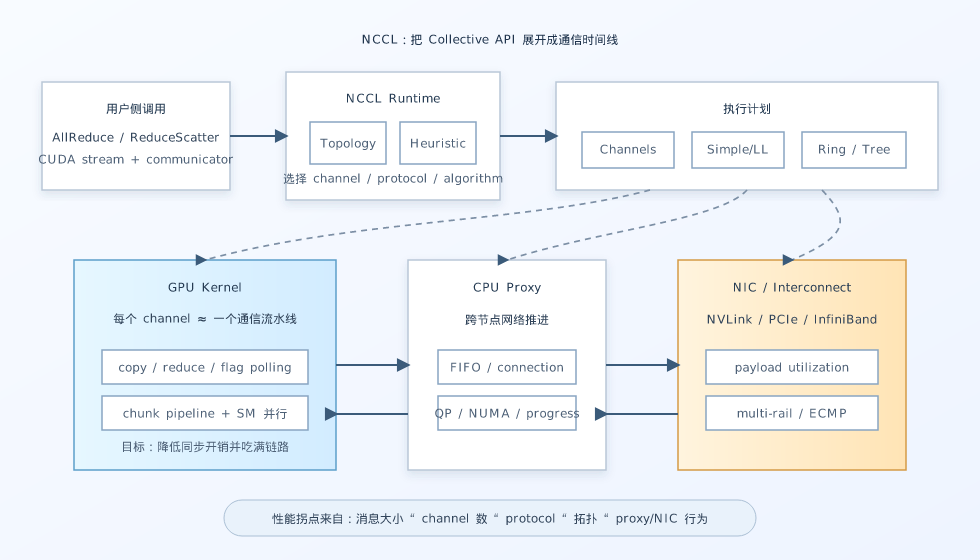

# NCCL 内部机制：从 Channels、Protocols 到 Ring/Tree

分布式训练里，NCCL 往往像一层“理所当然存在”的基础设施：PyTorch、Megatron、vLLM 或各种训练框架调用 all-reduce、reduce-scatter、all-gather，性能好不好就看网络、拓扑和 batch size。但真正调性能时，NCCL 又会突然变得非常具体：为什么小包 latency 不稳？为什么 channel 数量变了吞吐反而下降？为什么 ring 和 tree 在不同规模下表现完全不同？为什么同样是 all-reduce，某些机器上会卡在 proxy thread 或 NIC 利用率上？

2026 年 3 月更新的论文 **Demystifying NCCL: An In-depth Analysis of GPU Communication Protocols and Algorithms** 很适合作为入口。它没有把 NCCL 当成一个黑盒 API，而是从通信 channel、Simple/LL/LL128 协议、跨节点数据搬运、ring/tree 算法和模拟工具 ATLAHS 的角度，拆解 NCCL 如何把一次 collective 变成一条可执行的 GPU 通信时间线。

*图源：本站自绘重构图，参考文末论文、官方文档或项目资料绘制，用于突出文章主线和关键机制。*

这张图不是直接搬运论文截图，而是按本文讲解顺序重新整理的阅读图：先给出系统边界，再标出核心数据流、控制路径和性能瓶颈。后文会围绕这些节点逐层展开，从问题动机进入实现机制，再讨论工程取舍和适用场景。

## 要解决的问题：collective API 很简单，通信路径并不简单

NVIDIA 官方文档对 NCCL 的定位很明确：它提供拓扑感知的 GPU 间通信原语，包括 AllReduce、Broadcast、Reduce、AllGather、ReduceScatter、AlltoAll 以及点对点 send/recv；它不是完整的并行编程框架，而是专注于加速 GPU 间通信的库。NCCL 的一个重要设计是把通信和必要的 reduction 计算放在单个 GPU kernel 中完成，从而减少传统“memcpy + kernel + host 同步”组合带来的启动和同步开销。

从用户侧看，这个抽象非常干净：准备 communicator，把 collective 放到 CUDA stream 上，剩下交给 NCCL。但从系统侧看，一次 collective 至少要回答几类问题：

1. 这次消息应该切成多少份，分配给多少个 communication channels？
2. 每个 channel 用哪种协议搬数据：Simple、LL，还是 LL128？
3. 节点内走 NVLink/NVSwitch/PCIe 时，数据应该怎么从源 GPU 到目标 GPU？
4. 节点间走 InfiniBand/RoCE 时，CPU proxy、GPU kernel、NIC 队列之间如何配合？
5. collective 算法应该选 ring、tree，还是组合策略？

这些决定不只是“实现细节”。它们决定了 GPU SM 占用、FIFO buffer 利用率、PCIe/NVLink/NIC 带宽、跨节点流水线深度以及小消息延迟。因此，如果要理解大规模训练为什么有时通信效率很高、有时又突然掉下来，就不能只看 API 层的 all-reduce 名字，而要看 NCCL 在内部如何安排数据流。

## Channel：把一个 collective 切成多条并行通信流水线

论文里很重要的一个概念是 **communication channel**。如果一次 all-reduce 只由一个 GPU block/SM 处理，那么大消息很难吃满 NVLink、PCIe 或 InfiniBand 带宽。NCCL 因此把 buffer 切成多个 chunk，并用多个 channel 并行处理。每个 channel 可以理解成一条逻辑通信流水线：它有自己的拓扑关系、队列状态和 kernel block，在 ring 或 tree 中负责一部分数据。

这个设计的好处很直观：更多 channel 可以暴露更多 GPU 侧并行度，也可以更好地把流量分散到多个 NIC 或多条链路上。对于大消息，channel 数量足够时，NCCL 才有机会把网络和 GPU copy/reduction 资源都压满。

但 channel 并不是越多越好。论文提到，如果每个 channel 的 chunk 变得太小，NIC transport 侧的 FIFO buffer 可能装不满，proxy thread 发送的是大量“小半包”，网络效率反而下降。多 channel 还可能增加 queue pair、proxy 调度和 cache/内存访问压力。于是 NCCL 需要在“GPU 侧并行度”和“网络侧有效负载”之间做启发式选择。

这也是很多性能现象的来源：同样的模型、同样的 GPU 数量，message size 改一点，NCCL 可能切换 channel 数量或协议；吞吐曲线看起来不是平滑上升，而是出现台阶和拐点。

## Protocol：Simple、LL、LL128 的取舍

NCCL 的 protocol 不是网络协议意义上的 TCP/IB verbs，而是 GPU 通信 kernel 搬运和同步数据的内部格式。论文重点分析了三类：Simple、LL 和 LL128。

**Simple protocol** 更偏向大消息吞吐。它通常用较大的数据块和更直接的搬运方式，让 GPU copy/reduce 和互连带宽保持高利用率。代价是它对小消息 latency 不一定最优，因为等待数据块、buffer 管理和流水线填充本身也有成本。

**LL（Low-Latency）protocol** 面向小消息和低延迟场景。它通过更细粒度的数据单元和 flag/数据结合的方式，让接收端更快观察到可消费的数据，减少等待大块 buffer 填满的时间。但这种细粒度也意味着更多元数据和同步开销，因此大消息吞吐通常不如 Simple。

**LL128 protocol** 可以看成在低延迟和带宽之间折中：以 128-bit 风格的数据组织降低某些同步成本，同时保持比 LL 更好的有效负载比例。它适合一些中等大小消息，但具体收益依赖 GPU 架构、互连和 collective 模式。

我的理解是，protocol 选择本质上是在回答一个问题：这次通信的瓶颈更像“启动与可见性延迟”，还是“持续搬运吞吐”？小包更怕一次同步多等几微秒，大包更怕链路没有被填满。NCCL 的复杂性就在于，它需要在运行时结合消息大小、算法、拓扑和设备能力去做这个判断。

## Ring 与 Tree：带宽、延迟和规模的三角关系

NCCL 最常被提到的 collective 算法是 **ring**。以 all-reduce 为例，ring all-reduce 通常包含 reduce-scatter 和 all-gather 两个阶段，每个 GPU 只和 ring 上的前驱/后继通信。它的优点是带宽利用率高、实现稳定、对大消息友好；缺点是通信步数随 GPU 数量增长，小消息或大规模时 latency 压力会变明显。

**Tree** 算法则更适合降低通信深度。树形 broadcast/reduce 可以用更少的阶段把数据聚合或扩散出去，因此在小消息、延迟敏感或大规模集群中更有吸引力。NCCL 中还会使用 double binary tree 之类的结构，让节点在两棵树中承担不同角色，尽量同时利用上行和下行带宽，避免某些 rank 成为单点瓶颈。

因此，ring 和 tree 不是谁“更先进”的关系，而是目标不同：

- ring 更像带宽机器，适合大块数据和充分流水线；
- tree 更像延迟机器，适合减少阶段数和快速扩散；
- 实际系统还要考虑拓扑、NIC 数量、跨 socket/跨节点路径以及 channel 切分。

这解释了为什么 NCCL 调优经常不能脱离硬件。相同的 algorithm 名字，在 8 卡 NVLink 节点、跨节点 InfiniBand 集群、以及有多 NIC/多 rail 的系统上，具体路径完全不同。

## 跨节点通信：GPU kernel 之外还有 CPU proxy 和 NIC

虽然 NCCL 面向 GPU 通信，但跨节点路径并不等于“GPU 自己把一切做完”。在很多实现路径里，GPU kernel 负责执行 communication kernel、维护数据依赖和搬运本地 buffer；节点间传输还需要 NIC，某些路径还需要 CPU proxy thread 推进网络发送/接收。

这也是 NCCL 性能分析里容易被忽略的部分。GPU timeline 上看起来是一个 NCCL kernel，实际背后可能同时有：

- GPU block 按 channel 消费/产生 chunk；
- host proxy 管理网络 FIFO、connection 和 queue；
- NIC 在跨节点传输数据；
- 多个 queue pair 或路径承担 ECMP/多 rail 负载均衡；
- CUDA stream 负责和前后计算 kernel 建立顺序关系。

因此，当通信效率不好时，问题不一定在“GPU kernel 慢”。也可能是 chunk 太小导致 NIC payload 不饱和，也可能是 proxy thread CPU 亲和性不好，也可能是拓扑识别后选出的路径不适合当前消息形态。论文把这些层次展开后，一个很大的价值就是帮助读者把 NCCL 从单个 API 调用还原成端到端数据路径。

## ATLAHS：为什么需要能复现 NCCL 模式的模拟器

论文还提到，作者把对 NCCL 内部机制的分析用于 ATLAHS，一个 application-trace-driven network simulation toolchain。这个方向很有意义：大型 AI 训练集群的网络设计和性能预测，不能只用理想化 all-reduce 模型。真实 NCCL 会切 channel、选协议、走 ring/tree、使用 proxy 和不同 FIFO 行为；如果模拟器没有复现这些模式，预测出来的瓶颈可能会偏离真实系统。

换句话说，理解 NCCL 不是为了“知道源码里每个函数叫什么”，而是为了建立更准确的性能模型。对于系统研究者，模型可以帮助评估新网络、新拓扑或新 collective 算法；对于工程师，模型可以帮助定位训练 job 是被带宽、延迟、CPU proxy、还是拓扑路径限制。

## 适用场景：什么时候这些内部机制最重要

这些细节在下面几类场景中特别关键。

第一是 **大规模数据并行训练**。梯度 all-reduce 或 reduce-scatter 的消息很大，ring/channel/protocol 决定了能不能接近互连带宽上限。

第二是 **张量并行与流水线并行**。这类通信更频繁，消息大小分布更复杂，小消息 latency 和 stream 顺序会显著影响 step time。

第三是 **LLM serving 与推理系统**。decode 阶段 batch 小、kernel 短、通信粒度细，启动开销和 protocol 切换比训练场景更容易暴露。

第四是 **网络架构和集群规划**。如果要评估多 NIC、NVLink/NVSwitch、rail-optimized topology，不能只看单链路峰值带宽，而要看 NCCL 实际如何把 collective 映射到这些资源。

## 局限：NCCL 黑盒减少了应用负担，也限制了可控性

NCCL 的强项是自动拓扑检测和高性能默认策略。大多数应用不需要手写通信算法，也不应该轻易绕开 NCCL。但这种黑盒能力也有局限。

首先，自动选择不一定对所有 workload 最优。模型结构、batch size、pipeline schedule 变化后，通信模式可能和 NCCL heuristic 的假设不完全一致。

其次，NCCL 的内部实现会随版本变化。论文分析基于 NCCL 2.19.1，而官方当前文档已经来到 2.30.x；核心思想仍然有参考价值，但具体 protocol、device API、RAS/Inspector、NCCL Gin 等新能力会继续演进。

第三，NCCL 主要服务规则 collective。对于极细粒度、不规则、数据依赖强的 GPU-side 通信，NVSHMEM、NCCL device API 或专用通信 kernel 可能更合适。这也是为什么最近 GPU 通信系统会同时出现 NCCL 内部分析、NVSHMEM symmetric memory、DeepEP/NCCL EP、GPU-initiated networking 等多条路线。

## 我的理解：NCCL 是分布式 GPU 的“时间线整理器”

读完这类资料后，我对 NCCL 的理解从“高性能 collective 库”变成了“分布式 GPU 时间线整理器”。它做的事情不是简单发送一段 buffer，而是把数据切片、GPU block、CUDA stream、拓扑、协议、NIC、CPU proxy 和 collective 算法排成一条尽量紧凑的流水线。

这也给性能优化一个很实际的启发：看到通信瓶颈时，不能只问“带宽够不够”，还要问：

- 消息大小落在哪个 protocol 区间？
- channel 切分是否让 NIC 或 GPU 资源被浪费？
- ring/tree 的阶段数是否适合当前规模？
- 跨节点路径是否受 proxy thread、NUMA 或 queue pair 配置影响？
- 计算 kernel 与 NCCL kernel 在 CUDA stream 上是否真的形成了期望的重叠？

这些问题比“换更快网络”更细，但也更接近真实训练系统的性能边界。

## 小结

如果用一句话概括 NCCL 的内部机制：它把一次简洁的 collective API 调用，展开成由 channels、protocols、topology 和 ring/tree 算法共同驱动的 GPU 通信流水线。

Demystifying NCCL 这篇论文的价值在于，它给了我们一套观察这条流水线的语言。对于做分布式训练、LLM serving 或 GPU 集群性能分析的人来说，理解这些机制并不是为了替代 NCCL，而是为了在 NCCL 表现异常、需要建模或需要解释性能拐点时，有能力判断问题到底发生在哪一层。

## 参考资料

- Zhiyi Hu, Siyuan Shen, Tommaso Bonato, Sylvain Jeaugey, Cedell Alexander, Eric Spada, James Dinan, Jeff Hammond, Torsten Hoefler. Demystifying NCCL: An In-depth Analysis of GPU Communication Protocols and Algorithms. arXiv:2507.04786v3, 2026. <https://arxiv.org/abs/2507.04786>
- NVIDIA. NVIDIA Collective Communications Library (NCCL) Documentation, Overview. <https://docs.nvidia.com/deeplearning/nccl/user-guide/docs/overview.html>
- NVIDIA Developer. NVIDIA Collective Communications Library (NCCL). <https://developer.nvidia.com/nccl>
- NVIDIA. NCCL GitHub Repository. <https://github.com/NVIDIA/nccl>
