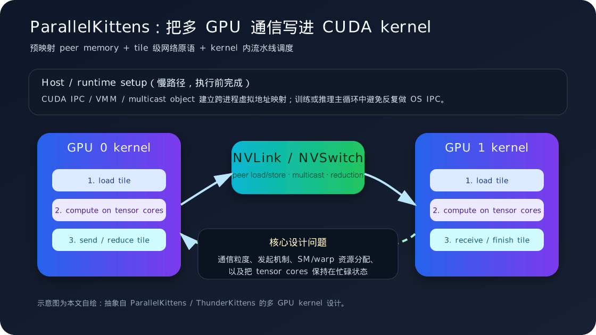

# ParallelKittens：把多 GPU 通信写进 CUDA Kernel

大模型系统近两年的一个明显变化是：我们越来越难只靠“单 GPU kernel 写得快”来解释端到端性能。模型参数、KV cache、MoE expert、长上下文 attention 都在迫使系统跨 GPU 工作；而互连带宽与通信软件栈的增长速度，通常赶不上 tensor core 算力的增长速度。

Hazy Research 在 2025 年末发布的 ParallelKittens（PK）论文和博客，正好切中这个矛盾：如果通信已经成为 AI kernel 的一部分，为什么还要把它完全交给通用通信库，在 kernel 边界外再做一次调度？PK 的答案是：把多 GPU 通信抽象成 CUDA kernel 内可组合的 tile 级原语，让开发者在同一个 kernel 模板里安排 load、compute、send/reduce 和 finish。

*图源：本站自绘重构图，参考文末论文、官方文档或项目资料绘制，用于突出文章主线和关键机制。*

这张图不是直接搬运论文截图，而是按本文讲解顺序重新整理的阅读图：先给出系统边界，再标出核心数据流、控制路径和性能瓶颈。后文会围绕这些节点逐层展开，从问题动机进入实现机制，再讨论工程取舍和适用场景。

## 要解决的问题：NCCL 很强，但不是所有通信都像“大块搬运”

NCCL、NVSHMEM 这类库是现代 GPU 集群的基础设施。对于大块连续 buffer 的 all-reduce、all-gather、reduce-scatter，它们通常很可靠，也很难被随便重写超越。但 AI workload 中有许多通信并不是这种形态：

- MoE all-to-all 往往伴随 token routing、load imbalance 和细粒度 expert 计算；
- sequence parallel 或 ring attention 需要一边传 KV tile，一边做 attention 计算；
- tensor parallel 中的 gather/reduce 往往夹在 GEMM、activation、normalization 之间；
- 新硬件上的 NVSwitch multicast/reduction、TMA、Blackwell TCGEN05 等能力，未必能立刻被通用库用到最合适的粒度。

因此，瓶颈不只是“通信库慢”，而是**通信库的抽象边界太粗**。一旦通信被放在 operator 外部，系统就容易出现空隙：kernel 结束、host 调度通信、等待通信完成、再启动下一个 kernel。即使可以用 stream overlap 缓解，也很难在 tile 级别精确控制“哪一小块数据算完后立即发出去”。

## PK 的核心思路：把通信当作 kernel 内的 tile 操作

ParallelKittens 扩展了 ThunderKittens 的 CUDA 嵌入式 DSL。ThunderKittens 原本关注单 GPU 上的 tile primitive：以 16x16 或更大 tile 为基本单位，封装 tensor core、shared memory、TMA、worker overlap 等细节。PK 在这个基础上加了一层多 GPU 能力。

它的设计可以拆成三件事。

第一，**执行前建立跨 GPU 地址关系**。在多进程训练常见的“一进程一 GPU”模型里，每个进程有自己的虚拟地址空间。PK 系列文章讨论了 CUDA IPC 和 CUDA VMM 两条路线：前者更容易映射已有 tensor，后者可以更好地配合 NVSwitch multicast/reduction，但要求开发者用 VMM 分配并管理内存。无论哪种方式，关键都是把 peer GPU 的 HBM 映射到当前进程可访问的地址空间中，让 kernel 内可以直接访问远端数据。

第二，**用 NVLink/NVSwitch 作为 kernel 可见的数据路径**。当 peer memory 已经映射好，跨 GPU 访问在代码形态上就接近普通 load/store，底层由 NVLink/NVSwitch fabric 路由。对于 broadcast 或 reduction，Hopper 之后的 NVSwitch 还提供 in-fabric acceleration；如果使用 VMM 和 multicast object，kernel 可以把一部分集体通信映射到交换网络内部完成，而不是完全依赖 ring 式点对点搬运。

第三，**用统一模板安排通信与计算重叠**。PK 不是只给一个 `send()` 函数，而是强调 resource scheduling：哪些 warp/SM 负责搬运，哪些负责 tensor core 计算，什么时候发起异步传输，什么时候等待，什么时候写回结果。论文摘要中提到 PK 用八个核心 primitive 和统一 programming template 来表达这些策略；博客则把经验概括为 transfer mechanism、scheduling strategy、design overhead 和 tile 四个维度。

## 一个 sequence-parallel kernel 可以怎么跑

以 sequence parallel 或 ring attention 的局部阶段为例，传统系统可能把流程拆成多个 operator：

1. 当前 GPU 计算本地 Q/K/V tile；
2. 调用通信库发送或接收下一段 K/V；
3. 等待远端 tile 到达；
4. 启动 attention kernel；
5. 重复下一段。

PK 风格的写法更像一个持久化的 tile 流水线：

1. producer warp 预取本地 tile，并通过 NVLink/NVSwitch 读取或发送 peer tile；
2. consumer warp 在 tensor cores 上计算当前 tile 的 attention/GEMM；
3. 通信 worker 提前推进下一块 tile 的跨 GPU 传输；
4. finish 阶段把局部结果写回，或触发下一步 reduce/gather；
5. 整个过程尽量不回到 host，也不把每个 tile 暴露成独立 kernel launch。

这里的关键收益不是“所有通信都神奇消失”，而是通信的时间线被压进了计算 kernel 内部。只要 tile 粒度、buffering 和 worker 分配合适，网络传输就可以和 tensor core 计算同时推进。

## 为什么 tile 是一个很自然的边界

PK 反复强调 tile，并不只是因为 ThunderKittens 原本就是 tile DSL。现代 GPU 的高效执行本来就围绕 tile 展开：tensor core 消费矩阵片段，shared memory/TMA 负责成块搬运，scheduler 需要在 warp group 和 SM 之间分配不同角色。

把网络通信也降到 tile 粒度后，系统可以获得几个好处：

- **依赖更精确**：某个 tile 准备好就能发送，不必等整个 operator 结束；
- **overlap 更充分**：一部分 warp 搬运下一块数据，另一部分 warp 计算当前块；
- **抽象更统一**：本地 HBM、peer HBM、shared memory、tensor core 输入都围绕 tile 描述；
- **更容易跟新硬件对齐**：当 Blackwell、NVSwitch 或 TMA-like 功能变化时，可以在 primitive 层吸收差异。

从论文报告看，PK 在 Hopper 和 Blackwell 上验证了这种方法：少于 50 行 device code 的 kernel，在数据/张量并行、sequence parallel、expert parallel 等场景中分别获得了最高 2.33x、4.08x、1.22x 的加速。博客中还提到，一些基础通信 kernel 用很少的 ThunderKittens device code 就能超过通用库实现。这些数字不能简单外推到所有模型，但足以说明“应用感知的通信 kernel”有现实价值。

## 和 GPU-Initiated Communication 的关系

我之前写过 GICC，它关注的是 HPC runtime 中 GPU 如何直接触发跨节点通信，减少 host 介入。ParallelKittens 的场景更偏 AI 系统与节点内 NVLink/NVSwitch，但两者背后有相似趋势：**把通信控制权靠近数据依赖发生的位置**。

差别在于：

- GICC 更像 runtime / network fast path：GPU 发起协调，NIC 执行，host 异步回收资源；
- PK 更像 kernel programming model：开发者在 CUDA kernel 内组织 tile、worker、peer memory 与 NVSwitch primitive；
- GICC 主要解决分布式 HPC 里 host 介入和细粒度协调问题；
- PK 主要解决 AI kernel 中通用通信库边界太粗、无法充分利用 scale-up GPU fabric 的问题。

这两条路线最终可能会合流：大规模 AI training/inference 既需要节点内 NVLink/NVSwitch 的 tile 级通信，也需要节点间 NIC 的低延迟 GPU-driven coordination。

## 适用场景与局限

PK 最适合那些通信模式稳定、性能足够关键、并且能从 tile 级 overlap 中获益的场景，例如 sequence parallel attention、tensor parallel 中的 fused gather/reduce、MoE expert parallel 的局部通信，以及某些需要利用 NVSwitch multicast/reduction 的 scale-up 系统。

但它也不是“替代 NCCL”的通用答案。局限主要有四个。

第一，工程门槛更高。开发者需要理解 CUDA VMM/IPC、peer memory、NVSwitch 语义、warp/SM 资源调度，以及不同 GPU 架构的细节。第二，内存管理变复杂。VMM 路线要求提前分配和映射内存，不能总是直接复用 PyTorch allocator 管理的任意 tensor。第三，可移植性需要额外维护。PK 当前主要面向 NVIDIA GPU；即使 ThunderKittens 有 HipKittens 等相关探索，跨厂商多 GPU fabric 的抽象仍然很难统一。第四，收益依赖 workload。对于大块、规则、已被 NCCL 高度优化的 collectives，手写 kernel 未必值得。

## 我的理解：AI 系统优化正在进入“网络感知 kernel”阶段

过去几年，FlashAttention 这类工作让大家意识到：一个算子快不快，取决于它是否按硬件喜欢的方式移动数据，而不只是数学表达式是否简洁。ParallelKittens 把这个思路推到多 GPU：当模型天然跨设备时，kernel 不仅要懂 tensor core 和 shared memory，也要懂 GPU fabric。

这对个人学习 CUDA/HPC 很有启发。以后看一个分布式 AI 优化时，可以多问几件事：

- 通信是在 operator 外部，还是已经进入 kernel 内部？
- overlap 的粒度是 stream、operator、tile，还是 warp/SM？
- 数据传输走的是 host、PCIe、NVLink、NVSwitch，还是 NIC？
- 是否利用了 multicast/reduction 这类 in-fabric acceleration？
- 优化收益来自带宽提升、延迟减少，还是时间线空隙被压缩？

如果说单 GPU kernel 优化是在整理 HBM、shared memory 和 tensor core 的关系，那么 PK 这类工作就是在继续整理 GPU 与 GPU 之间的关系。未来的高性能 AI 系统，大概率会越来越依赖这种网络感知、硬件感知、应用感知的 kernel 设计。

## 小结

ParallelKittens 的核心价值不在于发明了某个单一通信算法，而在于提供了一套把多 GPU 通信写进 CUDA kernel 的方法论：执行前建立 peer memory 映射，执行中以 tile 为粒度使用 NVLink/NVSwitch，调度上把通信 worker 与 tensor core compute 放进同一个流水线。

这类方法的代价是更高的工程复杂度，但它指出了一个很重要的方向：当 scale-up GPU 系统越来越大，通信不再只是 runtime 的事，也会成为 kernel 作者必须直接面对的性能维度。

## 参考资料

- Stuart H. Sul et al. ParallelKittens: Systematic and Practical Simplification of Multi-GPU AI Kernels. arXiv:2511.13940, 2025. <https://arxiv.org/abs/2511.13940>
- Hazy Research. Simple and Fast Multi-GPU AI Kernels. 2025-11-17. <https://hazyresearch.stanford.edu/blog/2025-11-17-pk>
- Hazy Research. One Kernel for All Your GPUs. 2025-09-22. <https://hazyresearch.stanford.edu/blog/2025-09-22-pgl>
- HazyResearch/ThunderKittens project page. <https://github.com/HazyResearch/ThunderKittens>
- NVIDIA. NVIDIA Blackwell Architecture. <https://www.nvidia.com/en-us/data-center/technologies/blackwell-architecture/>
