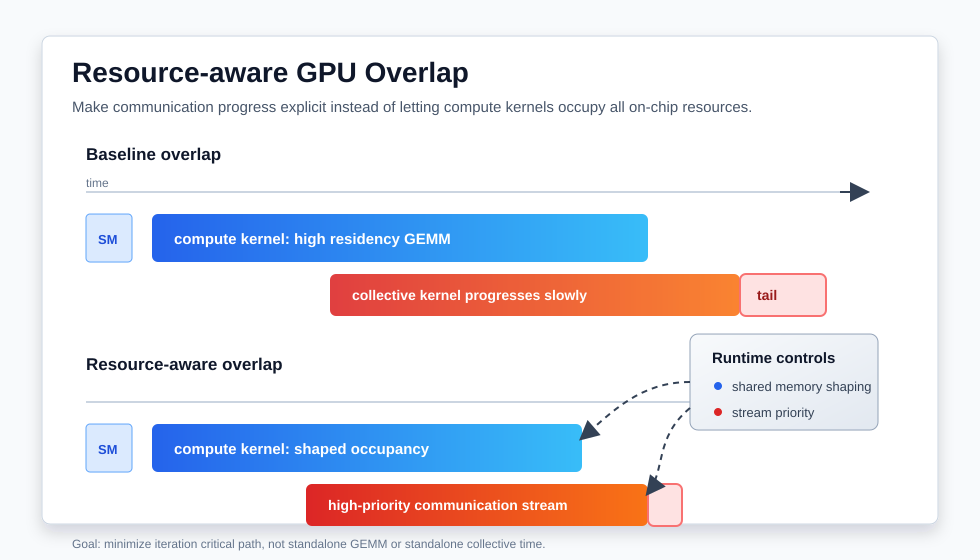

# 资源感知的 GPU 训练重叠：让通信真正跑起来

分布式 GPU 训练里，“把通信和计算重叠起来”已经是几乎默认的优化建议。FSDP/ZeRO 在 backward 中提前发起 reduce-scatter，pipeline parallel 把 activation 发送和下一段计算交错，MoE 训练里 dispatch/combine 也会尽量和 expert GEMM 重叠。这个方向当然是对的：如果通信完全串行，GPU 很容易在 collective 上等待。

但近期几篇工作提醒我们，overlap 不是一个免费的开关。通信 kernel 和 GEMM kernel 同时跑在同一张 GPU 上时，会竞争 SM、寄存器、shared memory、L2、HBM 带宽、NVLink/PCIe path，甚至功耗预算。结果可能是：timeline 上看起来通信被“盖住”了，但 GEMM 被拖慢，最终端到端收益低于预期。

这篇文章主要整理三类近期材料：

- **Characterizing Compute-Communication Overlap**：系统测量 A100/H100/MI250/MI210 上 overlap 对性能和功耗的影响。
- **Resource-aware Computation-Communication Overlap**：用 shared-memory-driven occupancy shaping 和通信流高优先级，让 collective 有稳定进展。
- **FlashOverlap / tail latency overlap**：从分布式 LLM 训练角度处理 overlap 末尾无法隐藏的通信尾巴。

核心观点很简单：**好的 overlap 不是让计算 kernel 占满 GPU 后祈祷通信自己挤进去，而是主动给通信保留可推进的资源。**



## 1. 问题：为什么“异步通信”不等于“有效重叠”

很多训练代码里会出现这样的模式：

```text
stream_compute: GEMM / attention / MLP backward
stream_comm:    all-gather / reduce-scatter / all-reduce
```

如果两个 stream 没有显式依赖，profile 里也能看到两段 kernel 时间范围有交叠，我们容易直接判断 overlap 成功。但 GPU 上的事实更复杂：两个 kernel 时间范围交叠，不代表两者都以接近独立运行的速度推进。

典型问题包括：

- 计算 kernel occupancy 太高，把 SM resident slots 基本吃满，通信 kernel 启动了但推进很慢；
- GEMM 本身已经接近功耗或 HBM 带宽上限，叠加 NCCL/RCCL 后触发频率下降或 memory contention；
- 通信 kernel 需要少量但持续的 SM 资源，计算 kernel 的大 block 配置让它很难插队；
- overlap 把通信主体隐藏了，但最后仍留下 tail latency，下一层计算必须等待；
- 优先级设置不合理，通信在 stream 上排队，无法在关键窗口内完成。

所以工程上应该区分三个时间：

```text
T_sequential = T_compute_alone + T_comm_alone
T_overlap    = max(T_compute_slowed, T_comm_slowed) + exposed_tail
T_ideal      = max(T_compute_alone, T_comm_alone)
```

真正想要的是接近 `T_ideal`，而不是仅仅比 `T_sequential` 快一点。差距通常来自两部分：一是 compute/communication 相互拖慢，二是通信尾部没有被隐藏。

## 2. 近期测量：overlap 会带来真实的计算减速

2025 年的 Characterizing Compute-Communication Overlap 工作很有价值，因为它不是只展示某个新 runtime 的最好结果，而是先问一个基础问题：现代 GPU 上计算和通信同时执行时，计算 kernel 到底会慢多少？

论文在 NVIDIA A100、H100 和 AMD MI250、MI210 上评估 GPT/LLaMA 训练，覆盖 FSDP 与 pipeline parallel。它的结论很直接：overlap 平均会造成约 18.9% 的计算减速，最高可到 40.0%；不过完全串行平均又比 overlapped execution 慢约 10.2%，最高慢 26.6%。这说明 overlap 通常仍然值得做，但它离“无干扰的理想重叠”有明显距离。

更值得注意的是功耗。论文观察到，在某些大模型和高 overlap 配置下，overlap 会推高峰值功耗；当加上严格 power cap 时，减速会被明显放大。这一点对大规模集群很现实：训练作业可能不是单卡 benchmark，而是运行在有功耗墙、散热约束、频率策略和多租户调度的环境里。

从工程角度，我会把这篇论文的启发总结成一句话：**overlap 的收益必须用端到端 iteration time 衡量，同时要观察 compute kernel slowdown、通信 tail 和 power/frequency trace。**

## 3. 方法一：用 shared memory 调 occupancy，给通信 kernel 留位置

2026 年 6 月发布的 Resource-aware Computation-Communication Overlap 更进一步：如果 overlap 被资源竞争削弱，能不能不改 NCCL/RCCL，也不改 GEMM kernel 的主要实现，只通过 runtime 控制让通信更稳定地推进？

它提出两个相对可移植的控制手段。

第一是 **shared-memory-driven occupancy shaping**。思路是给计算 kernel 的每个 thread block 动态分配额外 shared memory，从而降低同一个 SM 上可同时驻留的 block 数量。这样做看起来有点反直觉：主动降低计算 kernel 的 occupancy，似乎会让计算变慢。但如果原本计算 kernel 把资源占得太满，通信 kernel 只能断断续续地跑，那么适度降低计算 residency 反而能减少整体等待。

第二是 **给通信 stream 更高调度优先级**。occupancy shaping 只是在资源层面腾出空间；高优先级则保证通信 kernel 一旦有资源可用，就能更及时地获得调度机会。两者组合起来，相当于把“通信也需要稳定进展”这个事实显式编码到 runtime 策略里。

论文在 NVIDIA A40/A100/H100 和 AMD MI250X 上实验，报告总执行时间最高降低 25.5%，并且不需要修改 vendor communication library 或 kernel 实现。这个约束很重要，因为真实训练系统里很难要求每个算子都重写成 fused communication-compute kernel。能通过 launch 配置、shared memory 和 stream priority 做到一部分收益，工程落地成本会低很多。

可以把这种方法理解成一个调参问题：

```text
计算太满：GEMM 快，但通信没有进展，tail 大
通信太强：collective 快，但 GEMM 被过度让路
资源感知：控制计算 residency，让通信持续推进，总时间最短
```

这里的目标不是最大化 GEMM 单独吞吐，也不是最大化 NCCL microbenchmark 带宽，而是最小化一次训练 step 的 critical path。

## 4. 方法二：把 tail latency 当作一等公民

即使通信主体已经和计算重叠，最后一点通信尾巴仍然可能暴露在关键路径上。FlashOverlap 这类工作关注的就是这个问题：在张量并行、数据并行和 LLM 训练里，overlap 末尾残留的 tail latency 会让后续计算等待。

tail 的来源很多：

- collective 的最后阶段需要跨节点同步，无法完全被本地 GEMM 覆盖；
- 计算分块粒度不合适，最后一个 chunk 之后没有足够计算继续覆盖通信；
- 通信排队太晚，导致它错过最好的 overlap 窗口；
- 某些 rank 的计算或网络稍慢，形成 straggler。

处理 tail 的常见方向包括：更细粒度地切分计算和通信、调整 bucket size、提前发起依赖较弱的 collective、给关键通信更高优先级、或者把通信放进更贴近计算的数据流里。但这些方法都有代价：切得太细会增加 kernel launch 和调度开销；提前太多会加重资源竞争；优先级过高又可能牺牲计算吞吐。

因此，一个实用判断是：**先 profile tail，再决定要不要切分。** 如果通信大头已经被隐藏，只剩很短 tail，过度切分可能得不偿失；如果每轮都有稳定暴露的 all-gather 或 reduce-scatter 尾巴，就值得调 bucket、stream priority、prefetch 时机和 kernel occupancy。

## 5. 怎么在训练系统里落地

我会把资源感知 overlap 的落地流程拆成五步。

第一步，建立 baseline timeline。用 Nsight Systems、PyTorch profiler、NCCL debug trace 或 ROCm profiler 看一次 iteration。不要只看平均 step time，要标出每个 exposed communication window、GEMM slowdown 和同步点。

第二步，分离三种运行模式：

```text
compute alone: 只跑代表性 GEMM/attention/MLP
comm alone:    只跑对应 collective
overlap:       真实训练或构造出的并发执行
```

如果 overlap 中 compute 时间比 compute alone 明显变长，就说明资源竞争是真问题；如果 comm 的完成时间延后且 tail 暴露，就说明通信没有拿到足够推进机会。

第三步，先调 bucket 和依赖窗口。FSDP/ZeRO 里 bucket size 太大，通信启动晚；太小，launch/synchronization 变多。目标是让通信尽早进入可覆盖区间，但不要制造过多小 kernel。

第四步，引入 stream priority。对必须在下一阶段前完成的 all-gather、reduce-scatter 或 pipeline send/recv，提高通信 stream 的调度优先级。这里要小心验证端到端收益，因为优先级只是调度提示，不是硬隔离。

第五步，尝试 occupancy shaping。对于自研 CUDA kernel，可以通过 block size、动态 shared memory、cluster launch 或 kernel variant 控制 residency；对于框架生成或库 kernel，可以优先选择已有的 tile 配置、算法选项和 runtime launch 参数。目标不是盲目降低 occupancy，而是给通信 kernel 留出刚好足够的 SM 进展空间。

## 6. 一个简单的判断表

下面这个表适合做初步诊断：

| 现象 | 可能原因 | 优先动作 |
| --- | --- | --- |
| timeline 有 overlap，但 step time 收益很小 | GEMM 被通信拖慢 | 比较 compute-alone 与 overlapped compute time |
| communication tail 稳定暴露 | 通信启动晚或推进不足 | 调 bucket size、prefetch 时机、stream priority |
| 通信 kernel 启动后长时间不完成 | 计算 kernel residency 太高 | 尝试 occupancy shaping 或更小 tile |
| power cap 下性能突然变差 | overlap 推高功耗并触发降频 | 观察功耗/频率 trace，降低并发强度 |
| 小模型 overlap 有收益，大模型收益下降 | 大模型更接近资源上限 | 按模型规模分别调策略，不共用一套参数 |

这类诊断表比“打开 overlap”更重要。因为同一个策略在 A100、H100、MI250X 上可能表现不同；在 FSDP 和 pipeline parallel 上也可能相反。FSDP 的 collective 更重，容易带来高 overlap ratio 和高资源竞争；pipeline parallel 多是 send/recv，干扰模式可能更轻，但 tail 和 stage imbalance 更明显。

## 7. 对 CUDA/HPC 开发者的启发

这几篇工作的共同趋势是：GPU 系统优化正在从“单个 kernel 最快”转向“并发执行时资源分配最好”。这对 CUDA 和 HPC 开发有几个具体启发。

第一，kernel 的最佳配置要考虑邻居。一个 GEMM 或 stencil kernel 单独跑最快的 block/tile 配置，不一定是和通信并发时的最佳配置。如果它让 SM residency 过高，可能会拖慢 collective。

第二，通信库不是黑盒之外的事情。即使不改 NCCL/RCCL，也可以通过 stream、优先级、bucket、launch order 和 dependency graph 影响通信是否及时推进。

第三，功耗是性能资源。大规模训练通常运行在功耗受限的数据中心。overlap 增加并发度后，可能把 GPU 推到更高功耗区间，引发频率调整。只看 kernel 时间而不看 power trace，会漏掉关键原因。

第四，profile 要看 critical path。优化一个通信 microbenchmark 没有意义，除非它缩短了训练 step 的关键路径；降低一个 GEMM 的单独吞吐也不一定坏，假如它换来了更短的 exposed tail。

第五，自动调参会越来越重要。bucket size、stream priority、计算 kernel residency、通信算法选择都依赖模型、batch、拓扑和 GPU 代际。手写一套固定规则很难长期最优，更合理的方向是 profile-guided 或 runtime-adaptive 的策略。

## 小结

计算-通信重叠仍然是分布式 GPU 训练最重要的优化之一，但它不是“越满越好”。当 GPU 计算吞吐、HBM 带宽、NVLink/NIC 和功耗预算都接近上限时，overlap 本身会制造资源竞争。

近期论文给出的更稳妥路线是资源感知：先测量 overlap 对 compute kernel、communication kernel、tail latency 和功耗的影响，再通过 bucket、stream priority 和 occupancy shaping 给通信留下可推进的资源。这样做的目标不是让某一个 kernel 单独最好看，而是让整条训练 iteration 的 critical path 更短。

对做 CUDA、HPC 和深度学习系统的人来说，这个方向很值得跟踪。未来的大模型训练优化，很可能不只是写更快的 GEMM 或更快的 collective，而是让它们在同一张 GPU、同一个节点、同一条网络时间线上以更合理的资源配比一起运行。

## 参考资料

- Seonho Lee, Jihwan Oh, Junkyum Kim, Seokjin Go, Jongse Park, Divya Mahajan. Characterizing Compute-Communication Overlap in GPU-Accelerated Distributed Deep Learning: Performance and Power Implications. arXiv:2507.03114, 2025. <https://arxiv.org/abs/2507.03114>
- Minyu Cui, Miquel Pericas. Resource-aware Computation-Communication Overlap for multi-GPU ML Workloads. arXiv:2606.09200, 2026. <https://arxiv.org/abs/2606.09200>
- FlashOverlap: Minimizing Tail Latency in Communication Overlap for Distributed LLM Training. arXiv:2604.24013, 2026. <https://arxiv.org/abs/2604.24013>
- NVIDIA Technical Blog. Optimizing Communication for Mixture-of-Experts Training with Hybrid Expert Parallel, 2026. <https://developer.nvidia.com/blog/optimizing-communication-for-mixture-of-experts-training-with-hybrid-expert-parallel/>
