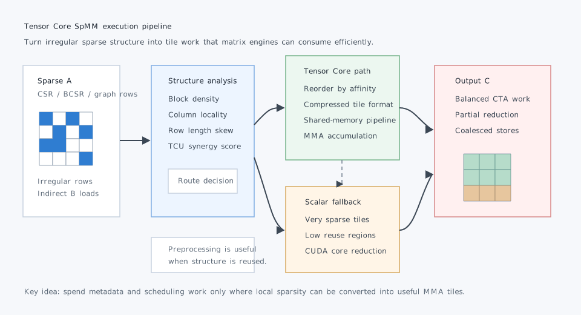

# Tensor Core SpMM：把不规则稀疏矩阵乘法送进矩阵引擎

稀疏矩阵乘稠密矩阵，也就是 SpMM，形式通常写成 `C = A_sparse * B_dense`。它是科学计算、图神经网络、推荐系统、稀疏 attention、求解器和预条件器里的基础 kernel。NVIDIA cuSPARSE 也把 SpMM 放在稀疏计算 API 的核心位置，并明确提到稀疏计算广泛用于 machine learning、AI、CFD、seismic exploration 和 computational sciences。

问题在于，现代 GPU 最强的矩阵计算资源是 Tensor Core，而 Tensor Core 天然喜欢固定形状、连续、规整的小矩阵乘法。通用 SpMM 的输入却高度不规则：每一行非零元数量不同，列索引跳跃，局部稀疏度变化大，很多 tile 即使用零填充也不够密。于是一个很现实的问题出现了：**能不能把通用稀疏矩阵的 SpMM 高效送进 Tensor Core，而不是只靠 CUDA core 做标量乘加？**

2025 年的 Acc-SpMM 和 cuTeSpMM 都在回答这个问题。它们的共同方向不是简单地“把稀疏块补零成 dense tile”，而是先判断哪些稀疏结构适合 Tensor Core，再通过数据重排、紧凑格式、tile 级流水线和负载均衡，让矩阵引擎真正吃到足够有效的乘加。

*图源：本站自绘重构图，参考文末论文、官方文档或项目资料绘制，用于突出文章主线和关键机制。*

这张图不是直接搬运论文截图，而是按本文讲解顺序重新整理的阅读图：先给出系统边界，再标出核心数据流、控制路径和性能瓶颈。后文会围绕这些节点逐层展开，从问题动机进入实现机制，再讨论工程取舍和适用场景。

## 1. 要解决的问题：Tensor Core 很快，但 SpMM 不规整

Dense GEMM 能把 Tensor Core 用得很好，因为计算模式稳定：从 A 和 B 中搬连续 tile，到 shared memory 或寄存器片段，再执行 MMA 指令，最后累加写回。这个路径的计算密度高，访存可预测，线程块之间也容易均衡。

SpMM 则几乎处处相反。

首先是 **非零分布不均匀**。有些行很长，有些行只有几个非零元；有些局部块比较密，有些块接近空。把它们硬塞进固定 MMA tile，会产生大量无效零乘法。

其次是 **B 矩阵访问依赖列索引**。稀疏矩阵 A 的列索引决定要读取 B 的哪些行，这会破坏连续访问，造成 cache 命中率和内存合并都不稳定。

第三是 **负载均衡难**。如果一个 warp 或 thread block 处理固定数量的行，长行会拖慢整个 block；如果按非零元切分，又容易引入原子写回或复杂归约。

第四是 **格式转换成本不可忽略**。HPC 应用常用 CSR/CSC/BCSR，GNN 框架也常以 CSR 风格存储图结构。如果为了 Tensor Core 每次都做昂贵重排，端到端训练或仿真未必划算。

所以 Tensor Core SpMM 的核心矛盾不是“有没有矩阵引擎”，而是：稀疏结构是否能被组织成足够密、足够连续、负载足够均衡的 MMA 工作单元。

## 2. 先看局部结构：哪些稀疏矩阵值得上 Tensor Core

cuTeSpMM 提出一个很有工程意义的判断：并不是所有稀疏矩阵都适合 Tensor Core。它引入类似 TCU-Synergy 的概念，用非零结构和建模的 operational intensity 估计一个矩阵是否有足够的 Tensor Core 亲和性。

这个判断非常重要。因为 Tensor Core 路径通常要付出额外成本：

- 把稀疏数据打包成 MMA 可消费的 tile；
- 为不完整 tile 做 zero filling 或 mask；
- 解码压缩元数据；
- 在 shared memory 中重新组织 A 和 B 的访问；
- 对不同稀疏块做调度和归约。

如果局部非零分布太散，Tensor Core 多做的零乘法和格式开销可能超过收益。反过来，如果一个矩阵存在很多局部密集区域，哪怕整体仍然稀疏，也可以把这些区域提取成高效 tile，让 Tensor Core 的吞吐抵消额外开销。

这给实际系统一个简单原则：**不要把 Tensor Core 当成默认答案，先判断稀疏结构是否有局部密度和数据复用。** 对 GNN、稀疏 attention、块稀疏线性层、有限元矩阵或图 Laplacian，性能差异往往来自结构本身，而不只是 GPU 型号。

## 3. Acc-SpMM 的方法：重排序、压缩格式、流水线、负载均衡

Acc-SpMM 的设计可以拆成四个层次。

第一层是 **data-affinity-based reordering**。目标是把访问 B 矩阵相近列的非零元聚在一起，提升 B 的数据复用和访存局部性。SpMM 中 A 的 value 和 index 只读一次通常还好，真正昂贵的是按照不规则列索引反复拉取 B 的行。重排序本质上是在不改变数学结果的前提下，让 GPU 看到更友好的访问序列。

第二层是 **memory-efficient compressed format**。Tensor Core 路径需要把稀疏 tile 的值、位置和有效元素组织起来。如果格式太臃肿，加载元数据的带宽会吞掉 MMA 的收益。Acc-SpMM 使用更紧凑的编码思路，减少稀疏 tile 解码和搬运成本，让 Tensor Core 的输入准备过程尽量轻。

第三层是 **high-throughput pipeline**。这对应 CUDA kernel 里最熟悉的性能工程：global memory 到 shared memory，再到 MMA 片段和累加器，应该形成流水线。理想情况下，当前 tile 在 Tensor Core 上计算时，下一批稀疏数据和 B tile 已经在路上；否则 Tensor Core 会因为等待不规则访存而空转。

第四层是 **adaptive sparsity-aware load balancing**。不同 row block 或 tile 的非零元数量差别很大，固定分配会导致部分 block 很忙、部分 block 很闲。稀疏感知调度需要按工作量而不是按行数切分，让每个 CTA/warp 拿到相近数量的有效乘加，同时控制归约和写回成本。

这四层合起来，解决的是同一个目标：把通用 SpMM 从“非零元驱动的散乱标量操作”改造成“可被 Tensor Core 批量消费的 tile 数据流”。

## 4. 一个可落地的 Tensor Core SpMM 执行路径

如果把这些论文里的思路转换成工程实现，我会把一个 SpMM kernel 设计成下面的流水线。

第一步，离线或半离线分析稀疏矩阵 `A`。统计每个 row block 的非零分布、列索引聚集度和局部 tile 密度。对训练中固定不变的图结构、稀疏权重或科学计算网格矩阵，这一步可以摊销；对每步变化的 dynamic sparsity，则要非常谨慎。

第二步，根据局部结构选择路径。高 Tensor Core 亲和性的区域进入 TCU tile 路径；太稀疏或太不规则的区域保留 CUDA core 路径。这个 hybrid 思路比“一刀切 Tensor Core”更稳，因为低密度区域强行补零会浪费算力。

第三步，把进入 TCU 路径的稀疏块压缩成轻量 tile 格式。格式需要回答三个问题：有效元素在哪里，值是什么，对应 B 的哪几行。理想格式应该让 warp 能快速解码，并把 B 的读取合并成尽量连续的 vectorized load。

第四步，在 kernel 内做双缓冲或多 stage pipeline。一个 stage 负责加载 A 的压缩 tile 和 B 的 dense tile，另一个 stage 负责 MMA，累加器保存当前 C tile。Hopper 之后的架构还可以结合 `cp.async`、TMA 或更高层 tile 抽象进一步隐藏搬运延迟。

第五步，按稀疏工作量调度 CTA。调度单位最好不是固定行数，而是接近固定的有效 tile 数或非零元数量。对长尾行，可以拆分到多个 CTA 后再归约；对短行，可以合并多个行块减少 launch 内部碎片。

第六步，输出阶段避免过度同步。若一个 C tile 只由一个 CTA 负责，直接写回最简单；若多 CTA 分担同一输出块，需要设计归约策略，避免 atomic 成为新的瓶颈。

这个流程看起来比调用 `cusparseSpMM` 复杂得多，所以它只适合真正受 SpMM 限制、且矩阵结构稳定或有规律的场景。对普通应用，cuSPARSE 仍然是默认基线；自定义 Tensor Core SpMM 应该在 profiler 证明必要之后再做。

## 5. 为什么“补零后做 GEMM”通常不够

很多 Tensor Core SpMM 方案的直觉是：把稀疏块补成小 dense tile，然后用 MMA。这个想法对块稀疏矩阵有效，但对通用稀疏矩阵经常不够。

原因有三点。

第一，补零会直接降低有效 FLOP 比例。一个 `16x16` tile 如果只有几十个有效元素，Tensor Core 的理论吞吐再高，也可能在做无意义乘法。

第二，补零会放大内存流量。原本只需要存非零值和索引，现在可能要搬运完整 tile 或更复杂的元数据。SpMM 很多时候已经受内存系统限制，额外流量会立刻反映到吞吐上。

第三，补零不能解决负载不均衡。局部密度不同的 tile 会让某些 CTA 做大量有效工作，另一些 CTA 做大量空转。没有稀疏感知调度，Tensor Core 路径也可能在尾部被慢块拖住。

因此更好的策略是：先用结构分析挑出值得 Tensor Core 处理的区域，再把它们压缩、重排和流水化；不值得的区域就不要勉强。

## 6. 对科学计算和深度学习系统的启发

对科学计算来说，SpMM 常出现在多右端项求解、块 Krylov 方法、有限元装配后的稀疏线性代数，以及图/网格算子中。传统优化重点通常是 CSR row split、warp-level reduction、cache blocking 和多 GPU 分区。Tensor Core SpMM 带来的新问题是：网格或矩阵重排序是否不仅能减少 fill-in，也能提升局部 TCU-Synergy？块结构是否能和 MMA tile 对齐？多 RHS 的列维度是否足够大，能摊薄稀疏索引成本？

对深度学习系统来说，SpMM 主要连接三类 workload：GNN message passing、稀疏激活或稀疏权重、以及稀疏 attention。这里的关键是端到端收益。某个 kernel 快 2 倍不代表训练 step 快 2 倍，因为还要看格式转换、反向传播、动态图变化、batching 和 framework dispatch。真正值得工程化的场景，通常具备三个条件：稀疏结构复用多次，dense feature 维度较大，SpMM 在 profiler 中占据显著时间。

对 CUDA kernel 作者来说，Acc-SpMM 和 cuTeSpMM 的共同启发是：Tensor Core 优化不只是写 MMA 指令。更重要的是围绕 MMA 构造数据供应链，包括稀疏格式、重排、预取、shared memory layout、工作量切分和 fallback 路径。矩阵引擎只是最后一环，前面的数据组织决定它能不能持续工作。

## 7. 实际调优 checklist

如果要在项目中评估 Tensor Core SpMM，我会按下面顺序做。

1. 先用 cuSPARSE 建立基线，记录不同矩阵、feature width、batch size 下的吞吐和端到端占比。
2. 统计稀疏矩阵局部块密度、行长度分布、列索引局部性和结构是否跨 iteration 复用。
3. 对高局部密度区域尝试 TCU tile 路径，对低密度区域保留 scalar CUDA 路径。
4. 让压缩格式服务于 kernel，而不是只追求存储最小；解码太慢会抵消压缩收益。
5. 用 Nsight Compute 同时看 Tensor Core utilization、global memory throughput、shared memory bank conflict、eligible warps 和尾部 block 时间。
6. 把预处理成本计入端到端性能，尤其是动态图、剪枝动态变化或在线推理场景。
7. 在 A100/A800/H100/RTX 4090 等不同架构上分别验证，因为 Tensor Core、cache、shared memory 和内存带宽比例不同，最佳路径可能不同。

## 8. 局限与风险

Tensor Core SpMM 不是通用银弹。

首先，通用稀疏矩阵的结构差异太大。SuiteSparse 里来自电路、图、网格、优化和物理仿真的矩阵模式完全不同，一个 kernel 很难统治所有情况。

其次，预处理和格式转换可能破坏端到端收益。固定矩阵适合重排；动态图或每步变化的 attention mask 未必适合重格式化。

第三，数值类型和精度要单独考虑。Tensor Core 常见路径使用 FP16/BF16/TF32/FP8 等格式，但科学计算中的双精度需求、条件数和误差累积可能限制可用路线。

第四，库版本会持续演进。cuSPARSE、cuSPARSELt、CUTLASS、Triton 和 CUDA 官方 tile 编程模型都会继续吸收类似优化。自研 kernel 应该持续和库基线比较，而不是一次 benchmark 后长期冻结。

## 小结

Tensor Core SpMM 的核心，不是把稀疏矩阵粗暴补零后调用矩阵引擎，而是把不规则稀疏结构重组为能被 MMA 高效消费的数据流。

Acc-SpMM 展示了一个完整方向：基于数据亲和性的重排序、内存高效压缩格式、高吞吐流水线和稀疏感知负载均衡。cuTeSpMM 则提醒我们先判断矩阵是否具有 Tensor Core 亲和性，不适合的区域应当走 scalar 或混合路径。

对 HPC/GPU 系统工程来说，这类工作最大的价值是提供了一套思维框架：当 kernel 受 SpMM 限制时，不只问“如何写更快的 CUDA core 循环”，还要问“这个稀疏结构能否被改造成 Tensor Core 喜欢的 tile 数据流”。如果答案是能，Tensor Core 才可能把稀疏计算从内存受限的散乱执行，推进到更接近现代 GPU 峰值能力的路径上。

## 参考资料

- Haisha Zhao, San Li, Jiaheng Wang, Chunbao Zhou, Jue Wang, Zhikuang Xin, Shunde Li, Zhiqiang Liang, Zhijie Pan, Fang Liu, Yan Zeng, Yangang Wang, Xuebin Chi. Acc-SpMM: Accelerating General-purpose Sparse Matrix-Matrix Multiplication with GPU Tensor Cores. arXiv:2501.09251, PPoPP 2025. <https://arxiv.org/abs/2501.09251>
- PPoPP 2025 Program. Acc-SpMM: Accelerating General-purpose Sparse Matrix-Matrix Multiplication with GPU Tensor Cores. <https://ppopp25.sigplan.org/details/PPoPP-2025-Main-Conference-1/39/Acc-SpMM-Accelerating-General-purpose-Sparse-Matrix-Matrix-Multiplication-with-GPU-T>
- Lizhi Xiang, Omid Asudeh, Gerald Sabin, Aravind Sukumaran-Rajam, P. Sadayappan. cuTeSpMM: Accelerating Sparse-Dense Matrix Multiplication using GPU Tensor Cores. arXiv:2504.06443, 2025. <https://arxiv.org/abs/2504.06443>
- NVIDIA Developer. cuSPARSE: GPU library APIs for sparse computation. <https://developer.nvidia.com/cusparse>
- NVIDIA cuSPARSE Documentation. Sparse matrix-dense matrix multiplication APIs. <https://docs.nvidia.com/cuda/cusparse/>
