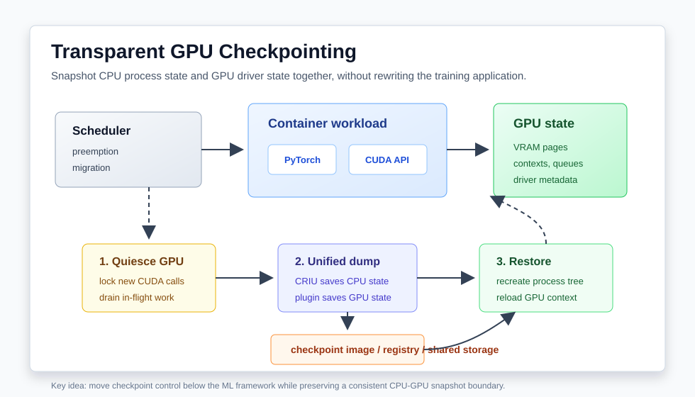

# GPU 透明 Checkpoint：从应用级保存到 CPU-GPU 统一快照

大规模 GPU 集群里，checkpoint 通常被理解成训练框架的一部分：模型参数、优化器状态、dataloader 位置、随机数种子定期写到并行文件系统或对象存储。这个路径对长期训练很重要，但它并不等价于“把一个正在跑的 GPU 进程搬走”。

如果调度器想抢占一个低优先级训练任务，把一个推理服务热迁移到另一台机器，或者在节点维护前把长时间运行的 CUDA 程序冻结下来，应用级 checkpoint 往往不够。原因很简单：GPU 上还有显存页、CUDA context、stream、event、kernel launch 状态、驱动对象和 CPU 进程里的 open file/socket/thread 状态。只保存 PyTorch state dict，并不能恢复一个完整运行现场。

2025 年的 CRIUgpu 论文把这个问题重新推进了一步：它不再靠拦截 CUDA/ROCm API 并在恢复时 replay 调用序列，而是利用新近 GPU 驱动 checkpoint 能力，把 CRIU 的 CPU 进程快照和 GPU driver state 放进同一个系统级 snapshot。对 HPC/GPU 平台来说，这意味着 checkpoint/restore 有机会从“应用自己配合”变成“容器运行时和调度器可编排的基础设施能力”。

## 要解决的问题：GPU 作业的状态不只在模型文件里

传统深度学习 checkpoint 解决的是算法状态恢复。它通常假设程序可以退出，然后由训练脚本重新创建进程、重新初始化 CUDA runtime、重新构造 NCCL 通信器、重新加载模型和优化器，再从某个 step 继续。

这个模型有三个明显限制。

第一，它侵入应用。不同框架、不同并行策略、不同数据管线都要维护自己的保存逻辑。HPC 里的 Fortran/C++/MPI+CUDA 程序、定制仿真代码、在线推理服务未必都有干净的应用级 checkpoint。

第二，它恢复的是语义状态，不是运行时状态。CUDA context、device allocation、stream dependency、JIT 后的 kernel cache、打开的 socket 和文件描述符，通常要由程序重新建立。恢复越重，抢占和迁移越难做成低延迟路径。

第三，它不适合通用调度器。Kubernetes、Slurm 或云平台希望用统一机制处理 preemption、maintenance、elastic migration 和 forensic debugging。如果每个 GPU 应用都要暴露一套专用 checkpoint API，调度器很难做统一策略。

CRIUgpu 的目标就是补上这层缺口：在不改训练代码、不重编 PyTorch、不长期代理 CUDA API 的情况下，冻结一个容器里的 CPU 和 GPU 状态，并在之后恢复。

## 旧路线：API interception 为什么难维护

GPU 透明 checkpoint 的早期路线通常是拦截设备 API。系统在应用和 CUDA/ROCm runtime 之间放一个 proxy，记录 `cudaMalloc`、`cudaMemcpy`、kernel launch、stream/event 操作等调用。checkpoint 时保存 CPU 状态和 proxy 维护的影子 GPU 状态；restore 时重新创建 CUDA context，再按日志 replay 这些 API。

这个思路理论上可行，但工程代价很重：

1. 需要覆盖大量 runtime/driver API，CUDA、ROCm、不同版本和不同链接方式都会增加维护成本。
2. steady-state 有额外开销，因为每次设备调用都要被观察、记录或转发。
3. 动态链接要求会影响现有 ML 框架部署，部分系统甚至需要重新编译 PyTorch。
4. replay 不一定等价于原始运行。浮点非确定性、异步 stream、动态并行、库内部状态都可能让恢复后的 GPU 状态偏离 checkpoint 时刻。

对单个研究原型来说，API replay 可以证明概念；对多租户 GPU 集群来说，它很难成为默认基础设施。平台工程更需要的是：不长期站在性能路径上，只在 checkpoint/restore 时进入控制路径。

## CRIUgpu 的核心方法：让驱动参与快照边界

CRIUgpu 的设计可以拆成四步。

第一步，调度器或容器运行时发起 checkpoint。触发来源可以是节点维护、资源抢占、作业迁移、故障前预防性转移，或者需要保留现场的 debugging。

第二步，GPU runtime 被临时 quiesce。以 NVIDIA 的 `cuda-checkpoint` 思路为例，工具会把目标进程的 CUDA 状态从 running 切到 suspended：阻止新的 CUDA 调用进入，等待已有 GPU work 完成或达到超时边界，然后让设备状态进入可保存状态。这个阶段的关键不是让应用配合写文件，而是在 runtime/driver 层建立一致性边界。

第三步，CRIU 保存 CPU 进程树，GPU 插件保存设备相关外部资源。CRIU 本来就擅长保存 Linux 进程的匿名内存、线程、文件、socket、pipe 等内核资源；GPU 插件则处理 `/dev/nvidia*`、`/dev/kfd`、`/dev/dri/renderD*` 这类设备文件背后的显存、队列、context 和驱动元数据。最后得到的是一个 CPU-GPU 统一 snapshot，而不是两个互相不知道的文件集合。

第四步，restore 时先恢复 CPU 进程树和文件描述符，再由 GPU 插件恢复设备状态，最后把 CUDA/ROCm 运行状态切回 running。应用看到的是同一个进程从冻结点继续执行，不需要重新走框架初始化路径。

这个方法最重要的变化是：checkpoint 控制面下沉到了容器运行时、CRIU 和 GPU driver 插件，而不是留在每个训练脚本内部。

## CUDA 路径：`cuda-checkpoint` 提供 GPU 状态切换

NVIDIA 在 2024 年介绍的 `cuda-checkpoint` 是这条路线的关键部件之一。它提供命令行工具，对指定 Linux 进程切换 CUDA 状态。运行到 suspended 状态后，CUDA device memory 会被保存到主机侧，GPU 资源可以被释放；恢复时再把 CUDA 状态切回可运行。

从工程角度看，`cuda-checkpoint` 最适合放在 CRIU 的插件或 orchestrator 里，而不是让用户手动操作。一个更完整的节点级流程可以是：

1. kubelet、CRI-O/containerd 或调度器 controller 决定要冻结某个 GPU pod；
2. runtime 找到容器内目标进程和对应 GPU 设备；
3. 调用 CUDA checkpoint 工具或 driver API 让 GPU 状态进入 suspended；
4. 调用 CRIU dump 进程树，同时让 CUDA 插件记录 GPU 外部资源；
5. 把 checkpoint archive 打包成本地文件、checkpoint image 或上传到 registry/共享存储；
6. 在原节点或新节点上 restore，并重新绑定兼容 GPU。

这里有一个实际限制：透明并不等于任意迁移。恢复节点需要驱动、GPU 架构、设备拓扑、MIG 配置、库版本和容器环境足够兼容。跨架构从 A100 迁到 H100，或者从一组 NCCL 拓扑迁到另一组拓扑，不应该被当成“天然可行”。调度器必须把 checkpoint artifact 的硬件约束记录下来。

## ROCm 路径：用 CRIU hook 管理 KFD 和 DRM 资源

CRIUgpu 的另一个价值是同时讨论了 AMD 和 NVIDIA。ROCm 应用的 GPU 状态主要通过 KFD 和 DRM render node 暴露给用户态。CRIU 插件可以在 dump/restore 外部文件时识别这些设备节点，然后通过 KFD checkpoint/restore ioctl 获取进程 GPU 信息、保存队列和内存对象、恢复 signal 与 buffer object 映射。

这说明透明 GPU checkpoint 不应该被设计成某个单一框架的私有功能。更合理的抽象是：

- CRIU 负责通用 Linux 进程状态；
- GPU vendor driver 暴露可冻结、可枚举、可恢复的设备状态接口；
- 容器运行时负责把两类状态打包、分发和恢复；
- 调度器负责决定什么时候值得 checkpoint，以及恢复到哪类节点。

这四层边界清楚以后，HPC 中心和云平台才有机会在不同 GPU vendor、不同工作负载之间复用同一套抢占和迁移策略。

## Kubernetes 场景：checkpoint image 让 GPU 作业可调度

Kubernetes 已经把普通容器 checkpoint 推到了更现实的位置。2026 年 1 月 Kubernetes 社区宣布成立 Checkpoint/Restore Working Group，目标包括改进 checkpoint/restore 生态、operator、checkpointctl、CRI integration 等组件。虽然 GPU 场景仍然比 CPU-only 容器复杂得多，但方向已经很清楚：checkpoint 不只是 debugging 工具，也会成为调度能力。

一个 GPU-aware Kubernetes 设计可以这样落地：

1. **准入阶段**：pod 声明是否支持透明 checkpoint，或者平台根据镜像、驱动和 GPU 类型自动标注 capability。
2. **运行阶段**：node agent 监控 GPU memory、进程树、driver version、MIG profile、通信连接和 checkpoint 最近成功时间。
3. **抢占阶段**：当高优先级作业到来，controller 选择 checkpoint 成本可接受的低优先级 GPU pod，而不是直接 kill。
4. **打包阶段**：CRIU dump + GPU plugin dump 生成 checkpoint archive，再用 Buildah/registry 或共享存储分发。
5. **恢复阶段**：scheduler 只把 checkpoint pod 放到满足硬件兼容约束的节点，runtime 完成 CPU/GPU restore。
6. **回退阶段**：如果 restore 失败，平台回退到应用级 checkpoint 或重新启动，而不是无限占用 GPU。

这个流程对推理服务也很有吸引力。冷启动里常见的权重加载、CUDA 初始化、kernel JIT 和 KV/cache warmup 都可能被 snapshot 吸收掉。对 batch 训练来说，收益更多体现在可抢占 GPU 队列和维护窗口；对在线推理来说，收益则体现在 warm pool、快速缩容后恢复和低延迟迁移。

## 和训练框架 checkpoint 的关系

透明 GPU checkpoint 不会替代应用级 checkpoint，二者应该分层使用。

应用级 checkpoint 更适合长期可靠性：它跨版本、跨硬件、跨并行拓扑的可移植性更好，也更容易做数据一致性审计。训练脚本知道 step、optimizer、scheduler、dataset cursor 和评测状态，能够把算法语义保存得更干净。

透明系统级 checkpoint 更适合短周期控制：抢占、节点维护、同构节点迁移、快速恢复、现场保留、推理 warm snapshot。它的优势是低侵入和恢复快，劣势是 artifact 更依赖运行环境。

一个成熟 GPU 平台应该同时保留两条路径：

1. 每隔较长周期写应用级持久 checkpoint，保证跨环境恢复。
2. 在节点侧高频或按需做透明 checkpoint，服务调度器的抢占和迁移。
3. 透明 checkpoint 失败时，退回最近应用级 checkpoint，而不是把作业状态赌在单一机制上。
4. 对分布式训练，系统级 checkpoint 必须和 rank group、NCCL communicator、网络连接、dataset shard 一起做一致性协议，不能只冻结单个进程。

## 对 HPC/GPU 系统实现者的提醒

第一，先从单节点、单进程、同构 GPU 做起。透明 checkpoint 的复杂度会随分布式通信急剧上升，尤其是 NCCL socket、RDMA queue pair、rank membership 和 collective in-flight 状态。把单节点能力打稳，比直接承诺多节点任意迁移更靠谱。

第二，把硬件兼容性写进 checkpoint metadata。至少记录 GPU 型号、driver、CUDA/ROCm runtime、MIG profile、visible device count、容器镜像 digest、mount 和网络约束。restore 调度时按 metadata 过滤节点。

第三，checkpoint 不应该阻塞调度器主循环。dump 大模型显存会消耗 PCIe/NVLink 带宽、CPU 内存和本地磁盘带宽，应当由 node agent 异步执行，并给 controller 暴露进度、超时和失败原因。

第四，要把安全边界当成一等公民。checkpoint archive 可能包含模型权重、tokenizer cache、环境变量、进程内 secret、网络连接信息和用户数据。它应该像生产模型权重一样加密、限权、审计和设置生命周期。

第五，恢复后必须有健康检查。CUDA context 能恢复，不代表训练语义一定健康。恢复后至少需要跑一次框架级 heartbeat、GPU kernel smoke test、通信组重建检查和业务层 ready probe。

## 小结

CRIUgpu 的意义不是“又多一种保存模型的方法”，而是把 GPU 作业的运行时状态纳入操作系统和容器平台的 checkpoint/restore 体系。过去 GPU 任务要么靠应用自己保存语义状态，要么靠 API interception 勉强 replay；新的驱动级 checkpoint 路线让平台可以在更低层建立一致的 CPU-GPU snapshot。

对未来 HPC 和 AI 集群来说，这会直接影响调度策略：低优先级训练不一定要被 kill，长时间仿真不一定要等维护窗口结束，推理服务也不一定每次扩容都从冷启动开始。真正难的部分会转向工程边界：硬件兼容、分布式一致性、artifact 安全、恢复验证和调度策略。谁能把这些边界处理好，谁就能把昂贵 GPU 从“不可中断资源”变成更可编排的集群资源。

## 参考资料

- Radostin Stoyanov et al. CRIUgpu: Transparent Checkpointing of GPU-Accelerated Workloads. arXiv:2502.16631, 2025. <https://arxiv.org/abs/2502.16631>
- NVIDIA Developer Blog. Checkpointing CUDA Applications with CRIU, 2024. <https://developer.nvidia.com/blog/checkpointing-cuda-applications-with-criu/>
- NVIDIA cuda-checkpoint repository. <https://github.com/NVIDIA/cuda-checkpoint>
- Viktória Spišaková, Radostin Stoyanov, Adrian Reber. Efficient Transparent Checkpointing of AI/ML Workloads in Kubernetes, KubeCon 2025 slides. <https://radostin.io/files/KubeCon-2025-Efficient-Transparent-Checkpointing-of-AI-ML-Workloads-in-Kubernetes.pdf>
- Kubernetes Blog. Announcing the Checkpoint/Restore Working Group, 2026. <https://kubernetes.io/blog/2026/01/21/introducing-checkpoint-restore-wg/>
