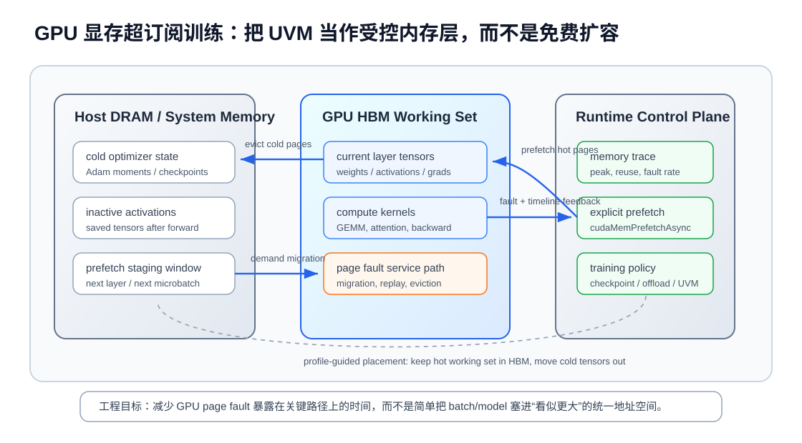

# UVM 显存超订阅训练：把统一内存做成可控的分层内存系统

训练大模型或大 batch 科学计算网络时，显存经常是第一个硬约束。最直接的工程反应是开混合精度、gradient checkpointing、ZeRO/FSDP、activation offload，或者干脆减小 batch。但 CUDA Unified Memory 还提供了另一条路：让应用分配超过单张 GPU HBM 容量的数据，并由系统在 CPU 内存和 GPU 显存之间迁移页面。

这个能力很诱人，因为它把“显存不够”从立即 OOM 变成了一个可运行的问题。NVIDIA CUDA 文档也明确说明，Unified Memory 支持 GPU memory oversubscription，可以让程序访问超过单个处理器内存容量的数组。但对深度学习训练来说，UVM 不是免费扩容。EuroMLSys 2025 的一篇论文专门分析了 UVM 和深度学习框架内存管理的交互，核心结论是：如果任由 page fault 在训练关键路径上发生，性能会被迁移、回放和驱逐拖得很厉害。

这篇文章讨论一个工程问题：**当模型工作集略大于 GPU 显存时，怎么把 UVM 从“会跑但很慢”的兜底机制，变成一个可观测、可调度、可验证的分层内存策略？**



## 1. 要解决的问题：显存不够不只是容量问题

深度学习训练的显存压力通常来自四类对象：

- 参数和梯度：每层权重、梯度 buffer，以及通信 bucket；
- optimizer state：Adam 的一阶/二阶矩、master weight，常常比参数本身更大；
- activation：forward 保存给 backward 的中间结果，随 batch、sequence length 和层数增长；
- temporary workspace：cuBLAS/cuDNN、attention kernel、通信库和框架 allocator 临时申请的 buffer。

当峰值显存超过 HBM 容量时，传统 CUDA device allocation 会直接失败。UVM 的 `cudaMallocManaged` 或 HMM 支持的 system allocated memory 能让 GPU 通过统一地址空间访问 CPU 侧内存，页面按需迁移到 GPU。这样模型可能不再 OOM，但训练 step 里会出现新的成本：

```text
GPU load missing page
  -> page fault
  -> driver/runtime 暂停或回放相关访问
  -> 从 host DRAM 迁移页面到 GPU HBM
  -> HBM 空间不足时驱逐其他页面
  -> kernel 继续执行
```

这条路径的延迟比 HBM load 高很多。更麻烦的是，训练不是线性扫描一个数组，而是由 framework allocator、autograd graph、kernel launch、通信 bucket 和 checkpoint/recompute 共同决定访问顺序。页面如果在错误时间被迁入，又很快被驱逐，就会形成 thrashing。结果是 GPU SM 在等待迁移，PCIe/NVLink 在搬冷数据，训练 iteration time 被 page fault tail 拉长。

所以 UVM oversubscription 的目标不应该是“让所有东西都能分配”，而应该是：**把当前计算阶段真正热的工作集留在 HBM，把冷状态放到 host memory，并且尽量在 kernel 访问前完成迁移。**

## 2. 近期研究给出的信号

EuroMLSys 2025 的 *Understanding Oversubscribed Memory Management for Deep Learning Training* 关注 UVM 在深度学习训练里的实际表现。它的价值在于没有只看通用数组 benchmark，而是把深度学习框架的内存管理放进来分析。论文指出，UVM 的 page fault handling overhead 会影响 DL workload；框架自身的 caching allocator、预分配和 tensor 生命周期会改变 UVM 看到的访问模式。

这对工程实践很关键。很多训练框架为了减少 `cudaMalloc/cudaFree` 成本，会维护私有显存池。allocator 认为自己在复用大块内存，UVM 却在以页面为单位迁移和驱逐；二者的粒度不一致，容易造成“框架层看起来复用，系统层实际在频繁换页”的现象。

NVIDIA 的 CUDA Unified Memory 文档给了更底层的方向：开发者可以使用 memory advise 和 prefetch，帮助驱动决定页面放在哪里、什么时候迁移。也就是说，UVM 不是只有 demand paging 一种用法。对训练系统来说，关键是把即将访问的 tensor、layer 或 microbatch 提前告诉 runtime，而不是等 GPU kernel 触发 fault。

Heterogeneous Memory Management（HMM）则把这个问题扩展到更普通的系统内存路径。NVIDIA 的 HMM 技术说明强调，GPU 可以直接访问 system allocated memory，减少显式内存管理改造。Linux kernel 的 HMM 文档也把它描述为把 GPU 这类设备内存集成进常规内存管理路径的基础设施。对 HPC 和深度学习系统来说，这意味着未来“CPU 内存、GPU HBM、远端内存、CXL 内存”可能越来越像一个分层地址空间，但性能仍然取决于放置、迁移和访问局部性。

2024 年的 Shared Virtual Memory 研究从 AMD SVM 角度补充了同一个教训：统一虚拟内存能提升可编程性，也支持 oversubscription，但预取和驱逐策略在超订阅时可能导致严重 thrashing。换句话说，不同厂商和平台实现不同，但系统风险类似：统一地址空间解决的是可访问性，不自动保证局部性。

## 3. 方法一：先把训练工作集切成热、温、冷

UVM 最怕的是所有 tensor 在系统眼里都一样。训练系统应该先把内存对象按访问时序分层。

热数据是当前 layer 或当前 microbatch 马上要访问的对象，例如正在做 GEMM/attention/backward 的权重、activation、梯度输出和 workspace。这部分必须尽量留在 HBM，访问期间不要触发 fault。

温数据是短期内会访问、但当前 kernel 不需要的对象，例如下一层权重、下一段 activation、即将 reduce-scatter 的 gradient bucket。这部分适合提前 prefetch 到 GPU，或者至少保证它不会和当前热数据互相驱逐。

冷数据是长时间不被 GPU kernel 直接访问的状态，例如暂时不用的 optimizer state、checkpoint shard、已经完成 backward 的旧 activation，或者下一轮 optimizer step 之前不会触碰的 moment buffer。这部分可以留在 host memory，甚至用更明确的 CPU offload 策略管理。

一个实用分类表如下：

| 对象 | 访问阶段 | 建议放置 |
| --- | --- | --- |
| 当前层权重和 activation | forward/backward kernel 内 | GPU HBM |
| 下一层权重或下一 microbatch 输入 | 即将进入 kernel | 异步 prefetch 到 GPU |
| Adam moments | optimizer step 前通常不热 | host/offload，按 shard 拉回 |
| checkpoint 后可重算 activation | backward 前不一定要常驻 | checkpoint/recompute 优先 |
| 通信 bucket | backward 局部窗口 | 与 reduce-scatter/all-gather 时机绑定 |

这一步听起来简单，但它决定了后面所有优化是否有效。如果热工作集本身仍然大于 HBM，UVM 只能不停换页，prefetch 也救不了；这时应该先用 checkpoint、tensor parallel、ZeRO/FSDP 或更小 microbatch 缩小热集。

## 4. 方法二：用 prefetch 把 page fault 从关键路径移走

UVM demand paging 的最大问题是 fault 发生在 GPU kernel 内部。kernel 本来应该在算矩阵乘或 attention，却因为页面不在 HBM 上等待迁移。工程上更可控的方式是把迁移动作提前到可覆盖的窗口里。

典型流程可以写成：

```text
for each training stage:
    prefetch(next_stage_hot_tensors, gpu, stream_prefetch)
    run(current_stage_compute, stream_compute)
    evict_or_advise(cold_tensors, cpu)
    wait only when next_stage really needs the data
```

在 CUDA 里，`cudaMemPrefetchAsync` 可以把 managed allocation 迁移到指定 device，`cudaMemAdvise` 可以给出 preferred location、accessed by、read mostly 等提示。它们不是强制调度器，但能显著改变驱动的迁移决策。老一些的 Unified Memory 性能研究也表明，prefetch 和 memory advise 的收益高度依赖平台、互连和 oversubscription 程度：PCIe、NVLink、CPU NUMA 拓扑和 GPU 代际都会改变结果。

对训练系统来说，prefetch 要和 autograd dependency 对齐，而不是简单按 layer 顺序机械预取。几个工程要点：

1. prefetch 的粒度要接近 tensor 生命周期。太细会增加 API 和调度开销；太粗会把冷页面也搬进 HBM，挤掉热数据。
2. prefetch stream 要和 compute stream 建立清晰依赖。提前太晚没有收益，提前太早可能造成 HBM 污染。
3. 对 backward，要特别关注 activation 的访问顺序。checkpoint/recompute 会改变哪些 activation 需要保存，进而改变 prefetch 对象。
4. 对 FSDP/ZeRO，要把参数 all-gather、gradient reduce-scatter 和 UVM prefetch 一起看。通信和迁移都在占用互连资源，不能各自为政。

好的 prefetch 不一定减少总搬运字节数，但它能把迁移放在可隐藏的位置，把 page fault tail 从 critical path 上拿掉。

## 5. 方法三：不要让 UVM 替代显式内存优化

UVM oversubscription 最容易被误用成“显存不够就开 managed memory”。这通常会得到一个能跑但吞吐很差的训练程序。更稳妥的策略是把 UVM 放在显式内存优化之后。

推荐顺序是：

```text
1. 混合精度 / FP8 / optimizer state 压缩
2. gradient checkpointing，减少必须常驻的 activation
3. microbatch 和 accumulation 调整，控制峰值工作集
4. ZeRO/FSDP/tensor parallel，把参数、梯度和 optimizer state 分片
5. 显式 CPU offload 管理冷状态
6. UVM/HMM 作为边界层，处理略超 HBM 的动态工作集
```

这个顺序的原因很实际：UVM 擅长处理“工作集有阶段性、只有一部分页面热”的情况，不擅长处理“每个 kernel 都随机访问超过 HBM 的数据”的情况。如果访问局部性差，统一内存只会把 OOM 转换成换页风暴。

对 LLM 训练尤其要小心 optimizer state。Adam moments 很大，但并不是每个 forward/backward kernel 都需要访问。把它们交给 UVM 自动换页，不如用 ZeRO-Offload、FSDP CPU offload 或自定义 shard prefetch 更明确。UVM 更适合兜住临界工作集、临时 buffer、动态 shape 下偶发峰值，而不是替代训练框架的内存规划。

## 6. Profiling：必须看 page fault、迁移和 GPU idle

判断 UVM 策略是否有效，不能只看“没有 OOM”。至少要看五个指标：

- 每个 iteration 的 page fault 数量和分布；
- HtoD/DtoH 迁移量，以及它们是否和 compute overlap；
- GPU SM active 是否在 fault 窗口下降；
- HBM residency 是否频繁抖动，是否出现同一批页面反复迁入迁出；
- step time 的 tail 是否由少数 layer 或 rank 拉长。

Nsight Systems 可以帮助定位 GPU kernel、UVM migration、CPU runtime 调用和 stream dependency 的时间线。Nsight Compute 更适合看具体 kernel 的 stall、memory throughput 和 occupancy。对分布式训练，还要同时打开 NCCL trace 或框架 profiler，因为 UVM 迁移可能和 all-gather/reduce-scatter 抢 PCIe/NVLink/NIC 路径。

一个实用诊断表：

| 现象 | 可能原因 | 优先动作 |
| --- | --- | --- |
| kernel 内部出现大量 UVM fault | prefetch 太晚或没有 prefetch | 按 layer/microbatch 提前迁移 |
| 同一 tensor 反复迁入迁出 | 热/冷分类错误或 HBM 污染 | 缩小 prefetch 粒度，标记冷数据 |
| step time 偶发长尾 | 特定 batch/sequence 触发峰值 | 按 shape 建立内存水位保护 |
| 通信变慢 | UVM 迁移和 collective 争互连 | 错开 prefetch 与 all-gather/reduce-scatter |
| 开 UVM 后 GPU 利用率低 | 工作集超过 HBM 太多 | 先做 checkpoint/offload/并行分片 |

如果 profile 里看不到 page migration 和 fault 的改善，就不要相信抽象层面的“统一内存更简单”。在 HPC 场景里，简单性只有在性能可解释时才成立。

## 7. 一个工程化落地方案

假设有一个 PyTorch/CUDA 训练任务，模型峰值显存比单卡 HBM 高 10% 到 30%，但不是高好几倍。可以按下面流程试验：

第一步，先在不启用 UVM 的情况下跑最小可行 batch，记录每层 activation、参数、optimizer state 和 workspace 峰值。目标是知道真正超出的部分是什么。

第二步，启用 checkpoint 或 selective recompute，把 backward 必须保留的 activation 降下来。优先减少热工作集，而不是把所有 activation 都交给 UVM。

第三步，把 optimizer state 和不在当前 step 热路径上的大对象放到 CPU/offload 管理里。只有短期会被 GPU 访问的 tensor 才考虑 managed memory。

第四步，对 managed tensor 建立阶段性 prefetch：forward 预取下一层，backward 预取将要使用的 saved tensor 或重算输入，optimizer step 前再拉对应 shard。每个 prefetch 都要有 stream dependency，避免 silent serialization。

第五步，用 profiler 验证三件事：page fault 是否从 compute kernel 内移走；HtoD 迁移是否被前一阶段计算覆盖；迁移是否和 NCCL collective 冲突。

第六步，设置保护阈值。比如当 sequence length 或 batch 触发过高 fault rate 时，自动减小 microbatch 或切换更保守的 offload 策略。UVM 应该有 fallback，不应该让生产训练进入不可预测的 thrashing。

这个方案的核心不是某个 API，而是把 UVM 纳入训练调度器：数据什么时候热、什么时候迁移、什么时候释放、什么时候通信，都由训练系统显式建模。

## 8. 对 CUDA/HPC 开发者的启发

第一，统一地址空间不是统一性能空间。CPU DRAM、GPU HBM、NVLink、PCIe、CXL 和远端内存即使用同一套虚拟地址访问，延迟和带宽仍然差几个数量级。代码能 dereference，不等于应该在 kernel 关键路径上 dereference。

第二，page fault 是系统级 stall，不是普通 cache miss。GPU 大量线程同时触发缺页时，影响会被放大，还可能导致 replay、迁移和驱逐串在一起。训练系统要尽量把 fault 变成显式 prefetch。

第三，框架 allocator 会影响 UVM。PyTorch/XLA/自研 runtime 的内存池、复用策略和 tensor 生命周期，都会改变 UVM 看到的页面热度。调 UVM 不能只看 CUDA API，也要看上层 allocator。

第四，分布式训练里互连是共享资源。UVM migration、NCCL collective、parameter prefetch 和 checkpoint offload 都可能同时走 PCIe/NVLink/NIC。优化显存时不能把通信当作背景噪声。

第五，未来的内存系统会更分层。Grace Hopper/Grace Blackwell、HMM、CXL memory 和 GPU direct storage 都在把“可访问内存”做大。真正有价值的系统软件，是能把这些层次变成可预测的 placement policy，而不是把所有层次混成一个慢速大内存。

## 小结

UVM 显存超订阅解决的是“能不能访问超过 HBM 的数据”，但深度学习训练真正关心的是“能不能在不破坏 critical path 的情况下访问”。如果把 UVM 当作透明魔法，page fault、迁移和驱逐会把训练拖慢；如果把它当作可控分层内存系统，结合工作集分类、显式 prefetch、checkpoint/offload 和 profiling，它可以成为处理临界显存压力的实用工具。

对 CUDA 高性能计算和深度学习系统开发者来说，最重要的判断是：热工作集必须适配 HBM，冷状态可以离开 GPU，迁移要尽量发生在可覆盖窗口里。UVM 的价值不在于让内存层次消失，而在于给运行时一个统一地址空间，让我们有机会用更高层的调度策略管理这些层次。

## 参考资料

- Mao Lin, Hyeran Jeon. Understanding Oversubscribed Memory Management for Deep Learning Training. EuroMLSys 2025. <https://euromlsys.eu/pdf/euromlsys25-31.pdf>
- NVIDIA CUDA C++ Programming Guide. Unified Memory and GPU Memory Oversubscription. <https://docs.nvidia.com/cuda/cuda-programming-guide/04-special-topics/unified-memory.html>
- NVIDIA CUDA C++ Programming Guide. Memory Advise and Prefetch. <https://docs.nvidia.com/cuda/cuda-programming-guide/02-basics/understanding-memory.html>
- NVIDIA Technical Blog. Simplifying GPU Application Development with Heterogeneous Memory Management. <https://developer.nvidia.com/blog/simplifying-gpu-application-development-with-heterogeneous-memory-management/>
- Linux Kernel Documentation. Heterogeneous Memory Management. <https://www.kernel.org/doc/html/v5.0/vm/hmm.html>
- Bennett Cooper, Thomas R. W. Scogland, Rong Ge. Shared Virtual Memory: Its Design and Performance Implications for Diverse Applications. arXiv:2405.06811, 2024. <https://arxiv.org/abs/2405.06811>
- Steven W. D. Chien, Ivy B. Peng, Stefano Markidis. Performance Evaluation of Advanced Features in CUDA Unified Memory. arXiv:1910.09598, 2019. <https://arxiv.org/abs/1910.09598>
